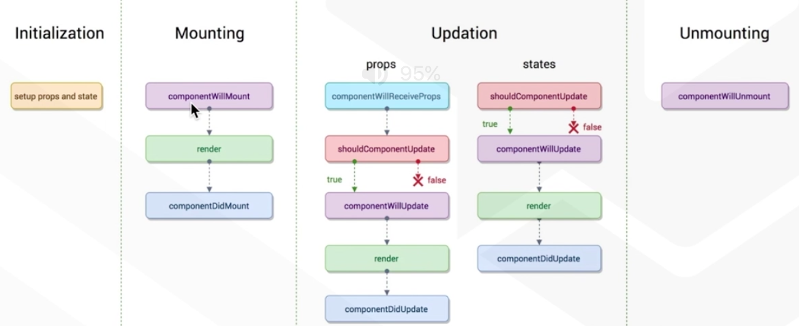

### 主流前端框架:

- vue(mvvm)
- react (mvvm)
- angular(mvc)

### 1.React介绍

#### 特性

- 声明式：如声明变量，在react中可以声明组件、变量等
- 组件化
  - 独立的模块开发成小组件，在不同的页面进行嵌套，类似堆积木的方式
  - 任何大的项目都可以拆分成无数小的项目，小的项目可以拆分成一个个小零件
  - 将积木拼在一起堆成一个大的项目
  - **模块化和组件化的区别**：==模块化相对于功能（如支付，订单做成独立的功能）， 组件化侧重于UI==
- 灵活
  - 支持单页面和多页面，通过路由分发出不同的页面
  - 支持服务端渲染，把react丢到node.js中去，渲染出多个页面
  - React Native，App开发

#### 引入方式

cdn

- https://unpkg.com/react@16/umd/react.development.js
- https://unpkg.com/react-dom@16/umd/react-dom.development.js
- https://unpkg.com/babel-standalone@6/babel.min.js

#### 基本语法

- ReactDOM.render() 渲染元素 如 div 等
- React.createElement() 创建元素（虚拟dom模拟真实dom进行对比差异，然后渲染）， react核心库提供各种api操作dom
- React.Component ES6语法，开发中经常使用extents继承React.Component

### 2.编写Hello World

- 首先vi命令 touch index.html创建程序入口
- cdn或者npm方式引入react

```html
<html lang="en">
<head>
    <meta charset="UTF-8">
    <meta name="viewport" content="width=device-width, initial-scale=1.0">
    <meta http-equiv="X-UA-Compatible" content="ie=edge">
    <title>React demo 4</title>
    <!-- cdn方式引入-->
    <script src="https://unpkg.com/react@16/umd/react.development.js"></script>
    <script src="https://unpkg.com/react-dom@16/umd/react-dom.development.js"></script> 
    <!-- 引入babel -->
    <script src="https://unpkg.com/babel-standalone@6/babel.min.js"></script> 
    
    <!-- 或者npm 方式引入 -->
    <!-- <script src="./node_modules/react/umd/react.development.js"></script>
    <script src="./node_modules/react-dom/umd/react-dom.development.js"></script> -->
</head>
<body>
    <div id = "app"></div>
    <script>
        var hello = React.createElement('h1',{},"Hello world!");
        ReactDOM.render(hello,document.getElementById('app'));
    </script>
</body>
</html>
复制代码
```

- ES6语法糖

  - 引入babel 并且在div下script下添加type="text/babel"属性，即可在script下直接写html标签

  ```html
  <head>
    ...
    <!-- 引入babel -->
      <script src="https://unpkg.com/babel-standalone@6/babel.min.js"></script> 
    ...
  </head> 
   
   ...
   
  <body>
      <div id = "app"></div>
      <script type = "text/babel">
          // var hello = React.createElement('h1',{},"Hello world!");
          // ReactDOM.render(hello,document.getElementById('app'));
          ReactDOM.render(
              <h1>Hello,World</h1>,
          document.getElementById('app'));
      </script>
  </body>
  
  复制代码
  ```

### 3.jsx介绍

- 1 即在js中编写html代码

```js
    // 1 js中插入html代码
    //原生方式 
    // var hello = React.createElement('h1',
    // {
    //     className:'red',
    //     name:'jack'
    // },
    // "Hello world!");
    // ReactDOM.render(hello,document.getElementById('app'));

    //语法糖    
    ReactDOM.render(
        <h1 className="red" name="jack">Hello,React</h1>,
    document.getElementById('app'));
```

- 2 同时html中也可以嵌套js代码

```js
    // 2 html中插入js代码
    var name = 'jack';
    var ele = <h1 className="red" name="jack">Hello,{name}</h1>;
    ReactDOM.render(
        ele,
    document.getElementById('app'));
```

### 4. 元素渲染

- React 只会更新必要的部分
- 值得注意的是 React DOM 首先会比较元素内容先后的不同，而在渲染过程中只会更新改变了的部分节点。
- 修改代码，每隔1s重新渲染一次，查看chrome控制台

```js
// 元素渲染
        function tick(params) {
            var time = new Date().toLocaleTimeString();
            var ele = <div>
                    <h1 className="red" name="jack">Hello,jack</h1>
                    <h2> 现在是，{time} </h2>
                </div>

            ReactDOM.render(
                ele,
             document.getElementById('app'));
        }
        setInterval(() => {
            tick();
        }, 1000);   
复制代码
```

- 可以看到，只会重新渲染改变的节点，而不会重新渲染整个标签
- vue是双向绑定，react是单向绑定


### 5. 组件和Props

公共UI，比如页面头部组件、底部组件、面包屑等，属于多个页面都需要用到的，这个时候需要将它做成（抽离成）组件， 一次修改，其他地方都跟着改变，提高开发效率

**创建方式**

- 函数式组件（无状态组件，没有生命周期）
  - 属性通过 props.name方式取得
- 继承自React.Component （有状态组件，有生命周期）
  - 有状态组件，属性通过this.props.name 方式取得

```js
//5 组件和props
        //5.1 函数式组件，无状态直接加载
        // function Hello(props) {
        //     return <div>
        //                 <h1>Hello,{props.name}</h1>
        //                 <p>年龄：{props.age}</p>
        //                 <p>擅长：Everything</p>
        //             </div>
        // }
        // ReactDOM.render(
        //             <Hello name ="jack" age = "29"/>,
        //         document.getElementById('app'));
        
        //5.2 标准组件（带状态）react组件
        class HelloJack extends React.Component{
            render(){ //渲染方法，内部returndom元素
                return <div>
                        <h1>Hello,{this.props.name}</h1>
                        <p>年龄：{this.props.age}</p>
                        <p>擅长：Everything</p>
                    </div>
            }
        }
        ReactDOM.render(
                    <HelloJack name ="jack" age = "29"/>,
                document.getElementById('app'));
    
```

## 6. React生命周期

四个阶段

- 1）组件初始化阶段

  - 属性初始化
  - 状态初始化

- 2）组件加载阶段

  - 获取属性值

- 3）数据更新阶段

  - 组件属性值发生变化

- 4）组件销毁阶段

  #### 流程

  
  
  

```js
// 6. React生命周期
        class HelloJack extends React.Component{
            
            // 构造函数 可以省略
            constructor(props){
                console.log('初始化阶段')
                // 初始化props
                super(props);
                //初始化状态
                this.state = {
                    name:'jack',
                    age:25
                }
            }

            componentWillMount(){
                console.log('组件加载前')
                //可以进行ajax请求，请求数据操作
            }

            componentDidMount(){
                console.log('组件加载后')
            }

            updateUser =()=>{
                //错误的语法，不会触发render方法
                //this.state.name = 'Time';
                this.setState({
                    name:'Tim',
                    age:32
                })
            } 

            shouldComponentUpdate(){
                //一般默认true
                //根据具体业务场景，可以增加判断条件，比如登录了就更新，未登录就不更新
                console.log('数据是否需要更新')
                return true;
            }

            componentWillUpdate(){
                console.log('数据将要更新')
            }

            componentDidUpdate(){
                console.log('数据已经更新')
            }

            render(){
                // 组件发生变化，就会执行render
                console.log('组件加载 或 数据更新')
                return <div>
                        <h1>Hello,{this.state.name}</h1>
                        <p>年龄：{this.state.age}</p>
                        <p>擅长：Everything</p>
                        {/*绑定updateUser函数 不能加括号，即不能写成updateUser（）*/}
                        <button onClick={this.updateUser}>更新数据</button>
                    </div>
            }
        }
        ReactDOM.render(
                    <HelloJack />,
                document.getElementById('app'));
复制代码
```

## 7.事件处理

事件名称为驼峰式命名，如onClick等
 四种方式：

- 方式1 箭头函数动态绑定 如果写成updateUser(){...}，就会undefined
- 方式2 初始化阶段绑定updateUser2对象，（设定指针）
- 方式3 onClick中 箭头函数直接绑定函数
- 方式4 onClick中 this.updateUser3.bind(this)

```js
//7. 事件处理
        class HelloJack extends React.Component{
            
            // 构造函数 可以省略
            constructor(props){
                // 初始化props
                super(props);
                //初始化状态
                this.state = {
                    name:'jack',
                    age:25
                }
                this.updateUser2 = this.updateUser2.bind(this);
            }

            // 方式1 箭头函数动态绑定 如果写成updateUser(){...}，this就会undefined
            updateUser =()=>{
                console.log(this);
                this.setState({
                    name:'Tim',
                    age:32
                })
            } 

            //方式2 初始化阶段绑定updateUser2对象，（设定指针）
            updateUser2(){
                console.log(this);
                this.setState({
                    name:'Joy',
                    age:33
                })
            } 

            // 方式3 onClick中 箭头函数直接绑定函数
            // 方式4 onClick中 this.updateUser3.bind(this)
            updateUser3(){
                console.log(this);
                this.setState({
                    name:'Stephen',
                    age:30
                })
            }

            render(){
                return <div>
                        <h1>Hello,{this.state.name}</h1>
                        <p>年龄：{this.state.age}</p>
                        <p>擅长：Everything</p>
                        <button onClick={this.updateUser}>更新数据</button><br/>
                        <button onClick={this.updateUser2}>更新数据2</button><br/>
                        <button onClick={()=>this.updateUser3()}>更新数据3</button><br/>
                        <button onClick={this.updateUser3.bind(this)}>更新数据4</button>
                    </div>
            }
        }
        ReactDOM.render(
                    <HelloJack />,
                document.getElementById('app'));
复制代码
```

## 8. 条件处理

### 8.1 if else 和三元表达式

```js
//8.条件处理

        function Login(){
            return <button >登录</button>
        }

        function LogOut(){
            return <button>登出</button>
        }

        class App extends React.Component{
            
            state = {
                isLogin:false
            }

            updateUser =()=>{
                console.log(this);
                this.setState({
                    isLogin:true
                })
            } 

            render(){
                // 获取状态
                const isLogin = this.state.isLogin;
                //或者
                // const{isLogin} = this.state;
                
                //1.if else
                // let ele;//声明为let 如果是const 则其值不能改变
                // if (isLogin) {
                //     ele = <Login/>
                // }else{
                //     ele = <LogOut/>
                // }

                return <div>
                        <h1>Hello,{this.state.name}</h1>
                        {/*{ele}*/}
                        {/* 2. 三元表达式*/}
                        {isLogin?<Login/>:<LogOut/>}
                        <br/>
                        <button onClick={this.updateUser}>更新数据</button><br/>
                    </div>
            }
        }
        ReactDOM.render(
                    <App />,
                document.getElementById('app'));
复制代码
```

### 8.2 子组件触发父组件的方法

```js
        function Login(props){
            //子组件通过props属性接收updateUser方法
            return <button onClick={props.updateUser}>登录</button>
        }

        function LogOut(props){
            return <button onClick={props.updateUser}>登出</button>
        }

        class App extends React.Component{
            
            state = {
                isLogin:false
            }

            updateUser =()=>{
                console.log(this);
                this.setState({
                    isLogin:!this.state.isLogin
                })
            } 

            render(){
                const isLogin = this.state.isLogin;
                
                return <div>
                        <h1>Hello,{this.state.name}</h1>
                        {/*将updateUser方法传递给子组件*/}
                        {isLogin
                            ?<Login updateUser={this.updateUser}/>
                            :<LogOut updateUser={this.updateUser}/>}
                        <br/>
                    </div>
            }
        }
        ReactDOM.render(
                    <App />,
                document.getElementById('app'));
复制代码
```

## 9.列表渲染

```js
//9. 列表渲染
        class List extends React.Component{
            
            state = {
                list:[1,2,3,4,5],
                list2:[
                    {id:1,text:'java'},
                    {id:2,text:'js'},
                    {id:3,text:'php'},
                    {id:4,text:'python'},
                    {id:5,text:'node'}
                ]
            }

            render(){
                const arr = this.state.list;
                const arr2 = this.state.list2;
                const listItem = []
                const listItem2 = []
                //map方式遍历
                arr.map((item)=>{
                    let li = <li>{item}</li>;
                    listItem.push(li);
                })
                //或for循环
                // for (let i = 0; i < arr.length; i++) {
                //     let li = <li>{arr[i]}</li>;
                //     listItem.push(li);
                // }
                for (let i = 0; i < arr2.length; i++) {
                    let li = <li key={arr2[i].id}>{arr2[i].text}</li>;
                    listItem2.push(li);
                }
                return <div>
                        <ul>
                            {listItem}
                            {listItem2}
                        </ul>
                    </div>
            }
        }
        ReactDOM.render(
                    <List />,
                document.getElementById('app'));
复制代码
```

## 10.表单应用

```js
//10.表单应用
        class ToDoList extends React.Component{
            
            state = {
                value:'',
                list:[]
            }

            handleAdd = ()=>{
                const val = this.state.value;
                const list = this.state.list;
                //或 es6结构语法
                // const{val,list} = this.state;
                list.push(val);
                this.setState({
                    list:list
                    //es6中 当list和value相等时，可以省略key
                    //由list:list 简写为 list
                })
            }

            handleInput = (event)=>{
                this.setState({
                    value:event.target.value
                })
            }

            render(){
                const val = this.state.value;
                const arr = this.state.list;
                const listItem = []
                arr.map((item,index)=>{
                    let li = <li key = {index}>{item}</li>;
                    listItem.push(li);
                })

                return <div>
                        <div>
                            <input type = "text" value={val} onChange={this.handleInput}/>
                            <button onClick={this.handleAdd}>添加条目</button>    
                        </div>
                        <ul>
                            {listItem}
                        </ul>
                    </div>
            }
        }
        ReactDOM.render(
                    <ToDoList />,
                document.getElementById('app'));
```

