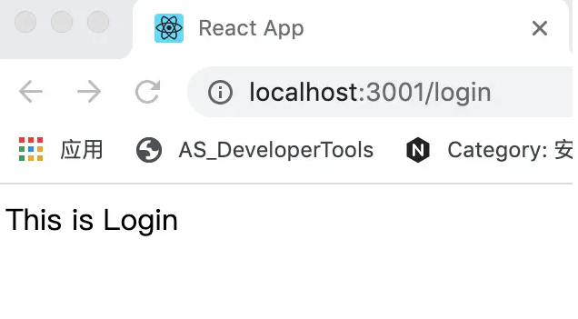
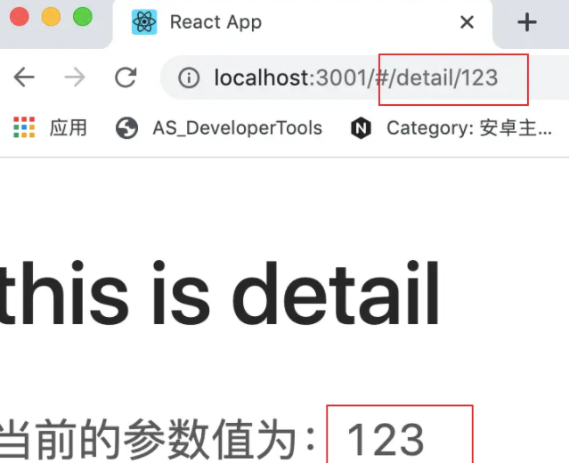

## 1.React-Router

### 1.1 路由基本配置

- BrowserRouter/HashRouter
  - BrowserRouter /xx 方式访问
  - HashRouter #/xxx 方式访问
- Switch:react 4.0 新增特性，目前已更新到5.0+版本
  - 匹配
- Route-exect/path/component
  - 根据地址精确匹配
- Link/NavLink
  - 路由封装

#### 安装

- yarn add react-router-dom

#### 完整代码

- src下新建pages包演示多页面路由功能
- 在pages下新建simplerouter包编写代码 **①首先在src下新建router.js**

```js
// import {BrowserRouter as Router,Route,Switch} from "react-router-dom";
import {HashRouter as Router,Route,Switch} from "react-router-dom";
import React from 'react'
import App from "./pages/simplerouter/app";
import Login from "./pages/simplerouter/login";
import Home from "./pages/simplerouter/home";

/**
 * @Description: 路由
 * @author dongshuhuan
 * @date 2020-05-16
 */
export default function IRouter(){
    return  <Router>
            {/*普通方式，根据path匹配,但是App的内容会出现在Login上方 ->图1所示*/}
            {/*<Route path = "/" component={App}></Route>*/}
            {/*<Route path = "/login" component={Login}></Route>*/}
            {/*<Route path = "/home" component={Home}></Route>*/}

        {/*如果用swithc，浏览器输入/home也只会加载App页，因为/home先匹配了/*/}
        {/*加上 exact 可以精准匹配 ->图2所示*/}
        {/*如果导入的是HashRouter，会自动加上# 如 http://localhost:3000/login#/ ->图3所示*/}
        <Switch>
            <Route exact path = "/" component={App}></Route>
            <Route path = "/login" component={Login}></Route>
            <Route path = "/home" component={Home}></Route>
        </Switch>

    </Router>
}
复制代码
```

**图1**


**图2**



**图3**


**②src下修改index.js**

```js
import React from 'react';
import ReactDOM from 'react-dom';
import * as serviceWorker from './serviceWorker';
import Router from "./router";

ReactDOM.render(
  <React.StrictMode>
    <Router/>
  </React.StrictMode>,
  document.getElementById('root')
);

serviceWorker.unregister();

复制代码
```

**③pages/simplerouter/app.js**

```js
import React from 'react'
import {Link} from "react-router-dom";
import './app.scss'
import {Button} from 'antd'
import 'antd/dist/antd.css'

/**
 * @Description:
 * @author dongshuhuan
 * @date 2020-05-16
 */

// export default function App() {
//     return <div  class="container">
//         <h1>欢迎来到React的世界</h1>
//         {/*Link的使用*/}
//         {/*如果是HashRouter  浏览器地址栏输入http://localhost:3000/#/login#/即可跳转到登录页 */}
//         <Link to="/login">点击跳转到登录页</Link>
//         <br/>
//         <Link to="/home">点击跳转到主页面</Link>
//         <br/>
//     </div>
// }


//有状态组件
export default class App extends React.Component{

    handleJump=()=>{
        this.props.history.push("/login");
    }

    render() {
        return <div className="container">
            <h1>欢迎来到React的世界</h1>
            {/*Link的使用*/}
            {/*如果是HashRouter  浏览器地址栏输入http://localhost:3000/#/login#/即可跳转到登录页 */}
            <Link to="/login">点击跳转到登录页</Link>
            <br/>
            <Link to="/home">点击跳转到主页面</Link>
            <br/>
            <Button onClick={this.handleJump}>登录跳转登录</Button>
        </div>
    }
}
复制代码
```

**④pages/simplerouter/home.js**

```js
import React from 'react'

export default function Home() {
    return <div>This is Home</div>
}
复制代码
```

**⑤pages/simplerouter/login.js**

```js
import React from 'react'

export default function Login() {
    return <div>This is Login</div>
}
复制代码
```

### 1.2 路由动态配置

- detail/2020
- Redirect/404
- JS中路由跳转 **router.js中新增以下代码**

```js
 {/*动态路由 浏览器输入http://localhost:3000/#/detail/123 即可看到效果*/}
    <Route path = "/detail/:goodsId" component={Detail}/>
    {/*重定向*/}
    <Route path = "/detail/:goodsId" component={Detail}>
        <Redirect to={'/login'}/>
    </Route>
    {/*404* 如果都没匹配到  输入http://localhost:3000/#/goods等不存在的路径即可看到效果 */}
    <Route path = "*" component={NoMatch}/>
复制代码
```

**detail.js & 404.js**

```js
export default class Detail extends React.Component{

    render() {
        return <div className="container">
            <h1>this is detail</h1>
        </div>
    }
}

export default function NoMacth() {
    return <div style={{color:'red'}}>404！！！</div>
}
复制代码
```

### 1.3 React Hooks & 路由Hooks

#### React Hooks（钩子 ）

用于解决函数式组件无状态问题

- useState： 解决状态问题
- useEffect：类似生命周期,didmount 和 didupdate中执行 **修改app.js**

```js
export default function App() {
    //useState,效果与有状态组件state={}相同
    const [count,setCount] = useState(10);
    //useEffect 第二个参数传递空数组 log只会打印一次
    //可以在serCount修改初始值
    useEffect(()=>{
        console.log("执行了useEffect");
        setCount(100);
    },[])

    return <div  class="container">
        <h1>欢迎来到React的世界</h1>
        {/*Link的使用*/}
        {/*如果是HashRouter  浏览器地址栏输入http://localhost:3000/#/login#/即可跳转到登录页 */}
        <Link to="/login">点击跳转到登录页</Link>
        <br/>
        <Link to="/home">点击跳转到主页面</Link>
        <br/>
        {/*useState*/}
        <p>
            当前count次数:{count}
        </p>
        <Button onClick={()=>{setCount(count+1)}}>更新次数</Button>
    </div>
}
复制代码
```

#### 路由Hooks

- useParams：获取参数（内部封装）
- useHistory：通过js api操作路由跳转

**useParams 如下图所示**

**图4**

****

**图5**


**useHistory** **完整代码，修改detail.js**

```js
import {useParams,useHistory} from "react-router-dom";

export default function Detail() {
    //React Hooks
    // 1、useParams 使用 查看图5所示
    const params = useParams();
    //2、useHistory
    const history = useHistory();
    return <div  className="container">
        {/*useParams */}
        {/*<h1>this is detail</h1>*/}
        {/*<p>当前的参数json数据为：{JSON.stringify(params)}</p>*/}
        {/*<p>当前的参数值为：{params.goodsId}</p>*/}

        {/*useHistory*/}
        <h1>this is detail</h1>
        <p>当前的参数值为：{params.goodsId}</p>
        <Button onClick={()=>{
            history.push('/')
        }}>跳转</Button>
    </div>
}


//有状态组件
// export default class Detail extends React.Component{
//
//     jumpHome=()=>{
//         this.props.history.push('/')
//     }
//
//     render() {
//         return <div className="container">
//             <h1>this is detail</h1>
//             {/*根据地址获取参数 图4所示 */}
//             <p>当前的参数值为：{this.props.match.params.goodsId}</p>
//             <Button onClick={this.jumpHome}>跳转</Button>
//         </div>
//     }
// }
```

