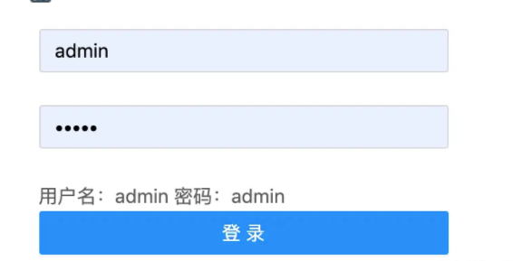
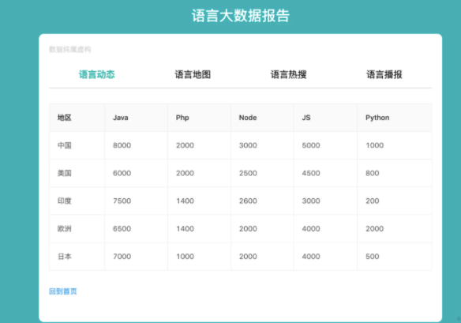

### 1.编写首页

```js
export default function DemoApp() {

    return <div  className="container">
        <h1>欢迎来到React的世界</h1>
        {/*Link的使用*/}
        {/*如果是HashRouter  浏览器地址栏输入http://localhost:3000/#/login#/即可跳转到登录页 */}
        <Link to="/demologin">跳转登录</Link>
        <br/>
        <Link to="/demohome">跳转主页</Link>
        <br/>
    </div>
}
复制代码
```

**src下路由router.js下添加如下代码**

```html
<Route path = "/demo" component={DemoApp}/>
<Route path = "/demologin" component={DemoLogin}/>
<Route path = "/demohome" component={DemoHome}/>
复制代码
```

**demo.scss**

```css
.container{
  padding-top: 20px;
  font-size: 28px;
  text-align:center;
  a{
    font-size: 26px;
  }
}

.ant-form.login-form{
  width: 300px;
  margin: 40px auto 0;
  button{
    width: 100%;
  }
}
复制代码
```

### 2.编写登录页面

模拟网络请求

- 安装axios：yarn add axios --save

```html
import React ,{useState}from 'react'
import {Form,Input,Button} from "antd";
import {useHistory} from "react-router-dom";
import './demo.scss'
import axios from 'axios'

/**
 * @Description:
 * @author dongshuhuan
 * @date 2020-05-16
 */
const FormItem = Form.Item;
export default function DemoLogin() {

    const [name,setName] = useState('');
    const [pwd,setPwd] = useState('');
    const history = useHistory();

    return <Form className={"login-form"}>
        <FormItem>
            <Input placeholder={"请输入用户名"} maxLength={5} onChange={(event)=>{
                setName(event.target.value)
            }}/>
        </FormItem>
        <FormItem>
            <Input placeholder={"请输入密码"} maxLength={5} type="password" onChange={(event)=>{
                setPwd(event.target.value)
            }}/>
        </FormItem>
        <label>用户名：{name}    密码：{pwd}</label>
        <FormItem>
            <Button type={"primary"} onClick={()=>{
                login(name,pwd).then((response)=>{
                    let res = response.data;
                    if (res.code===0){
                        history.push('/demohome')
                    }
                })
            }}>登录</Button>
        </FormItem>


    </Form>
}

function login(name,pwd) {
    return axios.get('login.json',{
        params:{
            name,pwd
        }
    })
}
复制代码
```

### 3.编写首页列表

**home.scss**

```
.home{
  height: calc(100vh);
  background: #10aeb5;
  h1{
    color: #ffffff;
    text-align: center;
    padding-top: 40px;
  }
  .wrap{
    padding: 20px 20px 50px;
    width: 800px;
    border-radius: 10px;
    background: white;
    margin: 0 auto;
    .nav{
      border-bottom: 1px solid lightgray;
      margin-bottom: 30px;
      line-height: 50px;
      a{
        display: inline-block;
        width: 25%;
        text-align: center;
        color: black;
        font-size: 18px;
        //a 标签和class在同一级用&
        &.checked{
          color:lightseagreen ;
          font-weight: bold;
        }
      }
    }
    p{
      color: lightgray;
    }
    .nav-link{
      display: inline-block;
      margin-top: 30px;
    }
  }
}
复制代码
```

**home.js**

```js
import React,{useEffect,useState} from 'react'
import { Table } from 'antd';
import {Link} from 'react-router-dom'
import './home.scss'
import axios from 'axios'

/**
 * @Description:
 * @author dongshuhuan
 * @date 2020-05-16
 */
export default function DemoHome() {
    const [data,setData] = useState([]);
    const [index,setIndex] = useState(0);
    const columns = [
        {
            title:'地区',
            dataIndex:'area'
        },{
            title:'Java',
            dataIndex:'java'
        },{
            title:'Php',
            dataIndex:'php'
        },{
            title:'Node',
            dataIndex:'node'
        },{
            title:'JS',
            dataIndex:'js'
        },{
            title:'Python',
            dataIndex:'python'
        }
    ];

    useEffect(()=>{
        axios.get("/data.json").then((response)=>{
            const res = response.data;
            if (res.code===0){
                setData(res.data)
            }
        })
    },[])

    return <div className={"home"}>
        <h1>语言大数据报告</h1>
            <div className={"wrap"}>
            <p>数据纯属虚构</p>
            <div className={"nav"}>
                <a className={index==0 ?"checked":""} onClick={()=>setIndex(0)}>语言动态</a>
                <a className={index==1 ?"checked":""} onClick={()=>setIndex(1)}>语言地图</a>
                <a className={index==2 ?"checked":""} onClick={()=>setIndex(2)}>语言热搜</a>
                <a className={index==3 ?"checked":""} onClick={()=>setIndex(3)}>语言播报</a>
            </div>
            <Table bordered
                   pagination={false}
                   columns={columns}
                   dataSource={data} />
            <Link to={'/demo'} className="nav-link">回到首页</Link>

        </div>

    </div>
}

//class 有状态组件实现页面交互功能
// export default class DemoHome extends React.Component{
//
//     //初始化表格 数据源
//     state={
//         data:[],
//         index:0,
//         columns : [{
//             title:'地区',
//             dataIndex:'area'
//         },{
//             title:'Java',
//             dataIndex:'java'
//         },{
//             title:'Php',
//             dataIndex:'php'
//         },{
//             title:'Node',
//             dataIndex:'node'
//         },{
//             title:'JS',
//             dataIndex:'js'
//         },{
//             title:'Python',
//             dataIndex:'python'
//         }],
//
//     }
//
//     componentDidMount() {
//         axios.get("/data.json").then((response)=>{
//             const res = response.data;
//             if (res.code===0){
//                 this.setState({
//                     data:res.data
//                 })
//             }
//         })
//     }
//
//     handleSwitch =(index)=>{
//         this.setState({
//             index
//         })
//     }
//
//     render() {
//         const {index,columns,data} = this.state;
//         return <div className={"home"}>
//             <h1>语言大数据报告</h1>
//             <div className={"wrap"}>
//                 <p>数据纯属虚构</p>
//                 <div className={"nav"}>
//                     <a className={index==0 ?"checked":""} onClick={()=>this.handleSwitch(0)}>语言动态</a>
//                     <a className={index==1 ?"checked":""} onClick={()=>this.handleSwitch(1)}>语言地图</a>
//                     <a className={index==2 ?"checked":""} onClick={()=>this.handleSwitch(2)}>语言热搜</a>
//                     <a className={index==3 ?"checked":""} onClick={()=>this.handleSwitch(3)}>语言播报</a>
//                 </div>
//                 <Table bordered
//                        pagination={false}
//                        columns={columns}
//                        dataSource={data} />
//                 <Link to={'/demo'} className="nav-link">回到首页</Link>
//
//             </div>
//
//         </div>
//     }
//
// }

复制代码
```

### 4.网页效果

**登录**



