阿里云服务器密码重置后：

```
user: root
password: Zganm123.
```

## 使用VScode连接阿里云服务器


#### 首先，需要在阿里云控制台找到，公网IP和重置账号密码

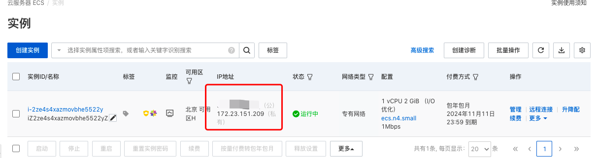

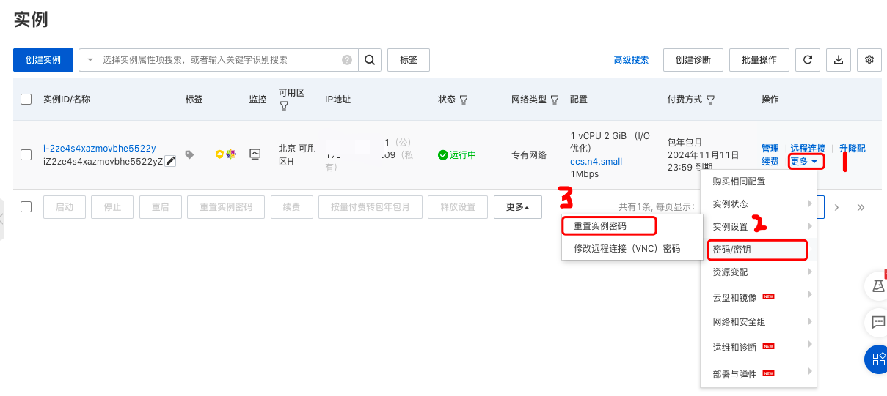

记住重置之后的密码

打开安全组并放行ssh连接的端口22

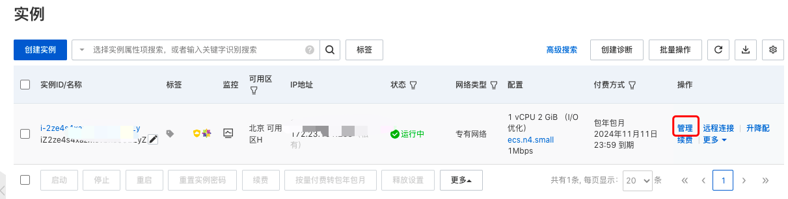

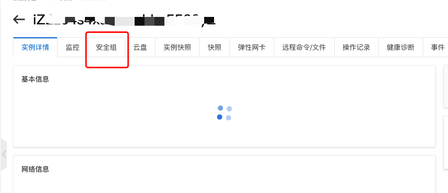

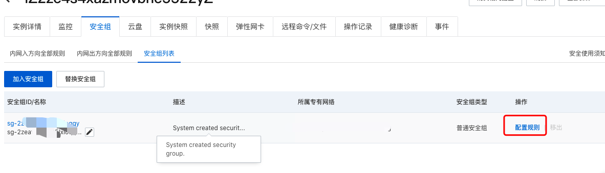

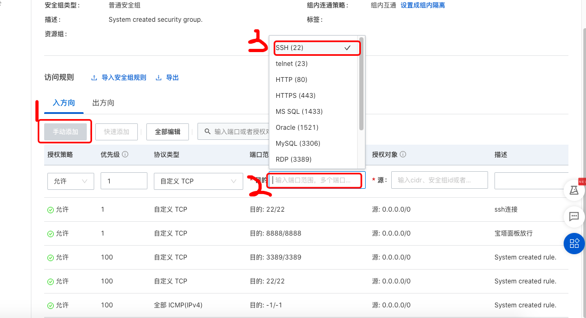

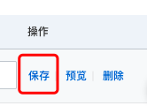


#### 打开vscode并安装ssh扩展

1、扩展安装

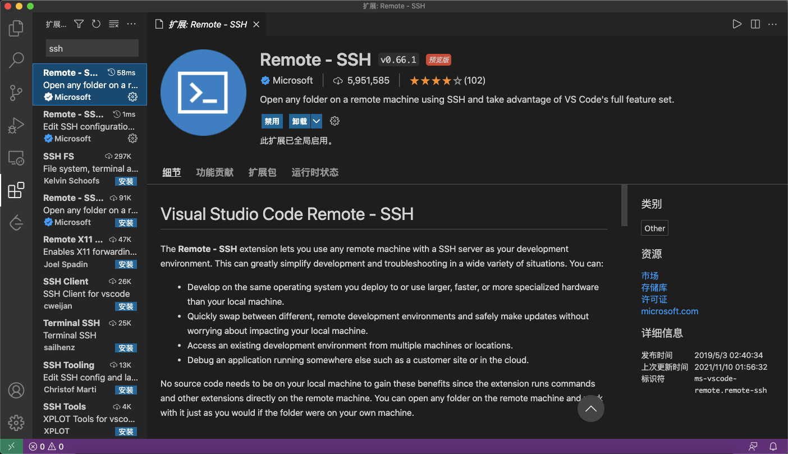

2、安装成功之后会在左下角出现绿色><符号，点击它

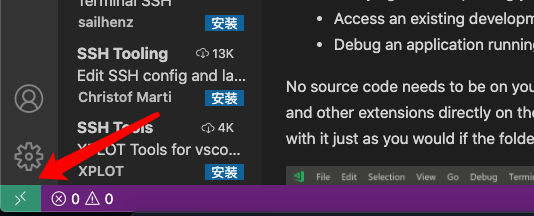

选择连接到主机

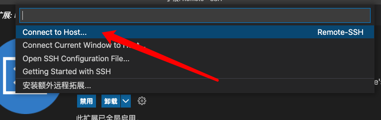

选择新增ssh连接主机

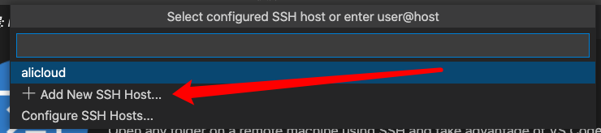

输入连接名（自己取的）

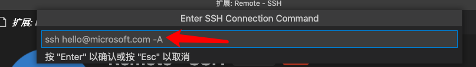

进入配置文件

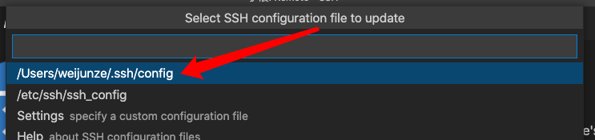

点击open

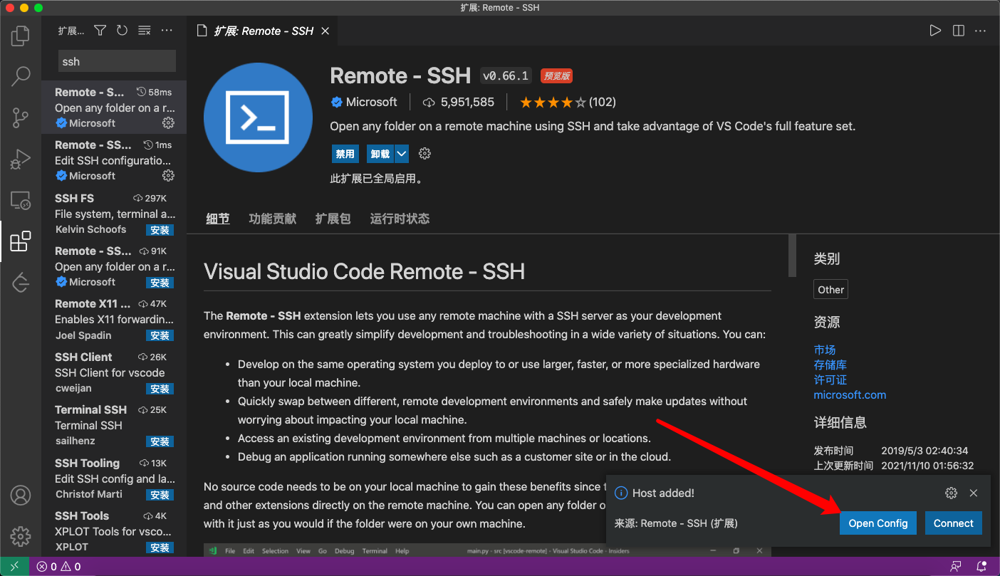

进入配置文件，然后将服务器的公网IP写到HostName后

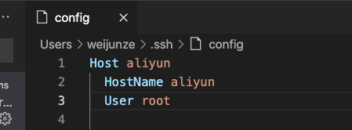

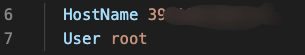

配置成功之后，点击左下角绿色><标志，点击connect to Host，然后选择你创建连接名，输入你之前重置的密码登录即可。连接成功之后页面如下

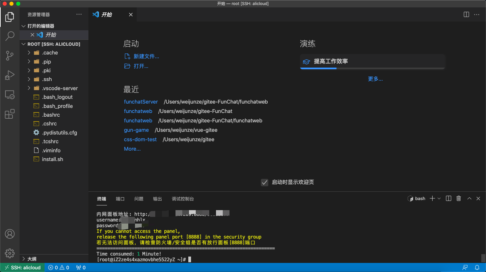

宝塔面板

> 外网面板地址: http://39.105.107.41:8888/96adb0f7
>
> 内网面板地址: http://172.23.151.209:8888/96adb0f7
>
> username: 8kglnhlx
>
> password: 9ff88a37
>
> If you cannot access the panel,release the following panel port [8888] in the security group
>
> 若无法访问面板，请检查防火墙/安全组是否有放行面板[8888]端口

root

Zganm123?

