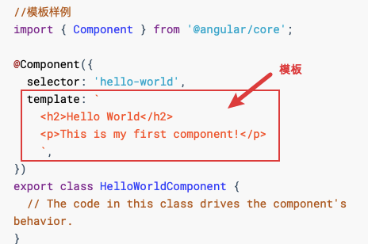

### angular介绍

#### angular官方介绍

Angular 是一个基于 [TypeScript](https://www.typescriptlang.org/) 构建的开发平台。它包括：

- 一个基于组件的框架，用于构建可伸缩的 Web 应用
- 一组完美集成的库，涵盖各种功能，包括路由、表单管理、客户端-服务器通信等
- 一套开发工具，可帮助你开发、构建、测试和更新代码

### angular应用

#### 组件

组件包括三个部分：带有 `@Component()` 装饰器的 TypeScript 类、HTML 模板和样式文件。

##### `@Component()` 装饰器

`@Component()`装饰器会指定如下 Angular 专属信息：

- 一个 CSS 选择器，用于定义如何在模板中使用组件。模板中与此选择器匹配的 HTML 元素将成为该组件的实例。
- 一个 HTML 模板，用于指示 Angular 如何渲染此组件。
- 一组可选的 CSS 样式，用于定义模板中 HTML 元素的外观。

```typescript
//模板样例
import { Component } from '@angular/core';

@Component({
  selector: 'hello-world',
  template: `
    <h2>Hello World</h2>
    <p>This is my first component!</p>
    `,
})
export class HelloWorldComponent {
  // The code in this class drives the component's behavior.
}
```

```HTML
//使用模板
<hello-world></hello-world>
```

```HTML
//angular渲染这个组件的时候，会生成以下DOM结构：
<hello-world>
    <h2>Hello World</h2>
    <p>This is my first component!</p>
</hello-world>
```

#### 模板

每个组件都有一个 HTML 模板，用于声明该组件的渲染方式。你可以内联它或用文件路径定义此模板。



##### 插值

Angular 使用额外的语法扩展了 HTML，使你可以从组件中插入动态值。当组件的状态更改时，Angular 会自动更新已渲染的 DOM。此功能的应用之一是插入动态文本，如下例子所示。

```typescript
content_copy<p>{{ message }}</p>
```

这里 message 的值来自组件类：

```typescript
content_copyimport { Component } from '@angular/core';

@Component ({
  selector: 'hello-world-interpolation',
  templateUrl: './hello-world-interpolation.component.html'
})
export class HelloWorldInterpolationComponent {
    message = 'Hello, World!';
}
```

当应用加载组件及其模板时，用户将看到以下内容：

```html
content_copy<p>Hello, World!</p>
```

注意这里所用的双花括号 —— 它们指示 Angular 对其中的内容进行插值。

##### 属性绑定

Angular 还支持属性绑定，以帮助你设置 HTML 元素的 Property 和 Attribute 的值，并将这些值传给应用的展示逻辑。

```
content_copy<p [id]="sayHelloId" [style.color]="fontColor">You can set my color in the component!</p>
```

注意这里所用的方括号 —— 该语法表明你正在将 Property 或 Attribute 绑定到组件类中的值。

##### 事件

声明事件监听器，来监听并响应用户的操作，例如按键、鼠标移动、单击和触摸等。可以通过在圆括号中指定事件名称来声明一个事件监听器：

```HTML
content_copy<button (click)="sayMessage()" [disabled]="canClick">Trigger alert message</button>
```

##### 最常用的指令是 `*ngIf` 和 `*ngFor` 


### 依赖注入

依赖注入让你可以声明 TypeScript 类的依赖项，而无需操心如何实例化它们，Angular 会为你处理这些琐事。这种设计模式能让你写出更加可测试、也更灵活的代码。尽管了解依赖注入对于开始用 Angular 并不是至关重要的事，但我们还是强烈建议你将其作为最佳实践，并且 Angular 自身的方方面面都在一定程度上利用了它。

为了说明依赖注入的工作原理，请考虑以下例子。第一个文件 `logger.service.ts` 中定义了一个 `Logger` 类。它包含一个 `writeCount` 函数，该函数将一个数字记录到控制台。

```ts
content_copyimport { Injectable } from '@angular/core';

@Injectable({providedIn: 'root'})
export class Logger {
  writeCount(count: number) {
    console.warn(count);
  }
}
```

接下来，`hello-world-di.component.ts` 文件中定义了一个 Angular 组件。该组件包含一个按钮，它会使用此 Logger 类的 `writeCount` 函数。要访问此功能，可通过向构造函数中添加 `private logger: Logger` 来把 `Logger` 服务注入到 `HelloWorldDI` 类中。

```ts
content_copyimport { Component } from '@angular/core';
import { Logger } from '../logger.service';

@Component({
  selector: 'hello-world-di',
  templateUrl: './hello-world-di.component.html'
})
export class HelloWorldDependencyInjectionComponent  {
  count = 0;

  constructor(private logger: Logger) {
  }

  onLogMe() {
    this.logger.writeCount(this.count);
    this.count++;
  }
}
```

