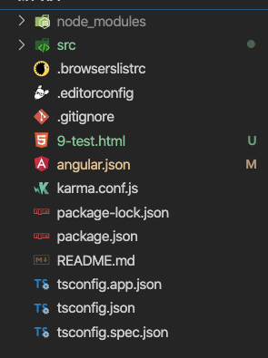
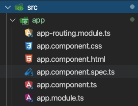

资源存放文件夹

node_nodules文件依赖于下文件

业务代码

不同浏览器兼容性代码

不同浏览器的一些格式化配置

git配置文件

其他的文件都是配置文件

### src文件

#### app文件

依次是

路由文件

app组件的样式文件

app组件的ui文件

app组件的测试文件

app组件的核心组件文件（需要编写业务逻辑的地方）

app组件的模板文件

#### asserts静态资源文件

#### environments环境配置资源（开发环境生产环境）

#### index.html单页面

#### main.js是项目的入口

#### styles.css整个项目的css样式文件