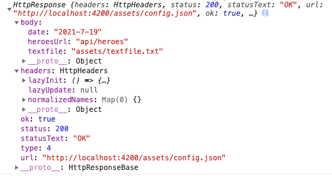

### 从服务器请求数据

#### 介绍

假设我们已经完成了服务器通讯的准备工作，可以开始和服务器进行数据传递。

使用HtpClient.get()，从服务器获取数据。该异步方法会发送一个HTTP请求头，并返回一个observable，她会在收到响应时发出所请求到的数据。返回的类型取决于你调用时传入的observe和responseType参数。

get()方法有两个参数。要获取的端点URL，以及一个可以用来配置请求的选项对象。

```js
options: {
    headers?: HttpHeaders | {[header: string]: string | string[]},
    observe?: 'body' | 'events' | 'response',
    params?: HttpParams|{[param: string]: string | number | boolean | ReadonlyArray<string | number | boolean>},
    reportProgress?: boolean,
    responseType?: 'arraybuffer'|'blob'|'json'|'text',
    withCredentials?: boolean,
  }
```

这些重要的选项包括observe和responseType属性。

- observe选项用于指定要返回的响应内容。
- responseType选项指定返回数据的格式

应用经常会从服务器请求JSON数据。在configService例子中，该应用需要服务器config.json上的一个配置文件来指定资源的URL。

```js
//assets/config.json
content_copy
{
  "heroesUrl": "api/heroes",
  "textFile": "assets/textfile.txt",
  "date": "2020-01-29"
}
```

要获取这类数据，`get()` 调用需要以下几个选项： `{observe: 'body', responseType: 'json'}`。这些是这些选项的默认值，所以下面的例子不会传递 options 对象。后面几节展示了一些额外的选项。

#### 请求输入一个类型的响应

要指定响应对象类型，首先需要定义一个具有必须属性的接口。这里要使用接口而不是类，因为响应对象是普通对象无法自动转换成类的实例。

```js
ng g i interface/config  //命令行创建一个接口文件,会自动生成以下内容的ts文件

//export interface Config {
//
//}
```

```js
//config.ts
export interface Config {
  heroesUrl:string,
  textFile:string,
  date:any
}
```

在组件中引入这个接口并使用

```js
import {Config} from "../../interface/config";
...

  config:Config|undefined;

```

修改后的组件方法

```js
showConfig(){
    this.configService.getConfig()
      .subscribe((data:Config)=> { //注意这里，后便会提到
        this.config = {...data}
        console.log(this.config )
      })
  }
```

要访问接口中定义的属性，必须将从JSON中获得的普通对象显示转换为所需的响应类型。

请注意以下内容和上一个修改后组件方法的区别

```js
showConfig(){
    this.configService.getConfig()
      .subscribe((data)=> { //注意这里，后便会提到
        this.config = {
      		heroesUrl:(data as any).heroesUrl,
  				textFile:(data as any).textFile,
 				date:(data as any).date
        }
        console.log(this.config )
      })
  }
```

#### 读取一个完整的响应体

在前边的例子中，我们请求的时候没有设置任何选项，默认情况下返回了响应体包含的JSON数据。

某些时候服务器会发回一个特殊的响应头或者状态码，来指出某些在应用的工作流程中很重要的条件。

可以使用get()方法的observe选项来告诉HttpClient，请求完整响应体。

```js
 getConfig() {
    return this.http.get<Config>(this.configUrl, {observe: 'response'});
  }
```

返回的全部内容：



类型问题，该响应体会有一个正确类型的body属性。直接替换即可。

```js
showConfig(){
    this.configService.getConfig()
      .subscribe((data)=> {
        this.config = {...data.body}
        console.log(this.config )
        console.log(data)
      })
  }
```

#### 发起JSONP请求（没看懂）

当服务器不支持CORS跨域协议的时候，应用程序可以使用HttpClient跨域发出JSONP请求

### 处理请求错误

#### 获取错误详情

```js
private handleError(error:HttpErrorResponse){
    if(error.status === 0){
      // A client-side or network error occurred. Handle it accordingly.
      console.error('An error occurred:', error.error);
    }else {
      // The backend returned an unsuccessful response code.
      // The response body may contain clues as to what went wrong.
      console.error(
        `Backend returned code ${error.status}, ` +
        `body was: ${error.error}`);
    }
    // Return an observable with a user-facing error message.
    return throwError(
      'Something bad happened; please try again later.');

  }
```

使用一个管道把HttpClient.get()调用返回的所有Observable发送给错误处理器

```js
getConfig() {
    return this.http.get<Config>(this.configUrl, {observe: 'response'})
      .pipe(  //管道
        catchError(this.handleError)
      );
  }
```

#### 重试失败请求

有时候错误是临时性的，只要充实就可能会自动消失。比如在移动端场景中可能会遇到网络连接中断的情况，只要充实一下就能拿到正确的结果。

RxJS库提供了几个重试操作符（operators）。例如

retry()操作符会自动重新订阅一个失败的Observable几次。重新订阅HttpClient方法会导致它重新发送HTTP请求。

```js
getConfig() {
    return this.http.get<Config>(this.configUrl, {observe: 'response'})
      .pipe(  //管道
        retry(3), //重新订阅3次失败的请求
        catchError(this.handleError)
      );
  }
```

### 把数据发送到服务器

#### 发送

除了从服务器获取数据之外，HttpClient还支持其他一些HTTP方法，比如PUT，POST和DELETE，可以用这些方法来修改远程数据。

POST

DELETE

PUT

#### 添加和更新请求头

很多服务器都需要额外的头来执行保存操作。例如，服务器可能需要一个授权令牌，或者需要Content-Type头来显示声明请求体的MIME类型

##### 添加请求头

```js
 getConfig() {
    const httpOptions ={
      headers:new HttpHeaders({ //添加
        'Content-Type':'application/json',
        Authorization:'my-auth-token'
      })
    }
    return this.http.get<Config>(this.configUrl, httpOptions)//使用
      .pipe(  //管道
        retry(3), //重新订阅3次失败的请求
        catchError(this.handleError)
      );
  }
```

##### 更新请求头

```js
httpOptions.headers = httpOptions.headers.set('Authorization':'my-new-auth-token')
```

### 配置HTTP URL参数

使用HttpParams类和params选项在你的HttpRequire中添加URL查询字符串。

首先导入HttpParams类

```js
import {HttpParams} from '@angular/common/http';
```

使用

```js
const options = term ?
   { params: new HttpParams().set('name', term) } : {};
```


