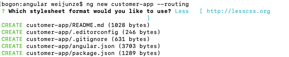
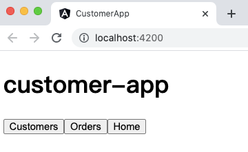
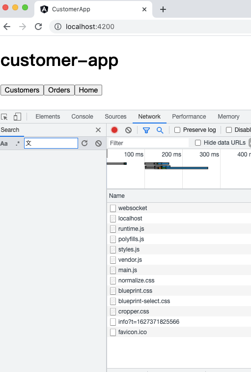
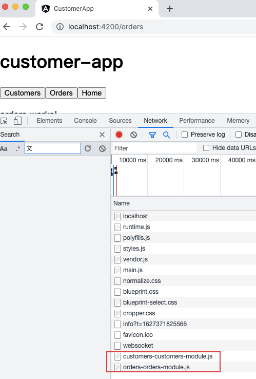

## Angular惰性加载特性模块


默认情况下，NgModule 都是急性加载的，也就是说它会在应用加载时尽快加载，所有模块都是如此，无论是否立即要用。对于带有很多路由的大型应用，考虑使用惰性加载 —— 一种按需加载 NgModule 的模式。惰性加载可以减小初始包的尺寸，从而减少加载时间。

### 配置

要惰性加载 Angular 模块，请在 `AppRoutingModule` `routes` 中使用 `loadChildren` 代替 `component` 进行配置，代码如下。


```js
//AppRoutingModule (excerpt)
content_copyconst routes: Routes = [
  {
    path: 'items',
    loadChildren: () => import('./items/items.module').then(m => m.ItemsModule)
  }
];
```

在惰性加载模块的路由模块中，添加一个指向该组件的路由。

```js
//Routing module for lazy loaded module (excerpt)
content_copyconst routes: Routes = [
  {
    path: '',
    component: ItemsComponent
  }
];
```

还要确保从 `AppModule` 中移除了 `ItemsModule`。

### 过程

#### 1.创建带有路由的项目



创建一个名叫 `customer-app` 的应用，而 `--routing` 标识生成了一个名叫 `app-routing.module.ts` 的文件，它是建立惰性加载的特性模块时所必须的。

#### 2.创建一个带路由的特性模块

接下来，你将需要一个包含路由的目标组件的特性模块。 要创建它，在终端中输入如下命令，其中 `customers` 是特性模块的名称。加载 `customers` 特性模块的路径也是 `customers`，因为它是通过 `--route` 选项指定的：

```bash
ng generate module customers --route customers --module app.module
```

这将创建一个 `customers` 文件夹，在其 `customers.module.ts` 文件中定义了新的可惰性加载模块 `CustomersModule`。该命令会自动在新特性模块中声明 `CustomersComponent`。

因为这个新模块想要惰性加载，所以该命令不会在应用的根模块 `app.module.ts` 中添加对新特性模块的引用。 相反，它将声明的路由 `customers` 添加到以 `--module` 选项指定的模块中声明的 `routes` 数组中。


```js
//src/app/app-routing.module.ts
content_copyconst routes: Routes = [
  {
    path: 'customers',
    loadChildren: () => import('./customers/customers.module').then(m => m.CustomersModule)
  }
];
```

注意，惰性加载语法使用 `loadChildren`，其后是一个使用浏览器内置的 `import('...')` 语法进行动态导入的函数。 其导入路径是到当前模块的相对路径。

#### 3.添加另一个特性模块

使用同样的命令创建第二个带路由的惰性加载特性模块及其桩组件。

```bash
ng generate module orders --route orders --module app.module
```

这将创建一个名为 `orders` 的新文件夹，其中包含 `OrdersModule` 和 `OrdersRoutingModule` 以及新的 `OrdersComponent` 源文件。 使用 `--route` 选项指定的 `orders` 路由，用惰性加载语法添加到了 `app-routing.module.ts` 文件内的 `routes` 数组中。

src/app/app-routing.module.ts

```
content_copyconst routes: Routes = [
  {
    path: 'customers',
    loadChildren: () => import('./customers/customers.module').then(m => m.CustomersModule)
  },
  {
    path: 'orders',
    loadChildren: () => import('./orders/orders.module').then(m => m.OrdersModule)
  }
];
```

#### 4.建立 UI

虽然你也可以在地址栏中输入 URL，不过导航 UI 会更好用，也更常见。 把 `app.component.html` 中的占位脚本替换成一个自定义的导航，以便你在浏览器中能轻松地在模块之间导航。


```js
//app.component.html
content_copy<h1>
  {{title}}
</h1>

<button routerLink="/customers">Customers</button>
<button routerLink="/orders">Orders</button>
<button routerLink="">Home</button>

<router-outlet></router-outlet>
```

要想在浏览器中看到你的应用，就在终端窗口中输入下列命令：

```bash
ng serve
```

然后，跳转到 `localhost:4200`，这时你应该看到 "customer-app" 和三个按钮。



#### 5.导入与路由配置

CLI 会将每个特性模块自动添加到应用级的路由映射表中。 通过添加默认路由来最终完成这些步骤。 在 `app-routing.module.ts` 文件中，使用如下命令更新 `routes` 数组：


```js
//src/app/app-routing.module.ts
content_copyconst routes: Routes = [
  {
    path: 'customers',
    loadChildren: () => import('./customers/customers.module').then(m => m.CustomersModule)
  },
  {
    path: 'orders',
    loadChildren: () => import('./orders/orders.module').then(m => m.OrdersModule)
  },
  {
    path: '',
    redirectTo: '',
    pathMatch: 'full'
  }
];
```

前两个路径是到 `CustomersModule` 和 `OrdersModule` 的路由。 最后一个条目则定义了默认路由。空路径匹配所有不匹配先前路径的内容。

#### 6.特性模块内部

接下来，仔细看看 `customers.module.ts` 文件。如果你使用的是 CLI，并按照此页面中的步骤进行操作，则无需在此处执行任何操作。

src/app/customers/customers.module.ts

```js
import { NgModule } from '@angular/core';
import { CommonModule } from '@angular/common';
import { CustomersRoutingModule } from './customers-routing.module';
import { CustomersComponent } from './customers.component';

@NgModule({
  imports: [
    CommonModule,
    CustomersRoutingModule
  ],
  declarations: [CustomersComponent]
})
export class CustomersModule { }
```

`customers.module.ts` 文件导入了`customers-routing.module.ts` 和 `customers.component.ts` 文件。

`@NgModule` 的 `imports` 数组中列出了 `CustomersRoutingModule`，让 `CustomersModule` 可以访问它自己的路由模块。

`CustomersComponent` 位于 `declarations` 数组中，这意味着 `CustomersComponent` 属于 `CustomersModule`。

然后，`app-routing.module.ts` 会使用 JavaScript 的动态导入功能来导入特性模块 `customers.module.ts`。

专属于特性模块的路由定义文件 `customers-routing.module.ts` 将导入在 `customers.component.ts` 文件中定义的自有特性组件，以及其它 JavaScript 导入语句。然后将空路径映射到 `CustomersComponent`。

src/app/customers/customers-routing.module.ts

```js
import { NgModule } from '@angular/core';
import { Routes, RouterModule } from '@angular/router';

import { CustomersComponent } from './customers.component';


const routes: Routes = [
  {
    path: '',
    component: CustomersComponent
  }
];

@NgModule({
  imports: [RouterModule.forChild(routes)],
  exports: [RouterModule]
})
export class CustomersRoutingModule { }
```

这里的 `path` 设置为空字符串，因为 `AppRoutingModule` 中的路径已经设置为 `customers`，因此，`CustomersRoutingModule` 中的此路由已经位于 `customers` 这个上下文中。此路由模块中的每个路由都是其子路由。

另一个特性模块中路由模块的配置也类似。

src/app/orders/orders-routing.module.ts (excerpt)

```js
import { OrdersComponent } from './orders.component';

const routes: Routes = [
  {
    path: '',
    component: OrdersComponent
  }
];
```

#### 7.确认它能正常工作（懒加载）

打开http://localhost:4200

可以看到下面，network中并未请求Customers和Orders组件相关的文件



分别点击按钮，显示组件

发现有相关文件加载，实现懒加载。



### `forRoot()` 与 `forChild()`

可能注意到，CLI 会把 `RouterModule.forRoot(routes)` 添加到 `AppRoutingModule` 的 `imports` 数组中。 这会让 Angular 知道 `AppRoutingModule` 是一个路由模块，而 `forRoot()` 表示这是一个根路由模块。 它会配置你传入的所有路由、让你能访问路由器指令并注册 `Router`。 `forRoot()` 在应用中只应该使用一次，也就是这个 `AppRoutingModule` 中。

CLI 还会把 `RouterModule.forChild(routes)` 添加到各个特性模块中。这种方式下 Angular 就会知道这个路由列表只负责提供额外的路由并且其设计意图是作为特性模块使用。你可以在多个模块中使用 `forChild()`。

`forRoot()` 方法为路由器管理*全局性的*注入器配置。 `forChild()` 方法中没有注入器配置，只有像 `RouterOutlet` 和 `RouterLink` 这样的指令。

## 对惰性加载模块进行故障排除

惰性加载模块时常见的错误之一，就是在应用程序中的多个位置导入通用模块。你可以通过首先使用 Angular CLI 生成模块并包括 `--route route-name` 参数来测试这种情况，其中 `route-name` 是模块的名称。接下来，生成不带 `--route` 参数的模块。如果你用了`--route` 参数，Angular CLI 就会生成错误，但如果不使用它便可以正确运行，则可能是在多个位置导入了相同的模块。

请记住，许多常见的 Angular 模块都应该导入应用的基础模块中。