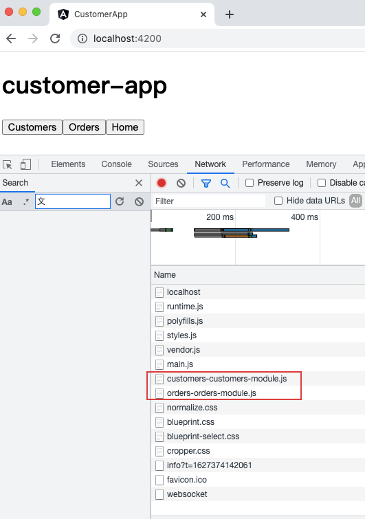

## 预加载

预加载通过在后台加载部分应用来改进用户体验。你可以预加载模块或组件数据。

#### 1.预加载模块

预加载模块通过在后台加载部分应用来改善用户体验，这样用户在激活路由时就无需等待下载这些元素。

要启用所有惰性加载模块的预加载，请从 Angular 的 `router` 导入 `PreloadAllModules` 令牌。

AppRoutingModule (excerpt)

```
content_copyimport { PreloadAllModules } from '@angular/router';
```

还是在 `AppRoutingModule` 中，通过 `forRoot()` 指定你的预加载策略。

AppRoutingModule (excerpt)

```
content_copyRouterModule.forRoot(
  appRoutes,
  {
    preloadingStrategy: PreloadAllModules
  }
)
```

刷新之后，加载了组件文件。



#### 2.预加载组件数据

要预加载组件数据，你可以使用 `resolver` 守卫。解析器通过阻止页面加载来改进用户体验，直到显示页面时的全部必要数据都可用。

##### 解析器

创建一个解析器服务。通过 CLI，生成服务的命令如下：

```sh
ng generate service 
```

在你的服务中，导入下列路由器成员，实现 `Resolve` 接口，并注入到 `Router` 服务中：

Resolver service (excerpt)

```js
import { Resolve } from '@angular/router';

...

export class CrisisDetailResolverService implements Resolve<> {
  resolve(route: ActivatedRouteSnapshot, state: RouterStateSnapshot): Observable<> {
    // your logic goes here
  }
}
```

把这个解析器导入此模块的路由模块。

Feature module's routing module (excerpt)

```js
import { YourResolverService }    from './your-resolver.service';
```

在组件的 `route` 配置中添加一个 `resolve` 对象。

Feature module's routing module (excerpt)

```
content_copy{
  path: '/your-path',
  component: YourComponent,
  resolve: {
    crisis: YourResolverService
  }
}
```

在此组件中，使用一个 `Observable` 来从 `ActivatedRoute` 获取数据。

Component (excerpt)

```js
content_copyngOnInit() {
  this.route.data
    .subscribe((your-parameters) => {
      // your data-specific code goes here
    });
}
```

