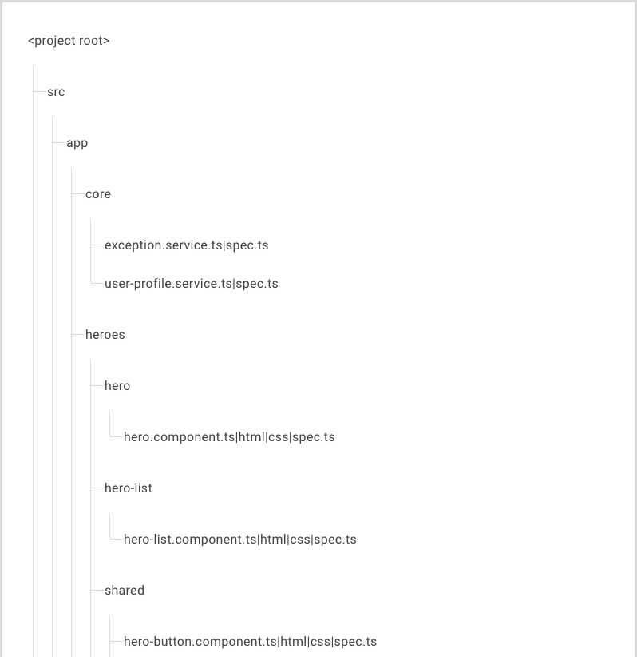
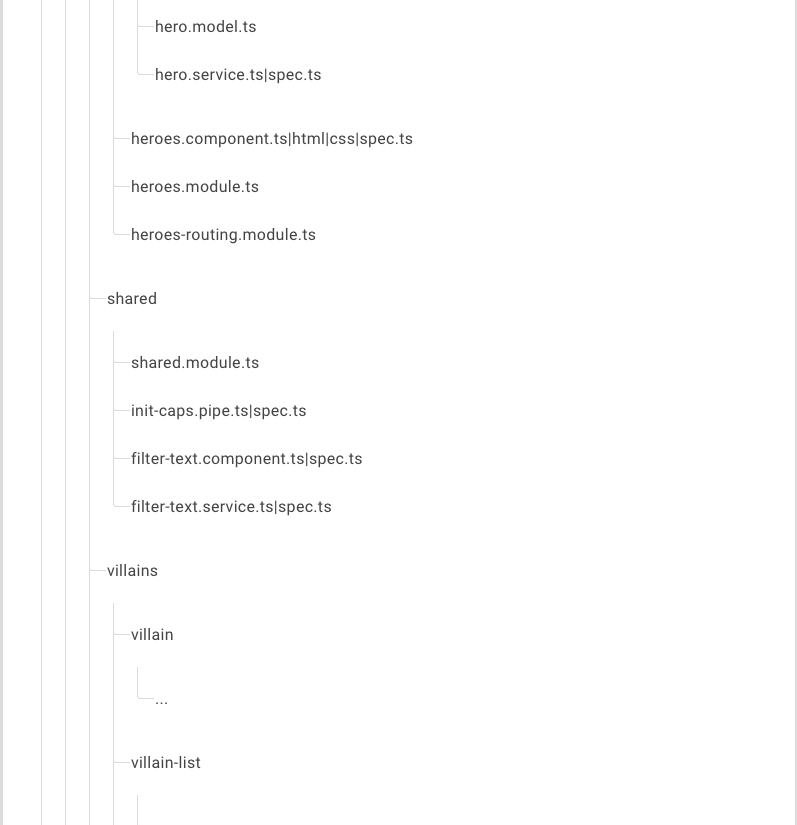
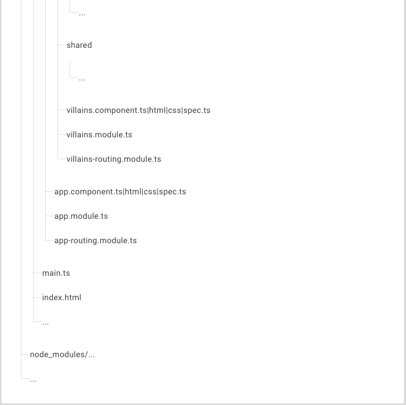

参考了一些完整的angular项目之后，发现很多种目录结构，它们适用于不同的应用项目。为了项目管理以及命名规范，查看angular文档中的风格指南模块，以此作为指导。

### 单一原则

单个文件实现单一功能。

定义简单函数，不超过75行。

### 命名规则

#### 总体原则

1. 先描述组件特性，再描述它的类型的模式并使用惯用的后缀来描述类型。
2. 遵循同一个模式来描述符号的特性和类型。推荐的模式为 `feature.type.ts`。
3. 使用大写驼峰命名法来命名类。
4. 匹配符号名与它所在的文件名。

#### 文件名

1. 在符号名后面追加约定的类型后缀（例如 `Component`、`Directive`、`Module`、`Pipe`、`Service`）。
2. 在文件名后面追加约定的类型后缀（例如 `.component.ts`、`.directive.ts`、`.module.ts`、`.pipe.ts`、`.service.ts`）。

#### 服务名

为服务的类名加上 `Service` 后缀。 例如，获取数据或英雄列表的服务应该命名为 `DataService` 或 `HeroService`

#### 组件名

使用带连字符的小写元素选择器值（例如 `admin-users`）。

为组件选择器添加自定义前缀。 例如，`toh` 前缀表示 **T**our **o**f **H**eroes（英雄之旅），而前缀 `admin 表示管理特性区。

#### 指令选择器

小驼峰形式拼写非元素选择器，除非该选择器用于匹配原生 HTML 属性。

#### 管道

为所有管道使用一致的命名约定，用它们的特性来命名。 管道类名应该使用 [UpperCamelCase](https://angular.cn/guide/glossary#case-types)（类名的通用约定），而相应的 `name` 字符串应该使用 *lowerCamelCase*。 `name` 字符串中不应该使用中线（“中线格式”或“烤串格式”）。

#### 目录

#### 组件和服务

在组件中只包含与视图相关的逻辑。所有其它逻辑都应该放到服务中。

把可复用的逻辑放到服务中，保持组件简单，聚焦于它们预期目的。

