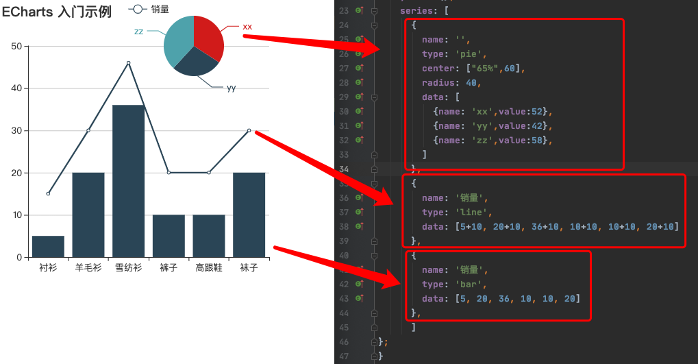
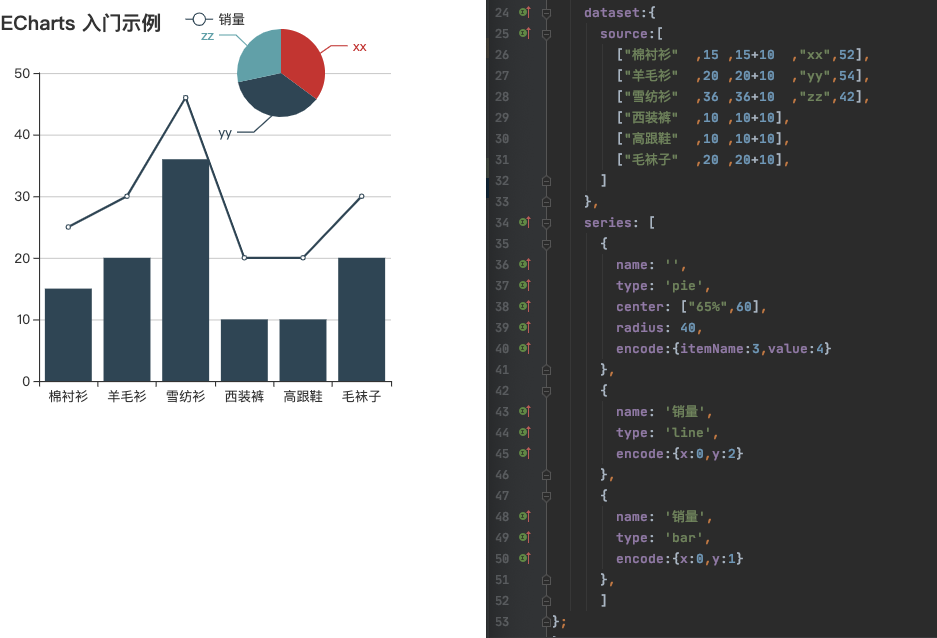
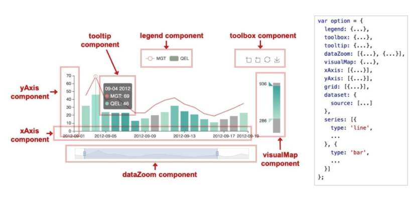
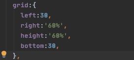
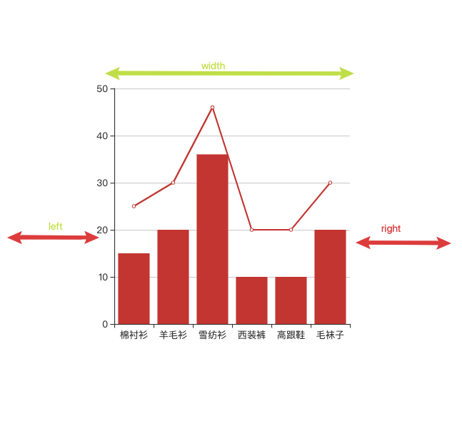
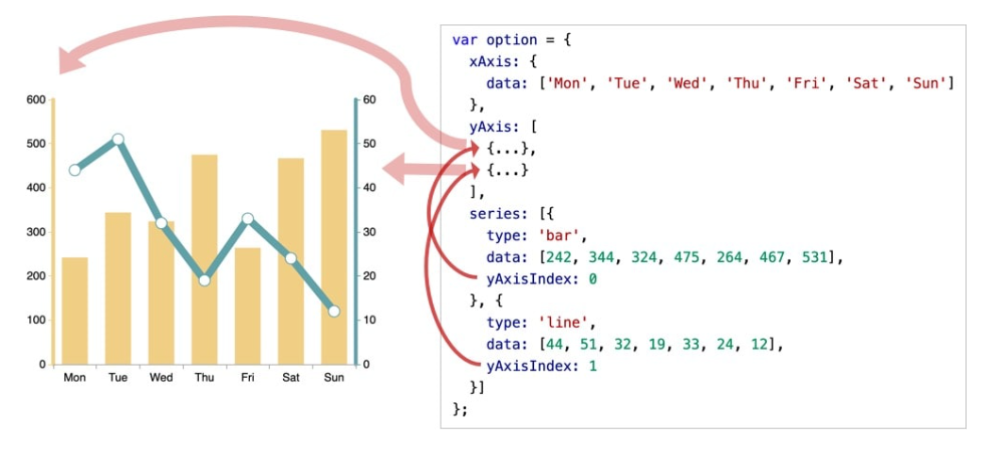
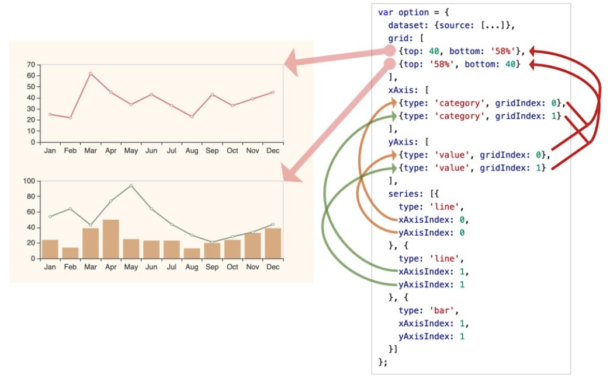

### echarts实例

1. 一个网页中可以创建多个echarts实例（由dom节点来承载）
2. 每个echarts实例中可以创建多个图表和坐标系等等（用option来描述）
3. 一个DOM节点作为echarts的渲染容器，每个echarts实例独占一个DOM节点

### 系列（series）

1. 系列指一组数值以及他们映射成的图，在echarts中系列（series）不仅表示数据，也表示数据映射成的图。
2. 一个系列包含的要素至少有：一组数值、图表类型（series.type）、其他关于这些数据如何映射成图的参数。

#### 图表类型（series.type）

1. line折线图
2. bar柱状图
3. pie饼状图
4. scatter散点图
5. graph关系图
6. tree树图

另一种数据配置方式，数据从dataset中获取

### 组件

1. 在系列之内，echarts中的各种内容，被抽象为“组件”

2. 组件包括：

   1. xAxis：直角坐标系X轴
   2. yAxis：直角坐标系Y轴
   3. grid：直角坐标系底板
   4. angleAxis：极坐标系角度轴
   5. radiusAxis：极坐标系半径轴
   6. polar：极坐标系底板
   7. geo：地理坐标系
   8. dataZoom：数据区缩放组件
   9. visualMap：视觉映射组件
   10. tooltip：提示框组件
   11. toolbox：工具栏组件
   12. series：系列

   

### 用option描述图表

使用option来描述其对图表的各种需求：数据、图标样式、形状、含有组件、组件功能等

option：数据、数据如何映射成图形、交互行为

### 组件的定位

不同的组件系列，经常有不同的定位方式。

#### 「类css的绝对定位」

对数组件和系列，都能够基于top/right/down/left/width/height绝对定位，这种绝对定位的方式，类似于css的绝对定位（position：absolute）。绝对定位基于的是echarts的容器DOM节点

以grid组件（直角坐标系的底板）为例，设置left，right，height，bottom达到效果。

其中，left right width是一组（横向），top height bottom是另一组（纵向）。这两组没有什么关联。

每组中至多设置两项就可以了，第三项会被计算出来。

#### 「中心半径定位」

少数圆形的组件或者系列，可以使用“中心半径定位”。例如pie（饼图）、sunburst（旭日图）、polar（极坐标系）

中心半径定位，往往依据center、radius来决定位置。

#### 「其他定位」

少数组件和系列可能有自己的定位方式，在他们的文档中会有说明。

### 坐标系

#### 引入

line（折线图）、bar（柱状图）、scatter（散点图）、heatmap（热力图）等，需要运行在“坐标系”上。

坐标系用于布局这些图，并且显示数据的刻度等。

echarts支持的坐标系：直角坐标系、极坐标系、地理坐标系、单轴坐标系、日历坐标系等。

像饼图、树图等，不需要依赖坐标系显示，可以独立存在。

#### 一个坐标系可能由多个组件协作而成。

##### X、Y、grid

最常见的直角坐标系中，包括有三种组件，XAxis（直角坐标系x轴）、YAxis（y轴）和grid（直角坐标系底板）。他们自动引用并组织，共同工作。

##### X、Y1、Y2  grid

##### 多个grid

