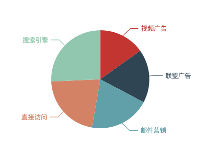
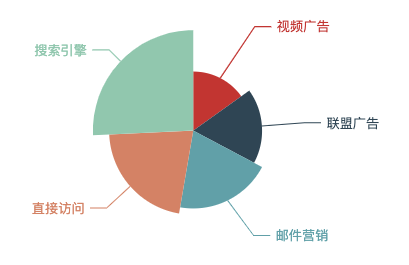
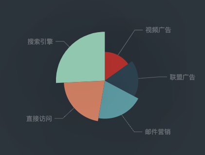
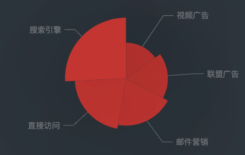
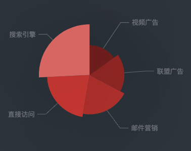

### 南丁格尔图(饼状图)

#### 饼状图

```ts
chartOptions: EChartOption = {
    series: [
      {
        name: '访问来源',
        type: 'pie',
        radius: "55%",
        data: [
          {value:235, name:"视频广告"},
          {value:274, name:"联盟广告"},
          {value:310, name:"邮件营销"},
          {value:335, name:"直接访问"},
          {value:400, name:"搜索引擎"},

        ],
      },

    ]
  };
```



#### 南丁格尔图

通过设置将饼状图设置为南丁格尔图

```
roseType:'angle'
```



#### 阴影配置

echarts中有一些通用样式，如阴影、透明度、颜色、边框颜色、边框宽度等。这些样式一般都会在系列的itemStyle里设置。

例如阴影的样式可以用过下面几个配置项设置。

```ts
itemStyle: {
    // 阴影的大小
    shadowBlur: 200,
    // 阴影水平方向上的偏移
    shadowOffsetX: 0,
    // 阴影垂直方向上的偏移
    shadowOffsetY: 0,
    // 阴影颜色
    shadowColor: 'rgba(0, 0, 0, 0.5)'
}
```

#### 鼠标高亮

itemStyle的emphasis是鼠标 hover 时候的高亮样式。这个示例里是正常的样式下加阴影，但是可能更多的时候是 hover 的时候通过阴影突出。

```ts
itemStyle: {
    emphasis: {
        shadowBlur: 200,
        shadowColor: 'rgba(0, 0, 0, 0.5)'
    }
}
```

#### 深色背景和浅色标签

深色主题需要修改背景颜色和文本颜色

背景色是全局的，所以直接在option下设置backgroundcolor

```ts
// 背景颜色
    backgroundColor: '#2c343c',
    //  文字颜色样式
    textStyle: {
      color: 'rgba(255, 255, 255, 0.3)'
    },
    //引导线颜色
    labelLine: {
      lineStyle: {
        color: 'rgba(255, 255, 255, 0.3)'
      }
    }
```



#### 设置扇形的颜色

在itemStyle中设置颜色

```ts
itemStyle: {
    // 设置扇形的颜色
    color: '#c23531',
    shadowBlur: 200,
    shadowColor: 'rgba(0, 0, 0, 0.5)'
}
```



echarts中每个扇形颜色可以通过分别设置data下的数据项实现

```ts
data: [{
    value:400,
    name:'搜索引擎',
    itemStyle: {
        color: '#c23531'
    }
}, ...]
```

只有明暗度的变化则有一种更方便的方式

通过visualMap组件将数值的大小映射到明暗度。

```ts
visualMap: {
    // 不显示 visualMap 组件，只用于明暗度的映射
    show: false,
    // 映射的最小值为 80
    min: 80,
    // 映射的最大值为 600
    max: 600,
    inRange: {
        // 明暗度的范围是 0 到 1
        colorLightness: [0, 1]
    }
}
```

