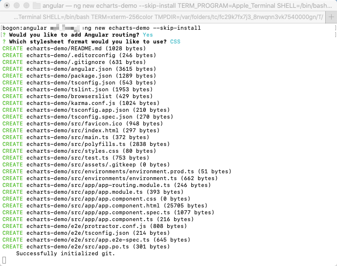
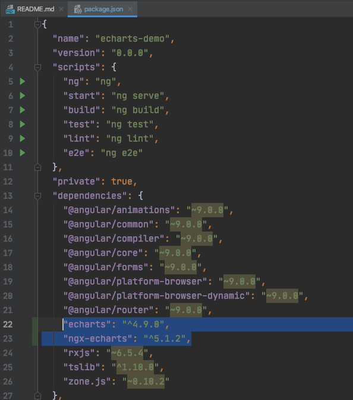
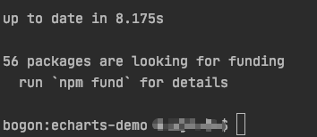
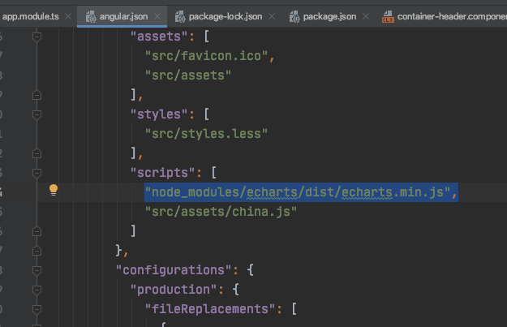
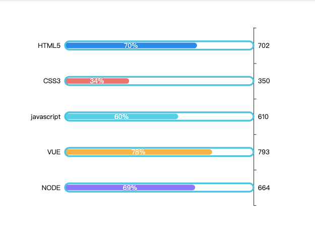

### 创建angular项目

```
cd 你的文件路径
ng new echarts-demo --skip-install //只创建项目并不下载 node_modules（速度快）
```



### 打开项目引入所需文件

我这里用到的是webstorm

找到package.json文件

将下方代码复制进去

```
"echarts": "^4.9.0",
"ngx-echarts": "^5.1.2",
```



​	然后npm安装 node_modules

```
在项目目录下控制台运行
npm i
```

​	这两步就是将所用到的echarts包和ngx-ecahrts包引入到项目中



显示安装成功

### 增加路径

找到angular.json文件

```
在第一个script数组里添加
"node_modules/echarts/dist/echarts.min.js",
下边那个是使用地图的时候需要的文件，现在暂时还不需要
```



### 在app.module引入

```js
import { BrowserModule } from '@angular/platform-browser';
import { NgModule } from '@angular/core';

import { AppRoutingModule } from './app-routing.module';
import { AppComponent } from './app.component';


import { NgxEchartsModule } from 'ngx-echarts';//引入部分

@NgModule({
  declarations: [
    AppComponent
  ],
  imports: [
    BrowserModule,
    AppRoutingModule,
     
     //引入部分
    NgxEchartsModule.forRoot({ //引入部分
      echarts: () => import('echarts') //引入部分
    }), //引入部分
     
  ],
  providers: [],
  bootstrap: [AppComponent]
})
export class AppModule { }

```

### 安装（运行时发生错误）

```
 ERROR in The target entry-point "ngx-echarts" has missing dependencies:
- resize-observer-polyfill
```

解决方法

```
npm install resize-observer-polyfill --save-dev
```

### 使用

在app.component.html中加入

```HTML
<div style="height: 500px;width:500px">
  <div echarts [options]="chartOptions"></div>
</div>

```

app.component.ts中加入

```js
import { Component } from '@angular/core';
import { EChartOption } from 'echarts';

@Component({
  selector: 'app-root',
  templateUrl: './app.component.html',
  styleUrls: ['./app.component.css']
})
export class AppComponent {
  title = 'echarts-demo';

  data = [
    {
      value:70,
      itemStyle:{
        color:"#1089E7"
      }
    },
    {
      value:34,
      itemStyle:{
        color:"#F57474"
      }
    },
    {
      value:60,
      itemStyle:{
        color:"#56D0E3"
      }
    },
    {
      value:78,
      itemStyle:{
        color:"#F8B448"
      }
    },
    {
      value:69,
      itemStyle:{
        color:"#8B78F6"
      }
    },
  ];
  titlename = ["HTML5", "CSS3", "javascript", "VUE", "NODE"];
  valdata = [702, 350, 610, 793, 664];
  chartOptions:EChartOption ={
    //图标位置
    grid: {
      top: "10%",
      left: "22%",
      bottom: "10%"
    },
    xAxis: {
      show: false
    },
    yAxis: [
      {
        show: true,
        data: this.titlename,
        inverse: true,
        axisLine: {
          show: false
        },
        splitLine: {
          show: false
        },
        axisTick: {
          show: false
        },
        axisLabel: {
          color: "black",

          rich: {
            lg: {
              backgroundColor: "#339911",
              color: "#fff",
              borderRadius: 15,
              // padding: 5,
              align: "center",
              width: 15,
              height: 15
            }
          }
        }
      },
      {
        show: true,
        inverse: true,
        data: this.valdata,
        axisLabel: {
          textStyle: {
            fontSize: 12,
            color: "black"
          }
        }
      }
    ],
    series: [
      {
        name: "条",
        type: "bar",
        yAxisIndex: 0,
        data: this.data,
        barCategoryGap: 50,
        barWidth: 10,
        itemStyle: {
          normal: {
            barBorderRadius: 20,

          }
        },
        label: {
          normal: {
            show: true,
            position: "inside",
            formatter: "{c}%"
          }
        }
      },
      {
        name: "框",
        type: "bar",
        yAxisIndex: 1,
        barCategoryGap: 50,
        data: [100, 100, 100, 100, 100],
        barWidth: 15,
        itemStyle: {
          normal: {
            color: "none",
            borderColor: "#00c1de",
            borderWidth: 3,
            barBorderRadius: 15
          }
        }
      }
    ]
  };
}

```

最后效果如下



