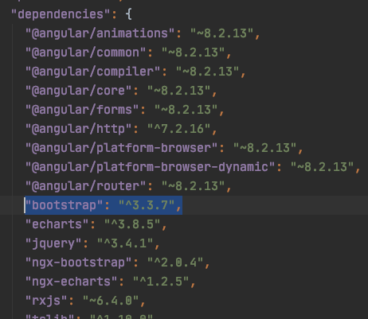
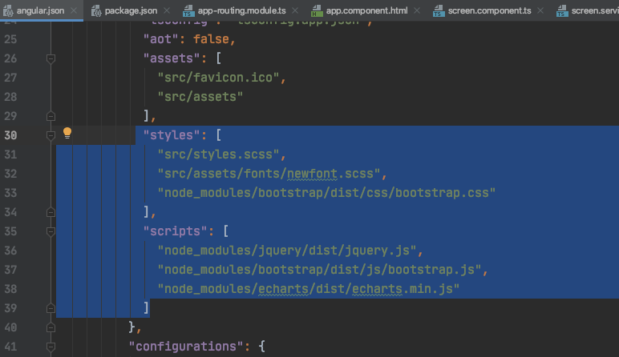
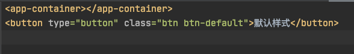

#### 1.引入bootstrap

```bash
npm install bootstrap@3
```

或者直接在package.json 中加入=="bootstrap": "^3.3.7",==



然后在运行

```
npm i
```

#### 2.在angular.json 中添加如下内容

```json
"styles": [
              "src/styles.scss",
              "src/assets/fonts/newfont.scss",
				  "node_modules/bootstrap/dist/css/bootstrap.css"
            ],
 "scripts": [
              "node_modules/jquery/dist/jquery.js",
 				  "node_modules/bootstrap/dist/js/bootstrap.js",
     			  "node_modules/echarts/dist/echarts.min.js"
            ]
```



#### 使用

在样式中直接添加类名（类名可以在bootstrap官网查看）

bootstrap官网：https://v3.bootcss.com/css/#grid

```
<button type="button" class="btn btn-default">默认样式</button>
```

