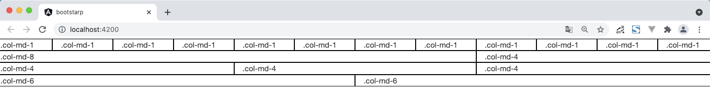

### 栅格布局参数

|                       | 超小屏幕 手机 (<768px)     | 小屏幕 平板 (≥768px)                                | 中等屏幕 桌面显示器 (≥992px)                        | 大屏幕 大桌面显示器 (≥1200px)                       |
| :-------------------- | :------------------------- | :-------------------------------------------------- | :-------------------------------------------------- | :-------------------------------------------------- |
| 栅格系统行为          | 总是水平排列               | 开始是堆叠在一起的，当大于这些阈值时将变为水平排列C | 开始是堆叠在一起的，当大于这些阈值时将变为水平排列C | 开始是堆叠在一起的，当大于这些阈值时将变为水平排列C |
| `.container` 最大宽度 | None （自动）              | 750px                                               | 970px                                               | 1170px                                              |
| 类前缀                | `.col-xs-`                 | `.col-sm-`                                          | `.col-md-`                                          | `.col-lg-`                                          |
| 列（column）数        | 12                         | 12                                                  | 12                                                  | 12                                                  |
| 最大列（column）宽    | 自动                       | ~62px                                               | ~81px                                               | ~97px                                               |
| 槽（gutter）宽        | 30px （每列左右均有 15px） | 30px （每列左右均有 15px）                          | 30px （每列左右均有 15px）                          | 30px （每列左右均有 15px）                          |
| 可嵌套                | 是                         | 是                                                  | 是                                                  | 是                                                  |
| 偏移（Offsets）       | 是                         | 是                                                  | 是                                                  | 是                                                  |
| 列排序                | 是                         | 是                                                  | 是                                                  | 是                                                  |

### 栅格布局简单理解

bootstrap的栅格布局将一行分成12份，即一行有12列。

使用相应的类前缀获取样式。

### 简单用例

```html
<!--class :border 是为了显示明显特意加上的，并不是bootstrap内容  -->

<div class="row">
  <div class="border col-md-1">.col-md-1</div>
  <div class="border col-md-1">.col-md-1</div>
  <div class="border col-md-1">.col-md-1</div>
  <div class="border col-md-1">.col-md-1</div>
  <div class="border col-md-1">.col-md-1</div>
  <div class="border col-md-1">.col-md-1</div>
  <div class="border col-md-1">.col-md-1</div>
  <div class="border col-md-1">.col-md-1</div>
  <div class="border col-md-1">.col-md-1</div>
  <div class="border col-md-1">.col-md-1</div>
  <div class="border col-md-1">.col-md-1</div>
  <div class="border col-md-1">.col-md-1</div>
</div>
<div class="row">
  <div class="border col-md-8">.col-md-8</div>
  <div class="border col-md-4">.col-md-4</div>
</div>
<div class="row">
  <div class="border col-md-4">.col-md-4</div>
  <div class="border col-md-4">.col-md-4</div>
  <div class="border col-md-4">.col-md-4</div>
</div>
<div class="row">
  <div class="border col-md-6">.col-md-6</div>
  <div class="border col-md-6">.col-md-6</div>
</div>

```



