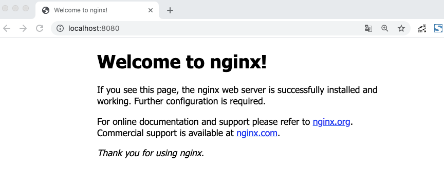
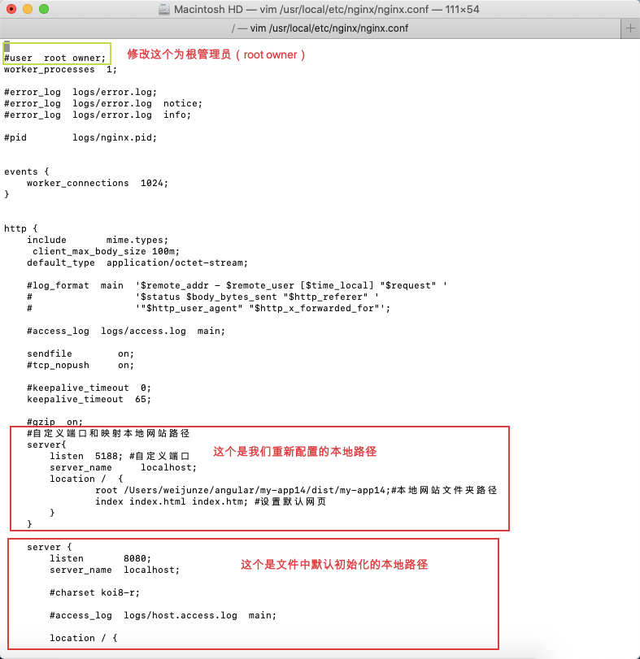

### 下载安装

根据网上教程可以成功安装（PS：打算学习nginx的时候发现自己的Mac上已经存在了新版的nginx，神奇）

### 使用

打开nginx之后，进入

```
http://localhost:8080  会出现以下内容
```



说明安装启动成功。

然后打开终端，准备编辑nginx的配置文件：

```
vim /usr/local/etc/nginx/nginx.conf //这个路径就是安装时候的默认路径，这个文件只能在终端中打开
进入nginx.conf页面后，按 “i" 键进入编辑状态
修改完成后，按esc键退出编辑状态，输入  :wq  保存并退出nginx.conf页面
```



重新启动nginx

```
sudo nginx -s reload
```

如果没有提示有错误的话，就是重启成功，如果提示有错误就根据错误提示进行修改（出现语法错误）

然后访问http://localhost:5188/就会跳转到我们重新配置的路径页面

```
location / {
          root /www/wwwroot/www.forus616.cn/contacts;
          index index.html index.htm;
        }
```

```
        location /apis {
    rewrite  ^.+apis/?(.*)$ /$1 break;
    include  uwsgi_params;
       proxy_pass   http://localhost:1894;
       }
```
