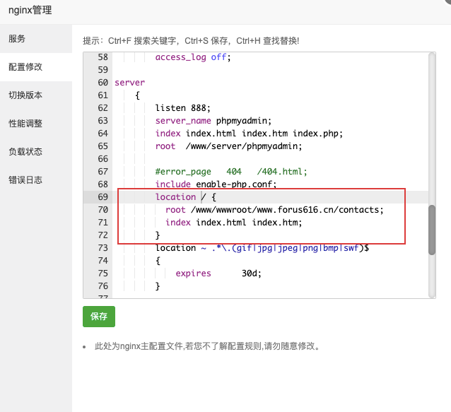
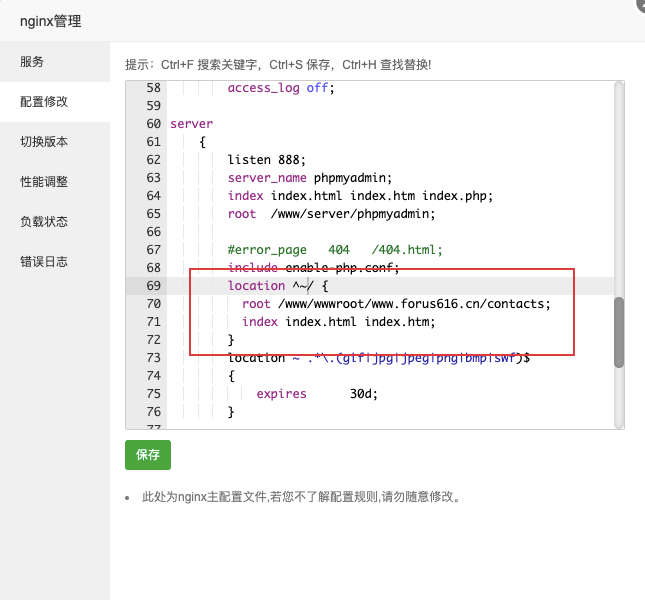

在面板上直接下载nginx。

打开并查看配置项。

发现他的默认端口是888（因为网站的80端口已经被使用）。添加location进行代理使用。



发现所有的静态资源无法访问（这里就不演示了，因为浏览器缓存，我即使重新配置也可以看到页面-_-）



下面是我找到的解决方法，还是对nginx的配置项不了解，导致出现了上边的问题。

问题定位在nginx的路由配置上。具体是，出于nginx的路由路径【/】在路由匹配成功之后还会继续往下寻找匹配规则（在上面的配置中找不到）以及在路径中末尾【/】的原因，静态资源的请求地址无法被nginx有效识别，直接导致反向代理失败了，所有的二级地址都没有被代理成功。

解决方法则是修改路由路径的匹配规则（加上 往下匹配的通配符【^~】）即可：

```
location ^~ /yanggb/ {
    proxy_pass http://127.0.0.1:2333/;
}
```

这样，nginx就能正常代理静态资源的访问，不会出现404请求报错了。