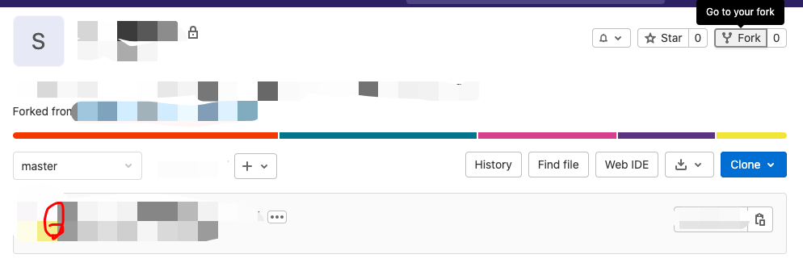
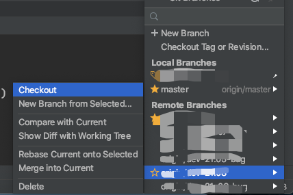

在matlab上将团队项目fork到自己的目录下

然后会将整个项目包括所有分支都fork到自己的目录下。继续将整个项目clone到本地

首先要在本地目标目录下git init 创建git文件

然后再目录下执行git clone <gitlab项目地址>

项目就会完整的克隆下来

然后再本地使用IDE打开，进入自己的分支

进行npm install安装依赖

这就完成了从gitlab获取项目的过程

