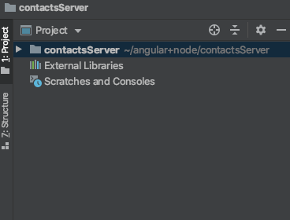
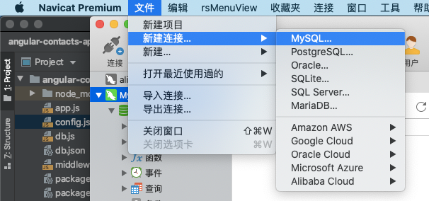
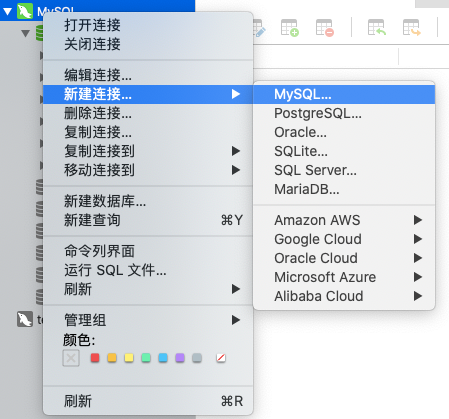
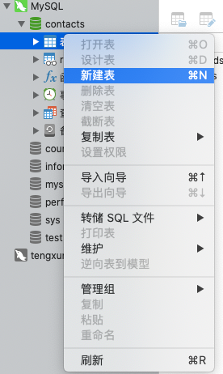
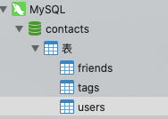

### 初始化nodeJS项目

创建一个空的新文件夹，并用编辑器打开



打开终端，在项目目录下输入

```js
npm init 
//初始化 package.json文件,一直回车，然后yes。
```

然后项目初始化就结束了，接下来根据接口文档进行编辑。

### 数据库配置

打开本地数据库->新建数据库->写入基础数据



因为我已经创建了本地数据库，直接在本地数据库创建本次需要使用的连接。



右击新建的连接中的表，点击新建表结构。这就是一个完整的数据库了，接下来就写数据就好了。



我用了Navicat可视化进行的初始化，比较方便。数据库配置的时候，可能遇到一些问题，百度解决。

我创建了用户表、联系人表和标签表，由于时间关系我们并没有进行数据库设计，只是提供登录功能，然后将所有的表内容共享。



### 根据接口文档编写接口

#### 用户模块

##### 用户注册

- POST
- `/users`

| 参数     | 是否必须 | 说明         |
| -------- | -------- | ------------ |
| email    | 是       | 邮箱，用户名 |
| password | 是       | 密码         |


##### 用户登陆

- 请求方法：POST
- 请求路径：`/session`

| 参数     | 是否必须 | 说明         |
| -------- | -------- | ------------ |
| email    | 是       | 邮箱，用户名 |
| password | 是       | 密码         |

##### 用户退出

- 请求方法：DELETE
- 请求路径：`/session`

#### 联系人分类

##### 获取分类列表

- 请求方法：`GET`
- 请求路径：`/tags`

##### 新增分类

- 请求方法：`POST`
- 请求路径：`/tags`

##### 编辑分类

- 请求方法：`POST`
- 请求路径：`/tags/:id`

##### 删除分类

- 请求方法：`DELETE`
- 请求路径：`/tags/:id`

---

#### 联系人

##### 联系人列表

- 请求方法：`GET`
- 请求路径：`/contacts`

##### 新增分类

- 请求方法：`POST`
- 请求路径：`/contacts`

##### 编辑分类

- 请求方法：`PATCH`
- 请求路径：`/contacts/:id`

##### 删除分类

- 请求方法：`DELETE`
- 请求路径：`/contacts/:id`

Request header field x-access-token is not allowed by Access-Control-Allow-Headers in preflight response.
