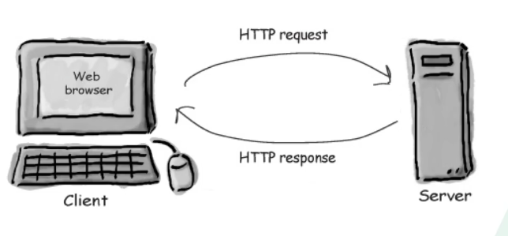

### HTTP协议的简介

#### 1.什么是协议

协议，网络协议的简称，网络协议是通信计算机双方必须共同遵从的一组约定。如怎么建立连接、怎么相互识别等。只有遵守这个约定，计算机才能正常通过网络收发消息。

#### 2.什么是http

- 获取服务器（其他电脑的一些文件）
- 简单快速：客户端向服务器请求服务的时候，只需要传送请求方法和路径
- 灵活，无连接
- GET
- POST

笔者一直听说http是属于“应用层的协议”，而且是基于TCP/IP协议的。这个不难理解，如果你上大学时候学过“计算机网络”的课程，就一定知 道OSI七层参考协议（我当时是死记硬背的）。如果你接触过socket网络编程，就应该明白TCP和UDP这两种使用广泛的通信协议（建立连接、三次握 手等等，当然，这不是本文讨论的重点）。如图：

**既然TCP/UDP是广泛使用的网络通信协议，那为啥有多出个http协议来呢？**

笔者曾自己动手写过一个简单的web服务器处理软件，根据我的推断（不一定准确）。UDP协议具有不可靠性和不安全性，显然这很难满足web应用的需要。

而TCP协议是基于连接和三次握手的，虽然具有可靠性，但人具有一定的缺陷。但试想一下，普通的C/S架构软件，顶多上千个Client同时连接，而B/S架构的网站，十万人同时在线也是很平常的事儿。如果十万个客户端和服务器一直保持连接状态，那服务器如何满足承载呢？

这就衍生出了http协议。基于TCP的可靠性连接。通俗点说，就是在请求之后，服务器端立即关闭连接、释放资源。这样既保证了资源可用，也吸取了TCP的可靠性的优点。

http请求头

> - Connection：浏览器想要优先使用的连接类型
> - Cache-control:控制缓存的行为
> - Date：创建报文的时间
> - Accept：能正确接收的媒体类型：application/json、text/plain
> - Accept-charset:用户支持的字符集
> - Authorization：客户端认证信息，一般存token信息
> - Cookie：发送给服务器的Cookie信息
> - Host：服务器的域名
> - Location：重定向到某个URL
> - Set-Cookie：需要存在客户端的信息
