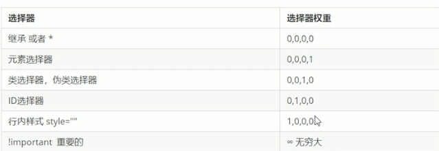
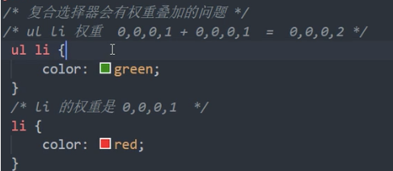

# 	css基础选择器

## 		选择器的作用

​			选择器就是根据不同的需求把不同的标签选择出来，简单来说就是选择标签用的

​			找到所选择的标签 然后设置这些标签的样式	

## 		选择器的分类

### 			基础选择器和复合选择器

​				基础选择器是由单个选择器组成的

​				基础选择器又包括：标签选择器、类选择器、id选择器和通配符选择器

### 			标签选择器	

​				标签选择器是指HTML标签名作为选择器，按标签名称分类，为页面中某一类标签指定统一的CSS样式 

​				作用：标签选择器可以把某一类标签全都选择出来，比如所有的div标签或者所有的span标签

​				优点：能够快速的为页面中同类型的标签统一设置样式

​				缺点：不能设置差异化样式，只能选择全部当前标签

### 			类选择器

​				如果想要差异化选择不同的标签，单独选一个或者某几个标签，可以使用类选择器

#### 				语法

​				类选择器口诀：样式点定义，结构类（class）调用，一个或多个，开发最常用

​				注意：

​				1.类选择器使用”.“英文点号进行标识，后面紧跟着类名（自定义、我们自己命名的）

​				2.可以理解为给这个标签起了一个名字

​				3.长名称或者词组可以使用中横线来为选择器命名

​				4.不要使用纯数字、中文等命名。尽量使用英文字母来表示

​				5.命名要有意义，尽量让别人一眼就知道这个类名的目的

##### 		优先级

​			当同一个元素指定多个选择器，就会有优先级产生

​				选择器相同，则执行层叠性

​				选择器不同，则根据选择器权重执行

​				




##### 		优先级的注意点：

​			继承的权重是 0 ，不管它父元素的权重多高，子元素继承下来的优先级权重都是 0 

​			a连接默认制定了样式（蓝色有下划线），他的权重大于继承下来的权重


##### 		权重的叠加

​			如果是复合选择器，或有权重叠加的问题




#### 奇数偶数选择器

:nth-child(*n*) 选择器匹配属于其父元素的第 N 个子元素，不论元素的类型。

*n* 可以是数字、关键词或公式。

请参阅 [:nth-of-type()](https://www.w3school.com.cn/cssref/selector_nth-of-type.asp) 选择器，该选择器选取父元素的第 N 个指定类型的子元素。

Odd 和 even 是可用于匹配下标是奇数或偶数的子元素的关键词（第一个子元素的下标是 1）。

在这里，我们为奇数和偶数 p 元素指定两种不同的背景色：

```css
p:nth-child(odd)
{
background:#ff0000;
}
p:nth-child(even)
{
background:#0000ff;
}
```

```js
 1.id选择器（#myid）
 2.类选择器（.myclassname）
 3.后代选择器（div h1 p）
 4.相邻选择器（h1+p）
 5.子选择器（ul>li）
 6.后代选择器（li a）
 7.通配符选择器 （*）
 8.属性选择器（a[rel = "external"]）
 9.伪类选择器（a:hover,li:nth-child(n)）
 10.兄弟选择器（.first~p）
 11.群选择器（.first,p）
 12.属性选择器（.first[class = 'class']或 [class = 'class']）
 可继承的样式：font-size font-family color 
 不可继承的样式：border padding margin width height
```

