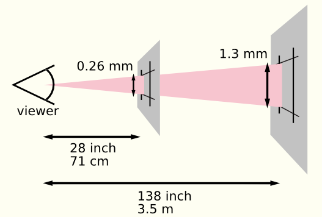
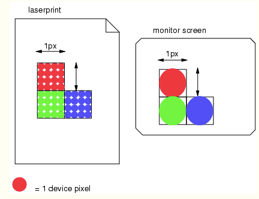
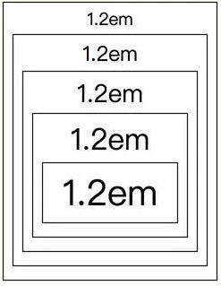
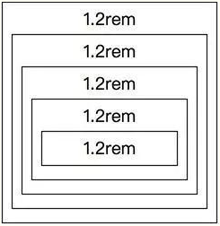
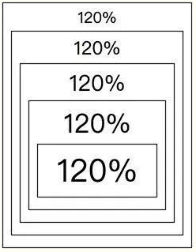
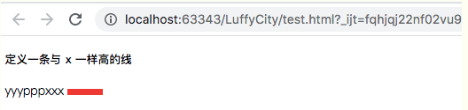
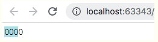
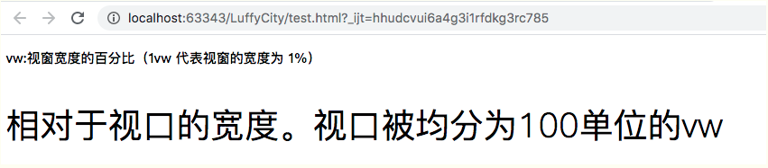
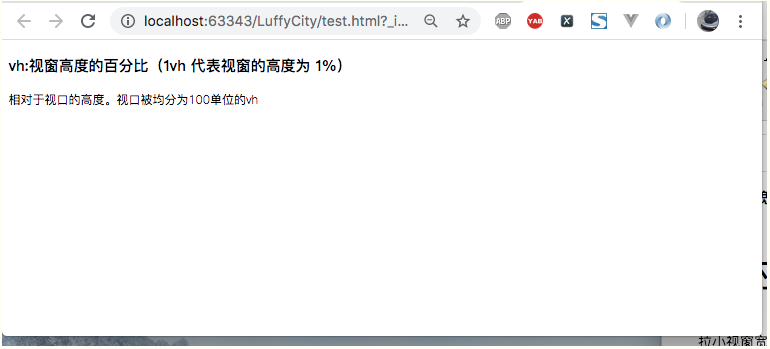

转载自https://www.cnblogs.com/xiugeng/p/12157344.html

## 一、绝对长度单位

　　绝对长度单位视借质而定，不依赖于环境（显示器、分辨率、操作系统等）。绝对长度单位相互之间是固定的，并固定在一些物理测量中。主要运用在输出环境已知的情况下。

　　绝对单位包括物理单位(pysical units：in, cm, mm, pt, pc, Q)和视角单位(visual angle unit：px)。

| 单位 | 描述                                   |
| ---- | -------------------------------------- |
| cm   | 厘米，1cm = 96px/2.54                  |
| mm   | 毫米，1mm = 1/10th of 1cm              |
| in   | 英寸 (1in = 96px = 2.54cm)             |
| px * | 像素 (1px = 1/96th of 1in)             |
| pt   | point，大约1/72英寸； (1pt = 1/72in)   |
| pc   | pica，大约6pt，1/6英寸； (1pc = 12 pt) |

所有的绝对长度单位都是兼容，px是它们的标准单位。

　　对于css设备，这些维度可以互相锚定：

- 通过将物理单位与其物理测量值相关联，或
- 通过将像素单位与参考像素相关联

　　对于典型视距下的印刷媒体，锚点单位应该是标准物理单位(inches、centimeters等)之一。对于屏幕媒体(含高分辨率设备)、低分辨率设备、观看距离异常设备，推荐使用锚点单位作为像素单位。对于这样的设备，建议像素单位是指最接近参考像素的设备像素的总数。

### 1、px(像素)

　　px 是 **pixels(像素)** 的缩写，是一种绝对单位，用于屏幕显示器上，传统上一个像素对应于计算机屏幕上的一个点，而对于高清屏则对应更多。

　　任何现代显示屏，不管是手机，平板，笔记本还是电视都是由成千上万的像素组成的，所以我们可以使用这些像素来定义长度。

　　CSS 将光栅图像(如照片等)的显示方式定义为默认每一个图像大小为“1px”。 一个“600x400”解析度的照片的长宽分别为“600px”以及“400px”，所以照片本身的像素并不会与显示装置像素(可能非常小)一致，而是与 px 单位一致。如此就可以将图像完整的与网页的其它元素排列起来。

　　**注意：**

- **chrome 浏览器最小的字体为 12px，如果设置 10px 也会渲染成 12px 。**
- **如果锚单位是像素单位，那么物理单位可能与它们的物理测量值不匹配。否则，如果锚单位是物理单位，则像素单位可能不会映射到所有设备像素。**


### 2、新旧css对于像素单位和物理单位定义区别

　　在以前的CSS版本中，像素单位与物理单位之间并没有固定的比例关系：物理单元总是与它们的物理测量值联系在一起，而像素则会随着参考像素的变化而变化。

　　现在版本中，很多内容均过多地依赖于96dpi的假设，打破这一假设会破坏内容。

　　参考像素是设备上一个像素的视角，像素密度为96dpi，与阅读器的距离为一臂之长。一臂标称长度为28英寸，其视角约为0.0213度。在臂长范围内，1px相当于0.26毫米(1/96英寸)。

　　下图说明了观看距离对参考像素大小的影响：71厘米(28英寸)的阅读距离产生0.26毫米的参考像素，而3.5米(12英尺)的阅读距离产生1.3毫米的参考像素。



由上图可知，如果观看距离增加，显示像素必须变得更大。

　　下图显示了影响设备的分辨率的像素单元：1px的面积1px是由一个单一的点在一个低分辨率的设备(例如，一个典型的计算机显示器)，在同一地区覆盖了16点高分辨率设备(如打印机)。



由上图可知，显示在高分辨率设备上覆盖1px*1px的区域需要的设备像素(点)比在低分辨率设备上覆盖同样的区域需要更多的设备像素(点)。


### 3、pt(点)

　　点(Points)，绝对长度单位。


### 4、pc(派卡)

　　派卡(Picas)，绝对长度单位。相当于我国新四号铅字的尺寸。 


### 5、cm(厘米)、mm(毫米)、in(英寸)、Q(1/4毫米)

　　厘米(Centimeters)，绝对长度单位。

　　毫米(Millimeters)，绝对长度单位。

　　英寸(Inches)，绝对长度单位。 

　　四分之一毫米(quarter-millimeters)，绝对长度单位。

　　**注意：值不区分大小写，序列化为小写，例如1Q序列化为1Q**。

## 二、相对长度单位

　　相对长度单位指定一个长度相对于另一个长度的属性。使用相对单位的样式表可以更容易地从一个输出环境扩展到另一个输出环境。

　　因此当面对不同的设备时，相对长度更适用。

| 单位 | 描述                                                         |
| ---- | ------------------------------------------------------------ |
| em   | 它是描述相对于应用在当前元素的字体尺寸，所以它也是相对长度单位。一般浏览器字体大小默认为16px，则2em == 32px； |
| ex   | 依赖于英文字母小 x 的高度                                    |
| ch   | 数字 0 的宽度                                                |
| rem  | 根元素（html）的 font-size                                   |
| vw   | viewpoint width，视窗宽度，1vw=视窗宽度的1%                  |
| vh   | viewpoint height，视窗高度，1vh=视窗高度的1%                 |
| vmin | vw和vh中较小的那个。                                         |
| vmax | vw和vh中较大的那个。                                         |
| %    |                                                              |

子元素不继承指定的父元素的相对值；它们继承计算的值。


### 1、字体相对长度

　　字体相对长度指的是它们的元素字体度量，或者，在rem的情况下，指的是根元素的度量。

#### （1）em

　　em是相对单位，为每个子元素通过「倍数」乘以父元素的px值，如果我们每一层div都使用1.2em，最内层就会是16px x 1.2 x 1.2 x 1.2 x 1.2 x 1.2 = 39.8px。(浏览器预设字体大小为16px，若无特别指定则会直接继承父元素字体大小)

```HTML
<div style="font-size:1.2em;">1.2em
    <div style="font-size:1.2em;">1.2em
        <div style="font-size:1.2em;">1.2em
            <div style="font-size:1.2em;">1.2em
                <div style="font-size:1.2em;">1.2em</div>
            </div>
        </div>
    </div>
</div>
```



#### （2）rem

 　rem是相对单位，为每个元素通过「倍数」乘以根元素的px值，如果我们每一层div都使用1.2rem，最内层就会是16px x 1.2 = 19.2px。(根元素指的是html的font-size，预设为16px )。


```html
<div style="font-size:1.2rem;">1.2rem
    <div style="font-size:1.2rem;">1.2rem
        <div style="font-size:1.2rem;">1.2rem
            <div style="font-size:1.2rem;">1.2rem
                <div style="font-size:1.2rem;">1.2rem</div>
            </div>
        </div>
    </div>
</div>
```

　　显示如下所示：



#### （3）%

　　%百分比是相对单位，和em大同小异，简单来说em就是百分比除以一百。如果每一层div都使用120%，就等同于1.2em，最内层就会是16px x 1.2 x 1.2 x 1.2 x 1.2 x 1.2 = 39.8px。


```html
<div style="font-size:120%;">120%
    <div style="font-size:120%;">120%
        <div style="font-size:120%;">120%
            <div style="font-size:120%;">120%
                <div style="font-size:120%;">120%</div>
            </div>
        </div>
    </div>
</div>
```

　　显示如下所示：



#### （4）ex

　　`ex` 是指所用字体中小写 x 的高度，通常为字体高度的一半。示例如下所示：


```html
<!DOCTYPE html>
<html lang="en">
<head>
    <meta charset="UTF-8">
    <title>Title</title>
    <style type="text/css">
        div {
            display: inline-block;
            font-size: 18px;
        }
        .x {
            width: 50px;
            height: 1ex;
            background: red;
        }
    </style>
</head>
<body>
    <h4>定义一条与 x 一样高的线</h4>
    <div>yyypppxxx</div>
    <div class="x"></div>
</body>
</html>
```

　　显示如下所示：



#### （5）ch

　　ch是一个相对于数字0的大小。1ch就是数字0的宽度。

```
<!DOCTYPE html>
<html lang="en">
<head>
    <meta charset="UTF-8">
    <title>Title</title>
    <style type="text/css">
        div {
            width: 3ch;
            background: powderblue;
        }
    </style>
</head>
<body>
    <div>0000</div>
</body>
</html>
```

　　显示效果：



**注意：只是与0的宽度相关，与0的高度无关**。由于ch使用规则稍微复杂，一般都会用em来代替ch使用。


### 2、窗口百分比长度

　　`vw`,`vh`,`vmin`,和`vmax`都是基于**浏览器视窗(Viewport)**的大小的。因为它们的实际大小是根据视窗(Viewport)大小改变的，对于响应式设计中这使它们成为很好的单位。

#### （1）vw

　　**vw** 相对于视口的宽度。视口被均分为100单位的vw(即浏览器可视区) 100vw = 可视区宽度

```HTML
<!DOCTYPE html>
<html lang="en">
<head>
    <meta charset="UTF-8">
    <title>Title</title>
    <style type="text/css">
        p {
            font-size: 3vw;
        }
    </style>
</head>
<body>
    <h3>vw:视窗宽度的百分比（1vw 代表视窗的宽度为 1%）</h3>
    <p>相对于视口的宽度。视口被均分为100单位的vw</p>
</body>
</html>
```

　　显示效果如下：



　拉小视窗宽度时，p标签内容随之变小。

#### （2）vh

　　**vh** 相对于视口的高度。视口被均分为100单位的vh(即浏览器可视区) 100vh  = 可视区高度

```HTML
<!DOCTYPE html>
<html lang="en">
<head>
    <meta charset="UTF-8">
    <title>Title</title>
    <style type="text/css">
        p {
            font-size: 3vh;
        }
    </style>
</head>
<body>
    <h3>vh:视窗高度的百分比（1vh 代表视窗的高度为 1%）</h3>
    <p>相对于视口的高度。视口被均分为100单位的vh</p>
</body>
</html>
```

　　显示效果如下：



拉大视窗高度，p标准内容随之变大

#### （3）vmin/vmax

　　**vmin/vmax** 相对于视口的宽度或高度中较小的那个。其中最小的那个**被均分为100单位的vmin（即vm）**

## 三、calc单位运算

　　calc()函数用于动态计算长度值，单位运算时可以使用各种单位进行加减乘除运算。

