由于GitHub速度太慢且非常不稳定，转而使用gitee码云仓库。这里总结一下使用gitee的过程

#### 创建账号

根据官网提示完成

#### ->新建仓库

点击头像旁边的按钮选择新建仓库

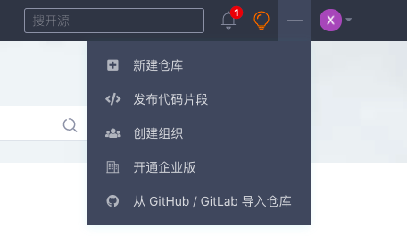

填写仓库名称，注意仓库名称为小写字母（如果填大写字母会自动转换成分隔例如：myApp=>my-app）

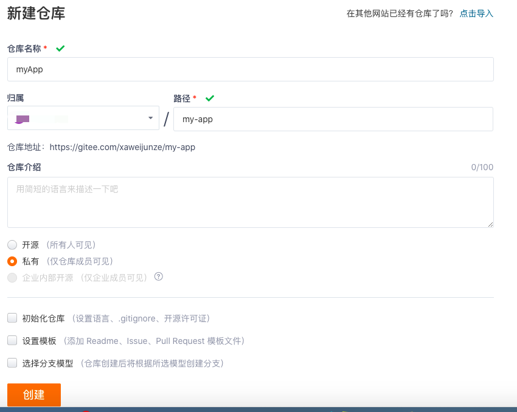

填写完成后点击创建即可。

#### ->添加公钥

创建完成后可以在我的仓库中看到，点击克隆下载按钮选择ssh，并复制clone链接。

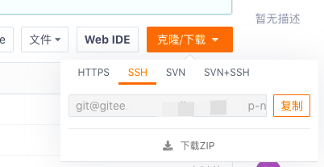

在本地项目目录下运行

```
git clone ssh链接
```

会提示ssh公钥有问题，这是因为我们没有在gitee上配置ssh公钥。

由于我本地已经配置过ssh秘钥了，我需要将本地的ssh公钥添加到gitee上。

1. 找到本地ssh公钥

   本地公钥默认地址是

   这是隐藏文件，mac上显示隐藏文件需要同时按下cmd+shift+. 按键

   ```
   ~/.ssh/id_res_pub
   ```

   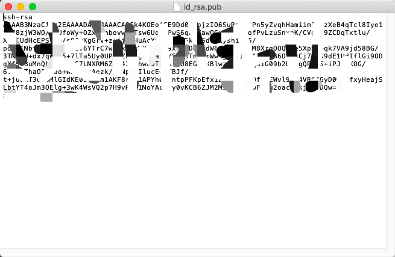

   将全部内容复制。

2. 添加到gitee

   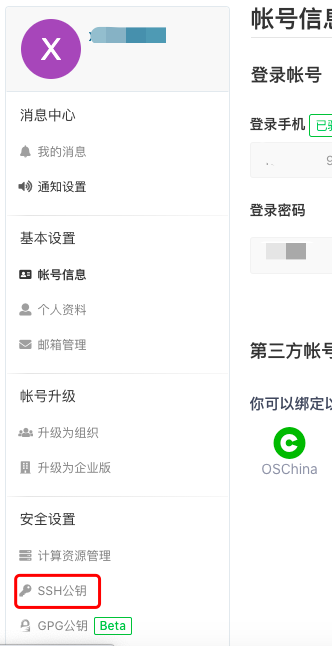

   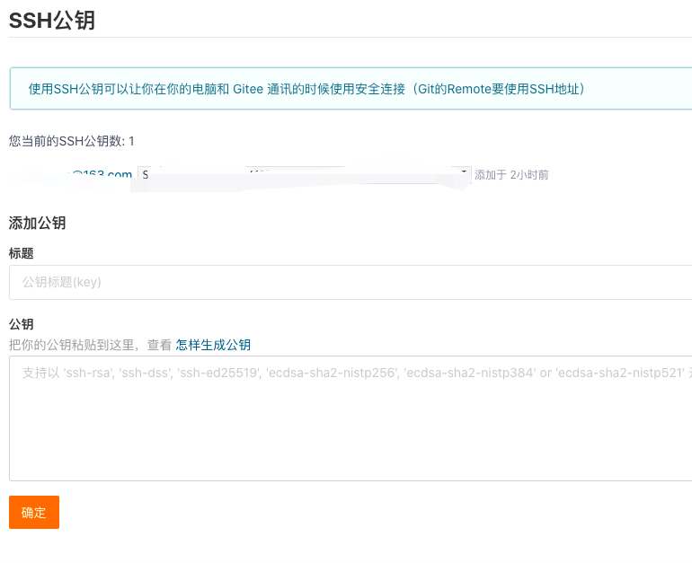

   直接粘贴到下方公钥的位置，标题会自动生成。

   添加后，在终端（Terminal）中输入

   ```
   ssh -T git@gitee.com
   ```

   ​		首次使用需要确认并添加主机到本机SSH可信列表。若返回 `Hi XXX! You've successfully authenticated, but Gitee.com does not provide shell access.` 内容，则证明添加成功。

   这里需要验证账户，会有

   ```
   Enter passphrase for key '/Users/weijunze/.ssh/id_rsa':
   ```

   输入你得gitee密码即可。

#### ->clone仓库

添加成功ssh公钥后，可以继续clone我们的仓库。

```
git clone ssh地址
```

这里可能会验证一下密码（gitee密码）

克隆成功会在本地出现一个项目文件。

#### ->开发项目

在克隆下来的目录上进行开发

#### ->提交更改

在提交更改的时候我们不能将node_mudoles中的依赖和dist打包一同提交（两者所占内存过大）

修改**gitignore**文件:

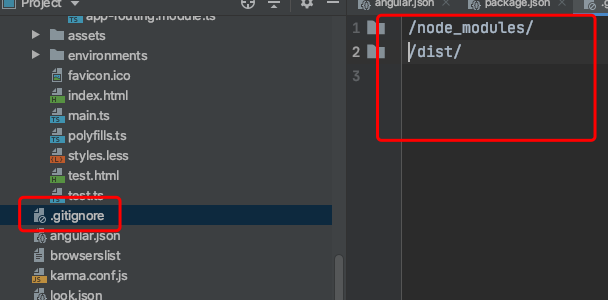

 内容如下，不想提交的写入即可：

```
/node_modules/
/dist/
```

可能没有这个文件，通过

```
touch .gitignore
```

可生成。


在webstorm中也可以直接手动决定是否将文件add到git中

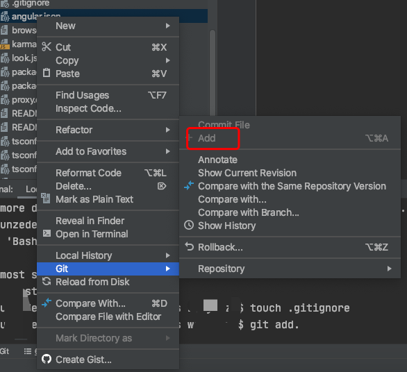

#### ->推送项目

```
git add .
git commit -m'update'
git push
```

#### ->拉去项目

有时候gitee中的项目更改后，我们需要将远端的项目拉取到本地（其实在推送项目的之前都要进行拉取操作，以保证不出现冲突）

```
git pull
```


#### ->新建分支

分支保护是为了防止相关成员推送代码到重要的分支（例如 master 分支），便于仓库的分支管理。

- 常规分支：仓库成员（开发者权限及以上）可推送分支
- 保护分支：可自定义保护策略，默认仓库管理员才能管理（推送）被保护的分支
- 只读分支：任何人都无法推送代码（包括管理员和所有者），需要推送代码时应设为“常规”或“保护”分支

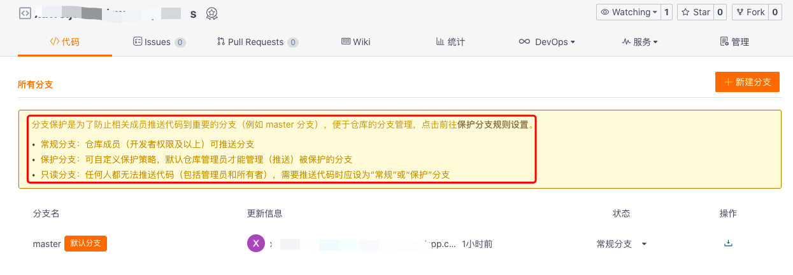

点击新建分支

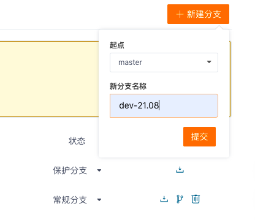

成功后需要重新在本地拉取远端，来更新分支。

```
git pull
```

成功后，可以在本地查看新的分支。

我用的webstorm，点击右下角，即可出现新的分支

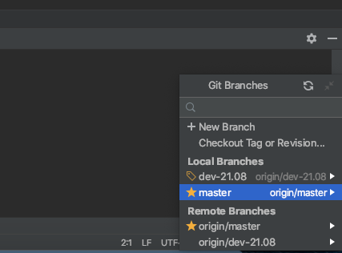

点击checkout按钮，即将本地分支切换到dev-21.08分支，再次提交更改的时候就可以提交到dev-21.08分支。不会改变保护分支master

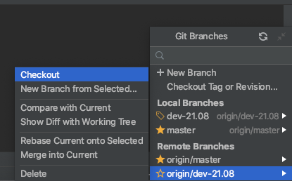

在远端切换到dev-21.08即可查看到新增的更改了。

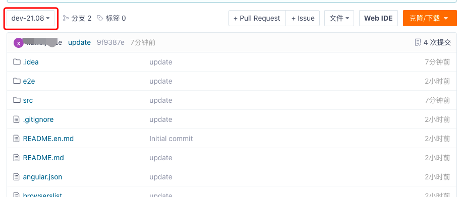

如果有问题可以参考gitee官方的操作手册https://gitee.com/help


