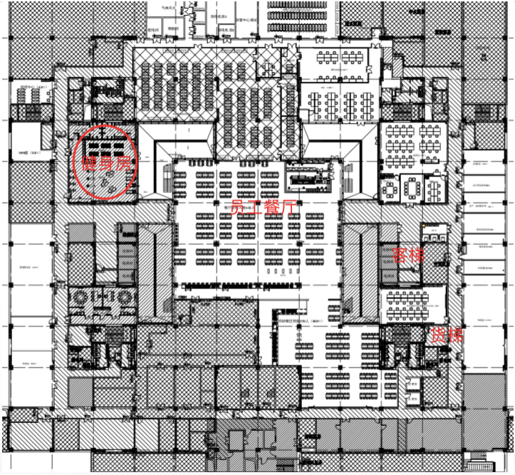

**各位同事：**

 

为丰富员工工作之余的文化生活，加强锻炼身体，公司新办公楼内特建设了健身房，即日起，将进入试运营阶段，为了合理、有效、安全的运营好健身房，给员工提供一个健康、有序锻炼身体的场所，特对健身房的使用作出如下暂行管理规定，请各位同事遵守。

**一、**   **健身房营业时间（工作时间禁止入内）：**

**工作日：06:30-8:30 12:00-13:00 18:30-22:00**

**周  末：08:00-21:00**

 

**二、**   **运动区域管理规范：**

1、 需穿软底运动鞋，禁止穿硬底鞋、高跟鞋踩踏地面及健身器材；

2、 严禁吸烟！严禁酒后进入锻炼！

3、 严禁在场内食用任何食物，严禁乱扔杂物，保持场内清洁卫生；

4、 运动前请充分热身，避免造成运动伤害；

5、 安全使用运动器械，遵守各项规定，服从工作人员管理，自觉维护秩序；

6、 运动完毕请将器械及时归位并摆放整齐；

7、 仅供内部员工使用，禁止外部人员进入场馆；

 

**三、**   **更衣柜管理规范：**

1、 领取更衣柜钥匙需出示并抵押员工卡；

2、 更衣柜仅限当天使用，不得私自占用，管理员每日下班前将统一清理柜内物品；

3、 更衣柜钥匙需妥善保存，如丢失，使用者将全额承担维修更换锁具费用；

4、 个人物品请妥善保存，衣柜中不要放置贵重物品，如造成财物丢失，自行承担损失；

5、 不得私自破坏或撬开更衣柜，造成损失将按价赔偿并公司范围内通报批评；

 

**四、**   **淋浴管理规范：**

1、 使用淋浴，公司收取成本费用，5元/次，请员工自觉扫码使用；

2、 淋浴用品请员工自行携带；

3、 淋浴时应注意安全，防止滑倒、摔伤；

4、 节约用水，严禁在浴室洗涤衣物；

5、 不随地吐痰，不随地丢垃圾，不随地大小便，保持淋浴间环境卫生整洁。

 

健身房门口张贴有进店须知，房间内张贴有管理规范，进入、使用健身房即为认同并接收须知及管理规范。大家在使用过程中如发现问题，请及时反馈行政部。健身房位于新办公大楼B1层，具体位置见下图。 

**一、新浪提供的接口地址：**
https://interface.sina.cn/news/wap/fymap2020_data.d.json

**二、163提供的接口地址：**
官方展示：

https://news.163.com/special/epidemic

API接口：

https://c.m.163.com/ug/api/wuhan/app/data/list-total

http://c.m.163.com/ug/api/wuhan/app/index/feiyan-data-list

 

**三、腾讯提供的接口地址：**
官方展示：

https://news.qq.com//zt2020/page/feiyan.htm

API接口：

https://view.inews.qq.com/g2/getOnsInfo?name=disease_h5

29+32

15+44+16

146+