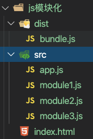
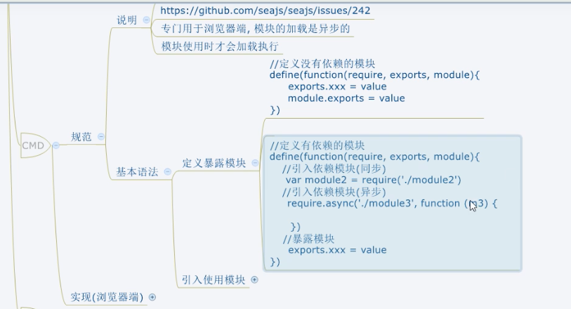
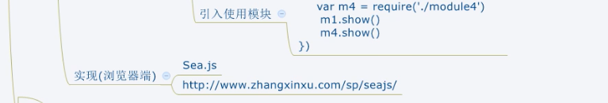

### CommonJS

#### 说明：

每一个模块都可以当做一个模块

在服务端：模块的加载是运行时同步加载的

在浏览器端：模块需要提前编译打包处理（浏览器不认识require）

#### 基本语法

##### 暴露模块

module.exports = value

exports.xxx = value

问题： 暴露的模块到底是什么

##### 引入模块

require(xxx)

第三方模块：xxx为模块名

自定义模块：xxx为模块文件路径

##### 服务器样例

```js
//module1.js
//给暴露对象赋值一个对象
module.exports = {
   uname : "module1"
   foo () {
      console.log(this.uname);
   }
}
```

```js
//module2.js
//暴露对象赋值一个方法
module.exports = function (){
	console.log('module2');
}
```

```js
//module3.js
//给暴露对象添加属性
exports.foo = function() {
   console.log('module3');
}
exports.bar = function() {
   console.log('module3');
}
```

```js
//app.js
let module1 = require('./modules/module1');
let module2 = require('./modules/module2');
let module3 = require('./modules/module3');

module1.foo();
module2();
module3.foo();
module3.bar();
//module1
//module2
//module3
//module3
```

##### 浏览器样例（需要引入一个browserify 包）

```npm
npm install -g browserify
```

文件结构：



```js
//module.js
module.exports = {
    foo(){
        console.log("foo: module1");
        
    }
}
```

```js
//module2.js
//暴露对象赋值一个方法
module.exports = function (){
	console.log('module2');
}
```

```js
//module3.js
//给暴露对象添加属性
exports.foo = function() {
    console.log('module3');
 }
 exports.bar = function() {
    console.log('module3');
 }
```

```js
//app.js
let module1 = require('./module1');
let module2 = require('./module2');
let module3 = require('./module3');

module1.foo();
module2();
module3.foo();
module3.bar();
//module1
//module2
//module3
//module3
```

```html
<!-- index.html -->
<body>
</body>
<script src="./src/app.js"></script>

```

现在进行访问index.html,回报错，因为浏览器无法解析require语句

需要将app.js打包

```
browserify src/app.js > dist/bundle.js
```

打包后的bundle.js文件

```js
(function(){function r(e,n,t){function o(i,f){if(!n[i]){if(!e[i]){var c="function"==typeof require&&require;if(!f&&c)return c(i,!0);if(u)return u(i,!0);var a=new Error("Cannot find module '"+i+"'");throw a.code="MODULE_NOT_FOUND",a}var p=n[i]={exports:{}};e[i][0].call(p.exports,function(r){var n=e[i][1][r];return o(n||r)},p,p.exports,r,e,n,t)}return n[i].exports}for(var u="function"==typeof require&&require,i=0;i<t.length;i++)o(t[i]);return o}return r})()({1:[function(require,module,exports){
//app.js
let module1 = require('./module1');
let module2 = require('./module2');
let module3 = require('./module3');

module1.foo();
module2();
module3.foo();
module3.bar();
//module1
//module2
//module3
//module3
},{"./module1":2,"./module2":3,"./module3":4}],2:[function(require,module,exports){
module.exports = {
    foo(){
        console.log("foo: module1");
        
    }
}
},{}],3:[function(require,module,exports){
//module2.js
//暴露对象赋值一个方法
module.exports = function (){
	console.log('module2');
}
},{}],4:[function(require,module,exports){
//module3.js
//给暴露对象添加属性
exports.foo = function() {
    console.log('module3');
 }
 exports.bar = function() {
    console.log('module3');
 }
},{}]},{},[1]);

```

修改index.html

```html
<!-- index.html -->
<body>
</body>
<script src="./dist/bundle.js"></script>


```

这时候就可以正常执行了。

### AMD

#### 规范

##### 说明

专门用于浏览器端，模块的加载是异步的。

##### 基本语法

###### 定义暴露模块

```js
//定义没有依赖的模块
define(function(){
	return moduleName; //模块名
})
```

```js
//定义有依赖的模块
define(['module1','module2'],function(m1,m2){
	return moduleName; //模块名
})
```

###### 引入使用模块

```js
require(['module1','module2'],function(m1,m2){
	//在这里使用m1/m2
})
```

#### 实现

##### 不使用AMD的方式，引用依赖

```js
// alerter.js 定义一个有依赖的模块
(function(window,dataService){
    let msg = 'alerter.js';
    function showMsg (){
        console.log(msg,dataService.getName());
    }
    window.alerter = {showMsg};

})(window ,dataService)
```

```js
//dataService.js  定义一个没有依赖的模块
(function(window){
    let name = 'dataService.js';
    function getName(){
        return name;
    }
    window.dataService = {getName};

})(window)
```

```js
// app.js
(function (alerter) {
    alerter.showMsg();
})(alerter)
```

```html
<!-- index.html -->
<body>
    <h1>不使用AMD</h1>
    <script src="./js/dataService.js"></script>
    <script src="./js/alerter.js"></script>
    <script src="./app.js"></script>
</body>
```

> 带来的问题就是需要发送三次请求，因此我们要引入AMD规范

##### 使用require.js （这是一个库，需要下载）

> 1.下载require.js，并引入
>
> ​	官网：www.requirejs.cn
>
> ​	引入：js/libs/require.js
>
> 2.创建项目结构
>
> ```
> |-js
> 	|-libs
> 		|-require.js
> 		|-jquery-3.6.0.js
> 	|-modules
> 		|-alerter.js
> 		|dataService.js
> 	|-main.js
> |index.html
> ```


```js
//dataService.js
//定义没有依赖的模块
define(function(){
    var name = 'dataService.js';
    function getName(){
        console.log(name);
    }
    //暴露
    return {getName};
});
```

```js
//alerter.js
//定义有依赖的模块
define([
    'dataService',
    'jquery'
], function(dataService) {
    let msg = 'alerter.js';   
    function showMsg (){
        console.log(dataService.getName());
        console.log(msg);
    } 
    $('body').css('background','red');
    // 暴露模块
    return {showMsg};
});
```

```js
//main.js
(function () {
    requirejs.config({   //模块配置 官网可查
        baseUrl: 'js/',
        paths: {
            dataService: './modules/dataService',
            alerter: './modules/alerter', //自定义库
            jquery: './libs/jquery-3.6.0' //第三方库
        }
    });
    requirejs(['alerter'], function (alerter) {
        alerter.showMsg();
    })
})()
```

```html
<script data-main="js/main.js" src="js/libs/require.js"></script>
<!-- 引入 -->

```


### CMD

将AMD和CommonJS组合使用，不常使用






### ES6

#### 语法

##### 1.默认导出和默认导入

```js
//当前文件模块是m1.js

//定义私有成员a和c
let a = 10;
let c = 20;
//外界无法访问变量d,因为它没有被导出
let d = 30;
function show(){
}
//将本模块的私有成员暴露出去，供其他模块使用
export default { //只能导出一次
   a,
   b,
   show
}
```

```js
//导入模块成员
import m1 from './m1.js'

console.log(m1);
//打印的结果是
//{a:10 ,c:20, show:[Function:show]}
```

##### 2.按需导出和按需导入

```js
//当前文件模块是m1.js

//向外按需导出变量s1
export let s1 = 's1111'; //可以使用多次按需导出
export let s2 = 's2222';
export function say = fucntion() {}
```

```js
//导入模块成员
import {s1,s2 as ss2,say} from './mi.js'

console.log(s1) //打印输出's1111'
console.log(ss2) //打印输出's2222'
console.log(say) //打印输出'Function:say'
```

##### 3.直接导入并执行模块代码

```js
// 当前文件模块为m2.js

//在当前模块中执行一个for循环
for(let i = 0; i<=2; i++){
   console.log(i);
}
```

```js
//直接导入并执行代码
import './m2.js'
```

