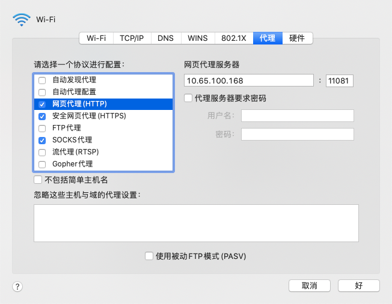

CRM : https://192.168.1.18/topsec.asp

知识共享平台： http://192.168.1.55

OA : http://192.168.1.170:8000

天融信大学： http://topsecyunxuetang.cn

vpn

```
 wei_junze
 Zganm123!
```

邮箱

```
wei_junze@topse.com.cn
Zganm123
wei_junzeca2021
```

CRM

```
魏俊泽13955
Zganm12345!
```

知识共享平台：http://192.168.1.55/

```
wei_junze
zganm123
```

OA 

```
固定资产已开通
```

天融信大学

```
wei_junze
topsec
```

gitlab

```
wei_junze
Zganm123
```

npm

```
registry=
https://dev.topsec.com.cn/nexus/repository/npm-remote/
```

webstrom激活码

```
http://lookdiv.com/index/index/indexcodeindex.html
输入 5263
```


10.65.100.168

10.65.100.168

10.65.100.168





隆哥，有时间没，很抱歉下班的时候打扰你，有点事儿想商量一下。

我中午接到了学校导师的电话，表示因为我本学期的课程安排紧凑不能继续批准我实习期的长假了。本月底就要离职回学校，暂时考虑的是本周五8月27日离职。请问我需要办理什么手续申请之类的吗？

因为实习协议说明提前要提前三天递交申请，所以我想问一下要用的申请表是不是外包人员工离职申请表，如果可以的话，我明天填好带给你还是交给指定的人呢


