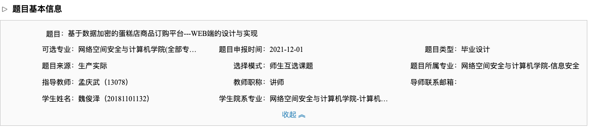

## 毕业设计选题系统

河北大学大学生毕业设计（论文）管理系统

http://hbu.co.cnki.net/Login.html?dp=hbu&r=1582547068649打开登录页面，首页有操作手册

账号：20181101132 密码：zganm123	账号类型：学生

- 主要研究内容 

  使用加密算法、.NET平台（或JSP、PHP等）和SQL Serve（My SQL等）数据库管理系统，设计开发一个安全的蛋糕店商品订购网站。利用该系统，可以对该蛋糕店商品进行分类，方便用户快速查询，管理员通过布蛋糕店的特价商品、优惠活动等信息，让用户及时了解店内活动，同时提供订购功能，可以让用户快捷方便地选购自己需要的商品，并对自己所购商品进行评价；利用该系统，可以让管理员及时了解注册用户的订购信息，及时为客户配送商品，并可以方便地对店中商品信息、用户信息、订单信息等进行添加、修改、删除操作；同时，利用数据加密技术，可以保证系统数据的安全性。
  
- 目标和要求 

  设计并开发出一个基于数据加密技术的方便、实用的蛋糕店商品订购网站，通过该网站，在保证系统数据安全性的条件下，用户可以快速地浏览、查询蛋糕店中的物品信息、折扣信息，方便地完成下单、评论等操作，同时管理员可以方便地对蛋糕店中的信息进行管理。
  学生通过对本课题的研究和设计，能够掌握基于B/S架构的应用系统的开发技术，巩固所学知识。
  要求学生精通数据加密算法、.NET（或JSP、PHP等）前台开发工具和SQL Server（My SQL等）后台数据库管理系统，能保证在校按时完成毕业设计。

| 论文（设计）各阶段名称     | 日期                    |
| -------------------------- | ----------------------- |
| 资料收集整理、理论知识学习 | 2020.12.31---2021.01.31 |
| 系统实现、建立系统原型     | 2021.02.01---2021.03.15 |
| 调试并测试                 | 2021.03.16---2021.04.01 |
| 毕业论文写作及答辩准备阶段 | 2021.04.02---2021.05.31 |

