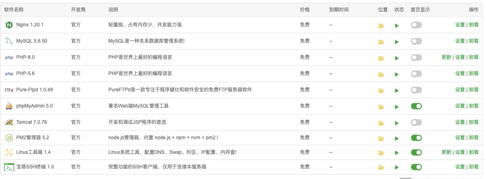
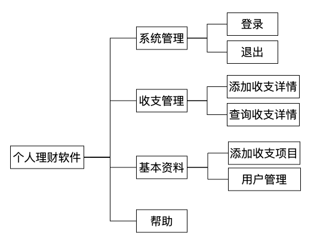

```

PATH=$PATH:/www/server/nvm/versions/node/v14.16.1/bin
vim ~/.bash_profile
source .bash_profile


```

nginx配置：

```
user  www www;
worker_processes auto;
error_log  /www/wwwlogs/nginx_error.log  crit;
pid        /www/server/nginx/logs/nginx.pid;
worker_rlimit_nofile 51200;

events
    {
        use epoll;
        worker_connections 51200;
        multi_accept on;
    }

http
    {
        include       mime.types;
		#include luawaf.conf;

		include proxy.conf;

        default_type  application/octet-stream;

        server_names_hash_bucket_size 512;
        client_header_buffer_size 32k;
        large_client_header_buffers 4 32k;
        client_max_body_size 50m;

        sendfile   on;
        tcp_nopush on;

        keepalive_timeout 60;

        tcp_nodelay on;

        fastcgi_connect_timeout 300;
        fastcgi_send_timeout 300;
        fastcgi_read_timeout 300;
        fastcgi_buffer_size 64k;
        fastcgi_buffers 4 64k;
        fastcgi_busy_buffers_size 128k;
        fastcgi_temp_file_write_size 256k;
		fastcgi_intercept_errors on;

        gzip on;
        gzip_min_length  1k;
        gzip_buffers     4 16k;
        gzip_http_version 1.1;
        gzip_comp_level 2;
        gzip_types     text/plain application/javascript application/x-javascript text/javascript text/css application/xml;
        gzip_vary on;
        gzip_proxied   expired no-cache no-store private auth;
        gzip_disable   "MSIE [1-6]\.";

        limit_conn_zone $binary_remote_addr zone=perip:10m;
		limit_conn_zone $server_name zone=perserver:10m;

        server_tokens off;
        access_log off;
server {
        proxy_connect_timeout    600;
        proxy_read_timeout       600;
        proxy_send_timeout       600;
        listen 889;

   #这里是nginx监听端口
        server_name  www.forus616.cn;
        location / {
    try_files $uri $uri/ /index.html;
}
	location /newsPage {
	          #proxy_pass   https://www.baidu.com;
            #proxy_pass   http://www.forus616.cn/news_page;
            proxy_pass   http://www.forus616.cn/test/my-app-news;
            #add_header 'Access-Control-Allow-Origin' *;
        }
        
        location /api {
		      proxy_pass https://c.m.163.com/ug/api/wuhan/app/data/list-total;
		#proxy_pass http://localhost:3005/test;
	}


	}
server
    {
        listen 889;


        server_name phpmyadmin;
        index index.html index.htm index.php;
        root  /www/server/phpmyadmin;
            location ~ /tmp/ {
                return 403;
            }
        
        #error_page   404   /404.html;
        include enable-php.conf;
        location ^~/ {
          root /www/wwwroot/www.forus616.cn/newsPage;
          index index.html index.htm;
        }
        location /api {
          proxy_pass https://c.m.163.com/ug/api/wuhan/app/data/list-total;
		#proxy_pass http://localhost:3005/test;
	}
        location ~ .*\.(gif|jpg|jpeg|png|bmp|swf)$
        {
            expires      30d;
        }

        location ~ .*\.(js|css)?$
        {
            expires      12h;
        }

        location ~ /\.
        {
            deny all;
        }

        access_log  /www/wwwlogs/access.log;
    }
include /www/server/panel/vhost/nginx/*.conf;
}


```


> 阿里云
>
> 外网面板地址: http://39.105.107.41:8888/96adb0f7
>
> 内网面板地址: http://172.23.151.209:8888/96adb0f7
>
> username: 8kglnhlx
>
> password: 9ff88a37
>
> If you cannot access the panel,release the following panel port [8888] in the security group
>
> 若无法访问面板，请检查防火墙/安全组是否有放行面板[8888]端口




