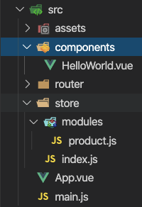

项目目录




HelloWord.vue

```vue
<template>
  <div class="hello">
    <h1>{{ msg }}</h1>
    <input v-model="txt" type="text" placeholder="请输入" @keyup.enter="keyupHandle">
    <button @click="addDelay">新增</button>
    <ul>
      <li v-for="item in list" :key= 'item'>{{ item }}</li>
    </ul>
  </div>
</template>

<script>
// mapState 是把不vuex中的state数据映射到组件的计算属性
// mapMutations 把vuex中的mutations映射到methods中
// mapActions 把vuex中的actions映射到methods中
import { mapState ,mapMutations ,mapActions } from 'vuex'
export default {
  name: 'HelloWorld',
  data () {
    return {
      msg: 'Welcome to Your Vue.js App',
      txt:''
    }
  },
  methods: {
    ...mapMutations('product',['add']),
    ...mapActions('product',['addAsync']),
    keyupHandle (e){
      if(e.currentTarget.value){
        // console.log(e.currentTarget.value);
        this.add(e.currentTarget.value); //直接调用mutations中的方法
      }
    },
    addDelay(){
      this.addAsync(this.txt);
    }
  },
  computed: {
    // ...mapState(['count']);
    ...mapState({
      c:'count',//相当于给count写了一个别名
    }),
    ...mapState('product',['list'])
  }
}
</script>

<!-- Add "scoped" attribute to limit CSS to this component only -->
<style scoped>
h1, h2 {
  font-weight: normal;
}
ul {
  list-style-type: none;
  padding: 0;
}
li {
  display: inline-block;
  margin: 0 10px;
}
a {
  color: #42b983;
}
</style>

```

state/index.js

```js
import Vuex from 'vuex'
import Vue from 'vue'
import product from './modules/product'; //这里引入数据product
Vue.use(Vuex);

const store = new Vuex.Store({
    state: {
        count:1,
        name: "vuex项目演示"
    },
    modules: {
        //一个单独的模块，每一个模块都需要完整的vuex数据对象
        // 包含state mutations actions getters 这些内容
        product, //数据过大时，可以通过模板将数据拆分
    }
});

export default store; 
```

state/modules/product.js

```js
export default{
    
        namespaced: true,
        state: {
            list: ['毛巾','洗发露','可乐']
        },
        //  用来改变数据，所有的数据改变都在这里进行
        // 目的是每一次的数据改变都可以被追踪到，都会被开发者工具记录下来
        mutations: {
            add(state,payload) {
                //state 表示当前模块的数据
                // payload 表示参数
                console.log(state);
                console.log(payload);
                state.list.push(payload);
                
            }
        },
        // 所有的异步操作要放到actions中
        // 在actions中也能直接改变state数据，但是不建议这样做
        // 因为在vuex中所有的数据改变都需要能呗追踪到，所以改变数据都需要在mutations中进行
        actions: {
            addAsync(context,payload){
                console.log(context);
                console.log(payload);
                // context.state.list.push(payload);
                setTimeout(() => {
                context.commit('add',payload);//commit表示触发一个mutation   
                }, 1000);
            }
        }
    }

```

