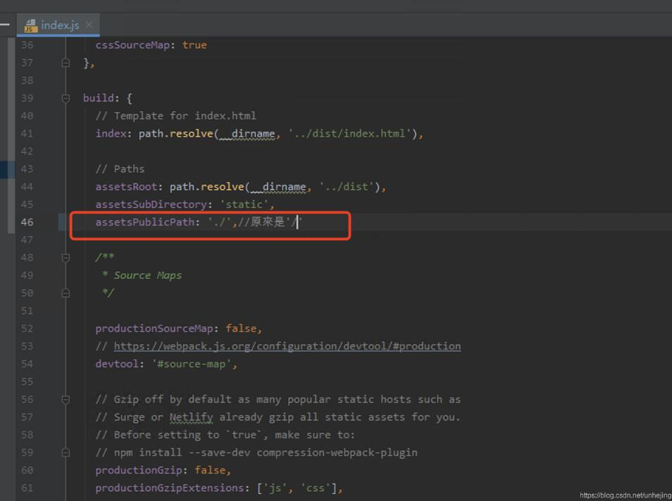
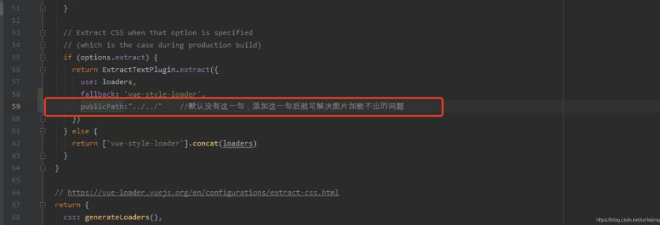

### vue项目打包

##### 一、终端运行命令 npm run build

##### 二、打包成功的标志与项目的改变，如下图：


3、点击index.html，通过浏览器运行，出现以下报错，如图：


##### 四、那么应该如何修改呢？

具体步骤如下：
1、查看package.js文件的scripts命令
2、打开webpack.dev.conf.js文件，找到publicPath: config.dev.assetsPublicPath,按Ctrl点击，跳转到index.js文件
3、其中dev是开发环境，build是构建版本，找到build下面的assetsPublicPath: '/',然后修改为assetsPublicPath: './',即“/”前加点。
4、终端运行 npm run build 即可。

此时点击index.html，通过浏览器运行便，会发现动态绑定的static的图片找不到，故static必须使用绝对路径。将图片路径修改为绝对路径，至此，打包完成。

#### vuecli3打包白屏解决方法

打开 dist index.html 文件发现白屏。打开调试后 发现文件引用路径不对

根据以往的经验 根目录下新建 vue.config.js

配置 publicPath

```
module.exports = {
	runtimeCompiler: true, 
	publicPath: './'
	}
```

满心欢喜的打开，结果还是白屏。打开调试发现文件路径是正确的，这就唧唧了！！。

**发现问题**

各种百度。发现了样的问题 一看vue-router的mode配置可能会影像打包后的链接地址，然后看看我自己的router:

```
var router =  new Router({ 
	mode: 'history'  //注释掉这一行
})
```

vue-router对mode的说明：

**mode**

类型: string

默认值: "hash" (浏览器环境) | "abstract" (Node.js 环境)

可选值: "hash" | "history" | "abstract"

**配置路由模式:**

hash: 使用 URL hash 值来作路由。支持所有浏览器，包括不支持 HTML5 History Api 的浏览器。

history: 依赖 HTML5 History API 和服务器配置。

abstract: 支持所有 JavaScript 运行环境，如 Node.js 服务器端。如果发现没有浏览器的 API，路由会自动强制进入这个模式。

**解决问题**

终于弄明白了，如果使用history模式上线，必须要服务端在服务器上有对应的模式才能使用history（看上面链接），如果服务器上没有配置，可以先使用默认的hash；

**补充知识：****vue打包项目以后白屏和图片加载不出来问题解决方法**

vue打包项目以后部署访问白屏。查看控制台是404.这是由于打包的时候没有设置对静态资源路径。原文件是绝对路径，需要改成相对路径。

1.白屏修改config/index.js



2.图片加载不出来，修改build/utils.js



以上这篇关于vue-cli3打包代码后白屏的解决方案就是小编分享给大家的全部内容了，希望能给大家一个参考，也希望大家多多支持脚本之家。