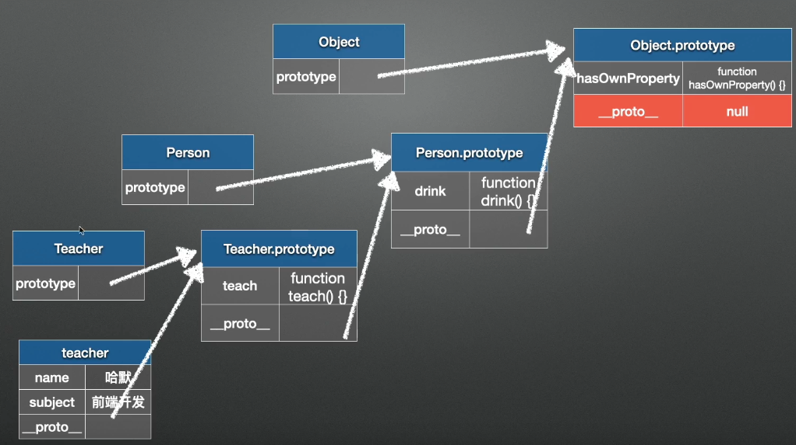

 闭包，场景（节流防抖，我选择节流函数写的）

```js
函数防抖（debounce）：当持续触发事件时，一定时间段内没有再触发事件，事件处理函数才会执行一次，如果设定的时间到来之前，又一次触发了事件，就重新开始延时。如下图，持续触发scroll事件时，并不执行handle函数，当1000毫秒内没有触发scroll事件时，才会延时触发scroll事件

实现方式：每次触发事件时设置一个延迟调用方法，并且取消之前的延时调用方法
```

```js
函数节流（throttle）：当持续触发事件时，保证一定时间段内只调用一次事件处理函数。

实现方式：每次触发事件时，如果当前有等待执行的延时函数，则直接return

// 节流throttle代码（定时器）：
function throttle(fn, wait) {            
    let timer = null;            
    return function() {       
        if (timerreturn;                
        timer = setTimeout(()=> {                        
            fn()                     
            timer = null;                    
        }, wait);    
    }        
}   

function throttle(func,wait){
   let timer = null
   return function(){
      if(timer) return;
      timer = setTimeout(function{
     	func()
      timer = null
      },wait)
   }
}

function handle() {            
    console.log(`节流:${Math.random()}`);        
}        
window.addEventListener('scroll', throttle(handle, 3000));
```

 用户频繁输入，怎么优化性能（防抖、节流）

给 input 事件加上防抖 or 节流 

```js
function debounce(method,delay){
    var timer = null; 
    return function(){
        var context = this,
            args = arguments;
        clearTimeout(timer); 
        timer = setTimeout(function(){
            method.apply(context,args); 
        },delay);
    }
}

function debounce(func,delay){
   var timer = null
   return function(){
		var  context = this
      var args = arguments;
      clearTimeout(timer);
      timer = setTImeout(function(){
			func.apply(context,args)
      })
   }
}
```

 promiseall实现

```js
Promise.all = (arr) => {
    return new Promise(function(resolve,reject){
     let i = 0;
     let result = [];
     next();
     function next() {
         arr[i].then(function (res) {
             result.push(res);
             i++;
             if (arr.length == i) {
                 resolve(result);
             } else {
                 next();
             }
         })
     }
    })
 }
```

 

 继承方式，手写实现组合继承，优化 

```js
function Animal (name){
   this.name = name || 'Animal';
   this.sleep = function(){
		console.log(this.name +'正在睡觉');
   }
}
Animal.prototype.eat = function(food){
   conlose.log(this.name + '正在吃'+ food);
}
```

```js
//1.原型链继承
function Cat(){
}
Cat.prototype = new Animal();
Cat.prototype.name = 'cat';
//　Test Code
var cat = new Cat();
console.log(cat.name);
console.log(cat.eat('fish'));
console.log(cat.sleep());
console.log(cat instanceof Animal); //true 
console.log(cat instanceof Cat); //true

特点：

非常纯粹的继承关系，实例是子类的实例，也是父类的实例
父类新增原型方法/原型属性，子类都能访问到
简单，易于实现
缺点：

要想为子类新增属性和方法，必须要在new Animal()这样的语句之后执行，不能放到构造器中
无法实现多继承
来自原型对象的所有属性被所有实例共享（来自原型对象的引用属性是所有实例共享的）（详细请看附录代码： 示例1）
创建子类实例时，无法向父类构造函数传参
```

```js
//2.构造函数继承
function Cat (name){
   Animal.call(this);
   this.name = name || 'tom';
}
// Test Code
var cat = new Cat();
console.log(cat.name);
console.log(cat.sleep());
console.log(cat instanceof Animal); // false
console.log(cat instanceof Cat); // true

特点：

解决了1中，子类实例共享父类引用属性的问题
创建子类实例时，可以向父类传递参数
可以实现多继承（call多个父类对象）
缺点：

实例并不是父类的实例，只是子类的实例
只能继承父类的实例属性和方法，不能继承原型属性/方法
无法实现函数复用，每个子类都有父类实例函数的副本，影响性能
```

```js
//3.实例继承
function Cat(name){
   var instance = new Animal();
   instance.name = name||'tom';
   return instance;
}
// Test Code
var cat = new Cat();
console.log(cat.name);
console.log(cat.sleep());
console.log(cat instanceof Animal); // true
console.log(cat instanceof Cat); // false
特点：

不限制调用方式，不管是new 子类()还是子类(),返回的对象具有相同的效果
缺点：

实例是父类的实例，不是子类的实例
不支持多继承
```

```js
//4.拷贝继承
function Cat(name){
   var animal = new Animal();
   for(let p in animal){
      Cat.prototype[p] = animal[p];
   }
}
// Test Code
var cat = new Cat();
console.log(cat.name);
console.log(cat.sleep());
console.log(cat instanceof Animal); // false
console.log(cat instanceof Cat); // true
特点：

支持多继承
缺点：

效率较低，内存占用高（因为要拷贝父类的属性）
无法获取父类不可枚举的方法（不可枚举方法，不能使用for in 访问到）

```

```js
//5.组合继承
function Cat(name){
   Animal.call(this);
   this.name = name||'tom';
}
Cat.prototype = new Animal();
Cat.prototype.constructor = Cat;

// Test Code
var cat = new Cat();
console.log(cat.name);
console.log(cat.sleep());
console.log(cat instanceof Animal); // true
console.log(cat instanceof Cat); // true
特点：

弥补了方式2的缺陷，可以继承实例属性/方法，也可以继承原型属性/方法
既是子类的实例，也是父类的实例
不存在引用属性共享问题
可传参
函数可复用
缺点：

调用了两次父类构造函数，生成了两份实例（子类实例将子类原型上的那份屏蔽了）
```

```js
//6.组合继承优化
function Cat(name){
   Animal.call(this);
   this.name = name||'tom';
}
Cat.prototype = Animal.prototype;
Cat.prototype.constructor = Cat;
特点：

弥补了方式2的缺陷，可以继承实例属性/方法，也可以继承原型属性/方法
既是子类的实例，也是父类的实例
不存在引用属性共享问题
可传参
函数可复用
修复了调用了两次父类构造函数，生成了两份实例（子类实例将子类原型上的那份屏蔽了）的问题

缺点
改变Cat.prototype会导致Animal发生改变
```


```js
//7.寄生组合继承
function Cat(name){
   Animal.call(this);
   this.name = name || 'tom;
}
Cat.prototype = Object.create(Animal.prototype)
Cat.prototype.constructor = Cat();
// Test Code
var cat = new Cat();
console.log(cat.name);
console.log(cat.sleep());
console.log(cat instanceof Animal); // true
console.log(cat instanceof Cat); //true

感谢 @bluedrink 提醒，该实现没有修复constructor。

Cat.prototype.constructor = Cat; // 需要修复下构造函数
特点：

堪称完美
缺点：

实现较为复杂

```


原型链 

> 所有的 JavaScript 对象都会从一个 显示原型：prototype（原型对象）中继承属性和方法。
>
> 
>
> ####  
>
> 
>
> JavaScript 对象有一个指向一个原型对象的链。当试图访问一个对象的属性时，它不仅仅在该对象上搜寻，还会搜寻该对象的原型，以及该对象的原型的原型，依次层层向上搜索，直到找到一个名字匹配的属性或到达原型链的末尾。
>
> 隐式原型：**`__proto__`** 属性，它是**对象所独有的**，可以看到`__proto__`属性都是由**一个对象指向一个对象**，即指向它们的原型对象（也可以理解为父对象）。直到原型链顶端**null**。
>
> 通过`__proto__`属性来连接对象直到`null`的一条链即为我们所谓的**原型链**。
>
> #### 

let,const区别

> let const是ES6新增的两种变量声明方式
>
> 实际上给js增加了块级作用域，let是声明块级变量
>
> const是声明块级常量 

js数据基本类型 

```
string number Boolean null undefined symbol bigint
Object
```

引用类型和基本类型区别

```
存储位置和存储方式不同
```

它们在内存的存储方式有什么区别

proimse的了解

async await generator的了解

```js
generator可以在执行过程中多次返回，所以它看上去就像一个可以记住执行状态的函数，利用这一点，写一个generator就可以实现需要用面向对象才能实现的功能。
调用generator对象有两个方法，
一是不断地调用generator对象的next()方法：
var f = fib(5);
f.next(); // {value: 0, done: false}
f.next(); // {value: 1, done: false}
f.next(); // {value: 1, done: false}
f.next(); // {value: 2, done: false}
f.next(); // {value: 3, done: false}
f.next(); // {value: undefined, done: true}
next()方法会执行generator的代码，然后，每次遇到yield x;就返回一个对象{value: x, done: true/false}，然后“暂停”。返回的value就是yield的返回值，done表示这个generator是否已经执行结束了。如果done为true，则value就是return的返回值。

当执行到done为true时，这个generator对象就已经全部执行完毕，不要再继续调用next()了。

第二个方法是直接用for ... of循环迭代generator对象，这种方式不需要我们自己判断done
```

const s = [1,2]  s[1] = 3

```

```

宏任务和微任务有哪些

> 微任务要比宏任务执行的早
>
> 宏任务：setTimeout 、setInterval、DOM事件、AJAX请求
>
> 微任务：Promise、async/await
>
> 执行顺序：
>
> ​	微任务->DOM渲染->宏任务
>
> 

node.js 有了解吗 

 在学编译原理的时候有思考过 js 是怎么实现的吗? 相当于 java 这种强类型的语言在实现是有什么区别吗 

axios的封装，在全局配置中实现接口响应成功或失败时提示 

```js
axios({
    method: 'post',
    url: '/user/12345',
    data: {
        firstName: 'Fred',
        lastName: 'Flintstone'
    }
})
.then(function (response) {
    console.log(response);
})
.catch(function (error) {
    console.log(error);
});
```

 JS的数据类型 

 判断类型的方法 

> typeof
>
> console.log(typeof a);  //'undefined'
>
>   console.log(typeof(true)); //'boolean'
>
>   console.log(typeof '123'); //'string'
>
> instanceof
>
> instanceof 严格来说是Java中的一个双目运算符，用来测试一个对象是否为一个类的实例，用法为：
>
> ```
> boolean` `result = obj ``instanceof` `Class
> ```
>
> 　　其中 obj 为一个对象，Class 表示一个类或者一个接口，当 obj 为 Class 的对象，或者是其直接或间接子类，或者是其接口的实现类，结果result 都返回 true，否则返回false。

 JS的事件循环，哪些方法是宏任务，哪些是微任务 

 定时器延时一秒执行，这个一秒是准确的时间吗 

浏览器的存储方式 

 cookie、localStorage、sessionStorage的差异 

 浏览器的缓存策略，cache-control中的no-cache和no-store的差异 

> 1. cache-control: no-cache
>    跳过设置强缓存，但是不妨碍设置协商缓存；一般如果你做了强缓存，只有在强缓存失效了才走协商缓存的，设置了no-cache就不会走强缓存了，每次请求都回询问服务端。
> 2. cache-control: no-store
>    不缓存，这个会让客户端、服务器都不缓存，也就没有所谓的强缓存、协商缓存了。
>
> 

实现一个类，有原型方法和静态方法，并用一个子类进行继承（ES5/ES6） 

```js
function Animal (name){
   this.name = name || 'Animal';
   this.sleep = function(){
		console.log(this.name +'正在睡觉');
   }
}
Animal.prototype.eat = function(food){
   conlose.log(this.name + '正在吃'+ food);
}
```

 express框架和Koa的区别 

 