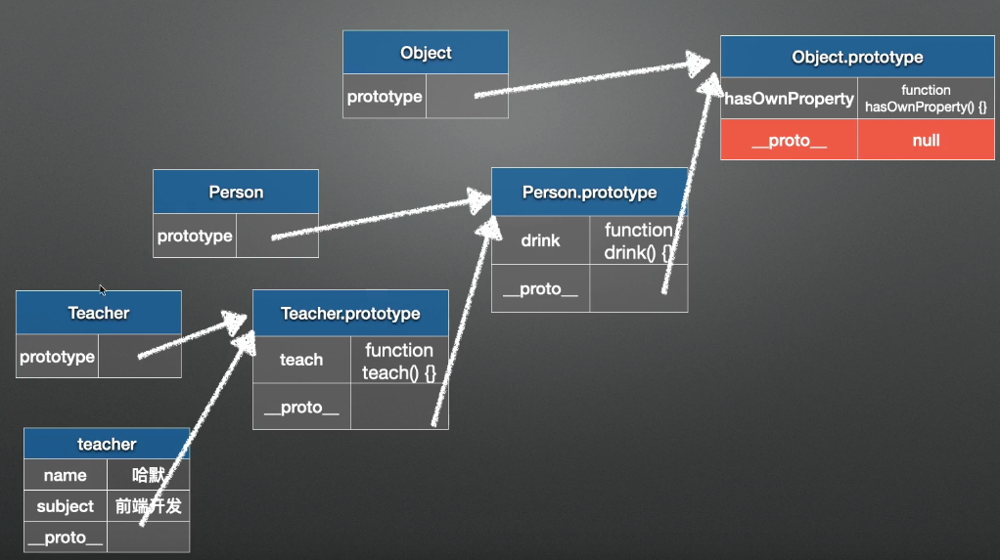

### this关键字

面向对象语言中 this 表示当前对象的一个引用。

但在 JavaScript 中 this 不是固定不变的，它会随着执行环境的改变而改变。

- 在方法中，this 表示该方法所属的对象。
- 如果单独使用，this 表示全局对象。
- 在函数中，this 表示全局对象。
- 在函数中，在严格模式下，this 是未定义的 (undefined)。
- 在事件中，this 表示接收事件的元素。

### 箭头函数

匿名函数最经典的总结：就是谁调用匿名函数，匿名函数中的this就指向谁；匿名函数是有执行上下文，只是执行上下文是执行的时候传递过来，箭头函数中的执行上下文是父级的执行上下文，匿名函数可以作为箭头函数的父级（详见例3）

```js
例1.匿名函数

var name='window';
var obj = {
    name:'obj',
    nameprintf:function(){
        console.log(this.name)
    }
}
var obj1 = {
    name:'obj1'
}
obj.nameprintf();//'obj'
var w = obj.nameprintf;
w();//'window'，这时候相当于Window.w(),this自然指向的是Window
obj.nameprintf.call(obj1) //obj1,匿名函数的中的this已经被绑定到了obj1
```

```js
例2.箭头函数它会直接绑定到它父级的执行上下文里的this。

var name='window';
var obj = {
    name:'obj',
    nameprintf:()=>{
        console.log(this.name)
    }
}
obj.nameprintf();//window,因为此时父级是obj，obj的上下文是window
```

```js
例3.两者相结合 

var obj={
    num:4,
    fn:function(){  
        console.log(this); //匿名函数的this，应该是谁调用指向谁
        (() => {
            console.log(this);//箭头函数的this，应该是父级的执行上下文，这里父级是fn，上下文就是调用fn函数的那个对象，和上面的this指向是一样的
        })();
    }
}
obj.fn(); //指向的都是obj
var w = obj.fn;
w(); //指向的Window 
var obj1 = {name:'obj1', fn:obj.fn}
obj1.fn(); //指向的obj1
obj.fn.call(obj1); //也是指向obj1
```


### prototype \_proto\_ constructor 原型链和原型对象

所有的 JavaScript 对象都会从一个 显示原型：prototype（原型对象）中继承属性和方法。

使用对象的构造器（constructor）：

```javascript
function Person(first, last, age, eyecolor) {
   this.firstName = first;  
   this.lastName = last;  
   this.age = age;  
   this.eyeColor = eyecolor;
}
var myFather = new Person("John", "Doe", 50, "blue");
var myMother = new Person("Sally", "Rally", 48, "green");
```

在一个已存在的对象构造器中是不能添加新的属性的：

```javascript
Person.nationality = "English";//不可行
```

要添加一个新的属性需要在在构造器函数中添加：

```javascript
function Person(first, last, age, eyecolor) {
   this.firstName = first;  
   this.lastName = last;  
   this.age = age;  
   this.eyeColor = eyecolor;  
   this.nationality = "English";
}
```

#### 原型链



JavaScript 对象有一个指向一个原型对象的链。当试图访问一个对象的属性时，它不仅仅在该对象上搜寻，还会搜寻该对象的原型，以及该对象的原型的原型，依次层层向上搜索，直到找到一个名字匹配的属性或到达原型链的末尾。

隐式原型：**`__proto__`** 属性，它是**对象所独有的**，可以看到`__proto__`属性都是由**一个对象指向一个对象**，即指向它们的原型对象（也可以理解为父对象）。直到原型链顶端**null**。

通过`__proto__`属性来连接对象直到`null`的一条链即为我们所谓的**原型链**。

#### 添加属性和方法

有的时候我们想要在所有已经存在的对象添加新的属性或方法。

另外，有时候我们想要在对象的构造函数中添加属性或方法。

使用 prototype 属性就可以给对象的构造函数添加新的属性：

```javascript
function Person(first, last, age, eyecolor) {
   this.firstName = first;
   this.lastName = last;
   this.age = age;
   this.eyeColor = eyecolor;
}
Person.prototype.nationality = "English";
```

当然我们也可以使用 prototype 属性就可以给对象的构造函数添加新的方法：

```javascript
function Person(first, last, age, eyecolor) {
   this.firstName = first;
   this.lastName = last;
   this.age = age;
   this.eyeColor = eyecolor;
}
Person.prototype.name = function() { 
   return this.firstName + " " + this.lastName;
};
```

#### constructor

`constructor`属性也是**对象才拥有的**，它是从**一个对象指向一个函数**，含义就是**指向该对象的构造函数**

#### 注意：

利用prototype重写构造函数后，`constructor`会指向你重新写的这个构造函数对象。

```javascript
function Person(first, last, age, eyecolor) {
   this.firstName = first;
   this.lastName = last;
   this.age = age;
   this.eyeColor = eyecolor;
}
Person.prototype = {
   getName: function() { 
   return this.firstName + " " + this.lastName;
	};
}
   
```

就像是这个实例，重写后会指向：

```javascript
 function() { 
   return this.firstName + " " + this.lastName;
};
```

这个构造函数对象。

所以在重写prototype之后，要将constructor重新写回原构造对象

```javascript
 Person.prototype = {
    constructor :Person;
   getName: function() { 
   return this.firstName + " " + this.lastName;
	};
}
```

### promise

- promise是一个对象，对象和函数的区别就是对象可以保存状态，函数不可以（闭包除外）
- 并未剥夺函数return的能力，因此无需层层传递callback，进行回调获取数据
- 代码风格，容易理解，便于维护
- 多个异步等待合并便于解决

#### promise详解

```jsx
new Promise(
  function (resolve, reject) {
    // 一段耗时的异步操作
    resolve('成功') // 数据处理完成
    // reject('失败') // 数据处理出错
  }
).then(
  (res) => {console.log(res)},  // 成功
  (err) => {console.log(err)} // 失败
)
```

- resolve作用是，将Promise对象的状态从“未完成”变为“成功”（即从 pending 变为 resolved），在异步操作成功时调用，并将异步操作的结果，作为参数传递出去；
   reject作用是，将Promise对象的状态从“未完成”变为“失败”（即从 pending 变为 rejected），在异步操作失败时调用，并将异步操作报出的错误，作为参数传递出去。
- promise有三个状态：
   1、pending[待定]初始状态
   2、fulfilled[实现]操作成功
   3、rejected[被否决]操作失败
   当promise状态发生改变，就会触发then()里的响应函数处理后续步骤；
   promise状态一经改变，不会再变。
- Promise对象的状态改变，只有两种可能：
   从pending变为fulfilled
   从pending变为rejected。
   这两种情况只要发生，状态就凝固了，不会再变了。

##### 最简单示例：

```jsx
new Promise(resolve => {
  setTimeout(() => {
    resolve('hello')
  }, 2000)
}).then(res => {
  console.log(res)
})
```

##### 分两次，顺序执行

```jsx
new Promise(resolve => {
    setTimeout(() => {
      resolve('hello')
    }, 2000)
  }).then(val => {
    console.log(val) //  参数val = 'hello'
    return new Promise(resolve => {
      setTimeout(() => {
        resolve('world')
      }, 2000)
    })
  }).then(val => {
    console.log(val) // 参数val = 'world'
  })
```

##### promise完成后then()

```jsx
let pro = new Promise(resolve => {
   setTimeout(() => {
     resolve('hello world')
   }, 2000)
 })
 setTimeout(() => {
   pro.then(value => {
   console.log(value) // hello world
 })
 }, 2000)
```

结论：promise作为队列最为重要的特性，我们在任何一个地方生成了一个promise队列之后，我们可以把他作为一个变量传递到其他地方。

#### 一、Pomise.all的使用

**Promise.all可以将多个Promise实例包装成一个新的Promise实例。同时，成功和失败的返回值是不同的，成功的时候返回的是一个结果数组，而失败的时候则返回最先被reject失败状态的值。**

具体代码如下：

```jsx
let p1 = new Promise((resolve, reject) => {
  resolve('成功了')
})

let p2 = new Promise((resolve, reject) => {
  resolve('success')
})

let p3 = Promse.reject('失败')

Promise.all([p1, p2]).then((result) => {
  console.log(result)               //['成功了', 'success']
}).catch((error) => {
  console.log(error)
})

Promise.all([p1,p3,p2]).then((result) => {
  console.log(result)
}).catch((error) => {
  console.log(error)      // 失败了，打出 '失败'
})
```

Promse.all在处理多个异步处理时非常有用，比如说一个页面上需要等两个或多个ajax的数据回来以后才正常显示，在此之前只显示loading图标。

代码模拟：

```dart
let wake = (time) => {
  return new Promise((resolve, reject) => {
    setTimeout(() => {
      resolve(`${time / 1000}秒后醒来`)
    }, time)
  })
}

let p1 = wake(3000)
let p2 = wake(2000)

Promise.all([p1, p2]).then((result) => {
  console.log(result)       // [ '3秒后醒来', '2秒后醒来' ]
}).catch((error) => {
  console.log(error)
})
```

**需要特别注意的是，Promise.all获得的成功结果的数组	里面的数据顺序和Promise.all接收到的数组顺序是一致的，即p1的结果在前，即便p1的结果获取的比p2要晚。这带来了一个绝大的好处：在前端开发请求数据的过程中，偶尔会遇到发送多个请求并根据请求顺序获取和使用数据的场景，使用Promise.all毫无疑问可以解决这个问题。**

#### 二、Promise.race的使用

顾名思义，Promse.race就是赛跑的意思，意思就是说，Promise.race([p1, p2, p3])里面哪个结果获得的快，就返回那个结果，不管结果本身是成功状态还是失败状态。

```jsx
let p1 = new Promise((resolve, reject) => {
  setTimeout(() => {
    resolve('success')
  },1000)
})

let p2 = new Promise((resolve, reject) => {
  setTimeout(() => {
    reject('failed')
  }, 500)
})

Promise.race([p1, p2]).then((result) => {
  console.log(result)
}).catch((error) => {
  console.log(error)  // 打开的是 'failed'
})
```

#### `async`和`await`是如何处理异步任务的？

简单说，`async`是通过`Promise`包装异步任务。

比如有如下代码：

```jsx
async function async1() {
  await async2()
  console.log('async1 end')
}
async function async2() {
  console.log('async2 end')
}
async1()
```

改为ES5的写法：

```jsx
new Promise((resolve, reject) => {
  // console.log('async2 end')
  async2() 
  ...
}).then(() => {
 // 执行async1()函数await之后的语句
  console.log('async1 end')
})
```

### 宏任务和微任务

微任务要比宏任务执行的早

宏任务：setTimeout 、setInterval、DOM事件、AJAX请求

微任务：Promise、async/await

执行顺序：

​	微任务->DOM渲染->宏任务
