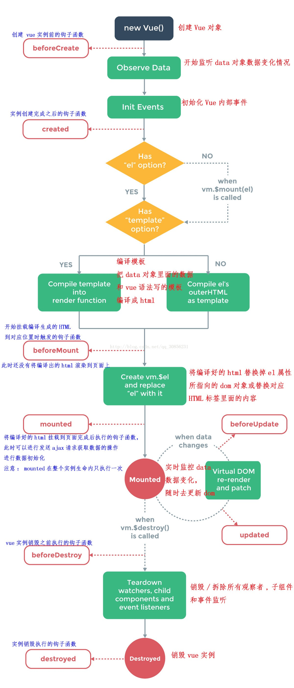

**vue**

- vue-cli 3.0 （2.0向3.0的过渡）
  - 配置
  - 优化
- vue基础知识
  - 双向数据绑定
  - template模板渲染语法和原理（vue-loader 、 虚拟DOM）
  - 指令和自定义指令
  - methods computed watch filters
  - class / style
  - 条件和循环渲染
  - 事件处理
  - 表单处理
  - 组件（属性）
  - ref
  - 生命周期
  - 插槽
  - transition
  - 渲染函数和jsx
  - 插件编写
  - 混入
  - devtools
  - ……
- vue-router
  - 基础知识
  - 动态路由
  - 编程式导航
  - 命名路由和命名容器
  - 导航守卫
  - HASH和BROWSER路由
  - 路由原理
  - ……
- vuex
  - state
  - getter
  - mutation
  - action
  - module
  - mapXxx
  - 实现原理
  - ……
- 单元测试
- SSR服务器渲染 nuxt.js
- UI组件库
- ……


一、什么是MVVM？

二、mvvm和mvc区别？它和其它框架（jquery）的区别是什么？哪些场景适用？

三、vue的优点是什么？

四、 组件之间的传值？

五、路由之间跳转

六、vue.cli中怎样使用自定义组件？遇到过哪些问题？

七、vue如何实现按需加载配合webpack设置

八、vuex面试相关

（5）vuex的Mutation特性

（6）不用Vuex会带来什么问题？

九、 v-show和v-if指令的共同点和不同点

十、vue中几种常见的指令

十一、Vue的生命周期

十二、什么是vue的计算属性？

十三、计算属性 computed 和 侦听器watch 的区别？

十四、**vue中 key 值的作用？？**

十五、Vue路由有哪几种模式？

十六、Vue组件传值有哪几种方式？

十七、$route和$router的区别

十八、vue中的单项数据流和双向数据绑定是什么意思？

十九、Vue组件中的data为什么必须是一个函数？

二十、Vue-route是什么？

二十一、怎么定义 vue-router 的动态路由? 怎么获取传过来的值？

二十二、对keep-alive 的了解？？

二十三、你之前有做过spa类型的项目吗？怎么实现的？？

二十四、如何给vue自定义组件添加点击事件？？

### 一、什么是MVVM？

```
MVVM是Model-View-ViewModel的缩写。MVVM是一种设计思想。Model 层代表数据模型，也可以在Model中定义数据修改和操作的业务逻辑；View 代表UI 组件，它负责将数据模型转化成UI 展现出来，ViewModel 是一个同步View 和 Model的对象。

在MVVM架构下，View 和 Model 之间并没有直接的联系，而是通过ViewModel进行交互，Model 和 ViewModel 之间的交互是双向的， 因此View 数据的变化会同步到Model中，而Model 数据的变化也会立即反应到View 上。

ViewModel 通过双向数据绑定把 View 层和 Model 层连接起来，而View 和 Model 之间的同步工作完全是自动的，无需人为干涉，因此开发者只需关注业务逻辑，不需要手动操作DOM, 不需要关注数据状态的同步问题，复杂的数据状态维护完全由 MVVM 来统一管理。
```

### 二、mvvm和mvc区别？它和其它框架（jquery）的区别是什么？哪些场景适用？

```
mvc和mvvm其实区别并不大，都是一种设计思想。主要就是 演变成mvvm中的viewModel。mvvm主要解决了mvc中大量的DOM 操作使页面渲染性能降低，加载速度变慢，影响用户体验。

区别：vue数据驱动，通过数据来显示视图层而不是节点操作。

场景：数据操作比较多、频繁的场景，更加便捷。
```

### 三、vue的优点是什么？

```
低耦合。视图（View）可以独立于Model变化和修改，一个ViewModel可以绑定到不同的"View"上，当View变化的时候Model可以不变，当Model变化的时候View也可以不变。

可重用性。可以把一些视图逻辑放在一个ViewModel里面，让很多view重用这段视图逻辑。

独立开发。开发人员可以专注于业务逻辑和数据的开发（ViewModel），设计人员可以专注于页面设计。

可测试。界面素来是比较难于测试的，而现在测试可以针对ViewModel来写。
```

### 四、 组件之间的传值？

```js
自定义组件过程
1.导入组件所在文件
import CustomDialog from '@/views/custom_dialog' //默认会导入index.vue
2.在组件中添加它
components: {
    'custom-dialog': CustomDialog
  },
///
3.使用组件
 <custom-dialog :dialogVisible="isShow" @close="closeDialog"></custom-dialog>
父组件通过标签上 :dialogVisible="isShow" 方式定义传值
子组件通过props方法接受数据
 props: ['dialogVisible'],
子组件通过$emit方法传递参数
 this.$emit('close')
```

### 五、路由之间跳转

```

- 声明式（**标签跳转**）
- 编程式（ **js跳转**）
```

### 六、vue.cli中怎样使用自定义组件？遇到过哪些问题？

```
第一步：在components目录新建组件文件（indexPage.vue），script一定要export default {}。

第二步：在需要用的页面（组件）中导入：import indexPage from '@/components/indexPage.vue'

第三步：注入到vue子组件的components属性上面,components:{indexPage}

第四步：在template视图view中使用，例如有indexPage命名，使用的时候则index-page。
```

### 七、vue如何实现按需加载配合webpack设置

```
webpack中提供了require.ensure()来实现按需加载。以前引入路由是通过import 这样的方式引入，改为const定义的方式进行引入。

页面不按需加载引入方式：import home from '../../common/home.vue'

页面按需加载引入方式：

const home = r => require.ensure( [], () => r (require('../../common/home.vue')))
1


```

### 八、vuex面试相关

#### （1）vuex是什么？怎么使用？哪种功能场景使用它？

```
vue框架中状态管理。在main.js引入store注入。新建一个目录store 。场景有：单页应用中，组件之间的状态，音乐播放、登录状态、加入购物车等。
```

#### （2）vuex有哪几种属性？

```
有五种，分别是 State、 Getter、Mutation 、Action、 Module。
```


#### （3） vuex的State特性

```
Vuex就是一个仓库，仓库里面放了很多对象。其中state就是数据源存放地，对应于一般Vue对象里面的data。

state里面存放的数据是响应式的，Vue组件从store中读取数据，若是store中的数据发生改变，依赖这个数据的组件也会发生更新。

通过mapState把全局 state 和 getters 映射到当前组件的 computed 计算属性中。
```

#### （4）vuex的Getter特性

```
getters 可以对State进行计算操作，它就是Store的计算属性。

虽然在组件内也可以做计算属性，但是getters 可以在多组件之间复用。

如果一个状态只在一个组件内使用，可以不用getters。
```

### （5）vuex的Mutation特性

```
Action 类似于 mutation，不同在于：Action 提交的是 mutation，而不是直接变更状态；Action 可以包含任意异步操作。

### 
```

### （6）不用Vuex会带来什么问题？

```
可维护性会下降，想修改数据要维护三个地方；

可读性会下降，因为一个组件里的数据，根本就看不出来是从哪来的；

增加耦合，大量的上传派发，会让耦合性大大增加，Vue用Component本意就是为了减少耦合，现在这么用，和组件化的初衷相背
```

### 九、 v-show和v-if指令的共同点和不同点

```
v-show指令是通过修改元素的display的CSS属性让其显示或者隐藏；

v-if指令是直接销毁和重建DOM达到让元素显示和隐藏的效果；

使用v-show会更加节省性能上的开销；当只需要一次显示或隐藏时，使用v-if更加合理。

```

### 十、vue中几种常见的指令

```
1、v-if：根据表达式的值的真假条件渲染元素。在切换时元素及它的数据绑定 / 组件被销毁并重建。
2、v-show：根据表达式之真假值，切换元素的 display CSS 属性。
3、v-for：循环指令，基于一个数组或者对象渲染一个列表，vue 2.0以上必须需配合 key值 使用。
4、v-bind：动态地绑定一个或多个特性，或一个组件 prop 到表达式。
5、v-on：用于监听指定元素的DOM事件，比如点击事件。绑定事件监听器。
6、v-model：实现表单输入和应用状态之间的双向绑定
7、v-pre：跳过这个元素和它的子元素的编译过程。可以用来显示原始 Mustache 标签。跳过大量没有指令的节点会加快编译。
8、v-once：只渲染元素和组件一次。随后的重新渲染，元素/组件及其所有的子节点将被视为静态内容并跳过。这可以用于优化更新性能。
```

### 十一、Vue的生命周期




> vue的生命周期就是**vue实例的创建运行销毁**的一个过程，在不同的阶段会触发不同的函数，这些函数也就是生命周期函数，比如create，在实例创建数据已经完毕，能够做一些数据的初始化，但是dom还没有渲染，mounted页面数据全部渲染完毕，可以在此函数内部操作dom

| 生命周期钩子  | 触发的行为                                                   | 在这阶段可操作的例子                                         |
| :-----------: | ------------------------------------------------------------ | ------------------------------------------------------------ |
| beforeCreate  | vue实例的挂载元素$el和数据data都为undefined，还未初始化。    | 可在这加个loading事件                                        |
|    created    | vue实例的数据data有了，$el还没有，DOM未生成                  | 结束loading，还可从服务器获取一些初始化的数据                |
|  beforeMount  | vue实例的$el和data都初始化了，但还是虚拟的dom节点，页面还未被渲染。先把坑占住，到后面mounted挂载的时候再把值渲染进去。 |                                                              |
|    mounted    | vue实例挂载完成，虚拟的DOM变成真实DOM                        | 在这发起后端请求，拿回数据，配合路由钩子做一些事情；可操作DOM节点 |
| beforeUpdate  | data中的数据发生改变，还没有重新渲染之前调用                 |                                                              |
|    updated    | data中的数据发生改变，重新渲染之后调用                       | 数据更新时，做一些处理（此处也可以用watch进行观测）          |
| beforeDestroy | 组件销毁前调用                                               | 给用户提示，比如“您确定删除xxx吗？移除定时器或者事件绑定”    |
|   destroyed   | 组件销毁后调用，vue实例解除了事件监听以及和dom的绑定（无响应了），但DOM节点依旧存在 | 当前组件已被删除，清空相关内容                               |


### 十二、什么是vue的计算属性？

> 在模板中放入太多的逻辑会让模板过重且难以维护，在需要对数据进行复杂处理，且可能多次使用的情况下，尽量采取计算属性的方式。
>
> 好处：
> ①使得数据处理结构清晰；
> ②依赖于数据，数据更新，处理结果自动更新；
> ③计算属性内部this指向vm实例；
> ④在template调用时，直接写计算属性名即可；
> ⑤常用的是getter方法，获取数据，也可以使用set方法改变数据；
> ⑥相较于methods，不管依赖的数据变不变，methods都会重新计算，但是依赖数据不变的时候computed从缓存中获取，不会重新计算。

### 十三、计算属性 computed 和 侦听器watch 的区别？

> computed：当页面中有某些数据依赖其他数据进行变动的时候，可以使用计算属性。
> watch：监听的是已经在 data 中定义的变量，当该变量变化时，会触发 watch 中的方法；数据变化时执行异步或开销较大的操作，可以随时修改状态的变化。
>
> 通俗来讲，既能用computed 实现又可以用 watch 监听来实现的功能，推荐用 computed，重点在于 computed 的缓存功能
>
> 可参考：[Vue中计算属性和 watch的区别](https://www.cnblogs.com/lk-food/p/12365949.html)
> [vue中，计算属性 computed 和 watch 的区别](https://www.jianshu.com/p/a69a9bac9dc3)

### 十四、**vue中 key 值的作用？？**

> 为了给 Vue 一个提示，以便它能跟踪每个节点的身份，从而**重用和重新排序现有元素**；
> 数据发生改变，只是将对应的对象重新排序；未改变的对象，不会重新创建，进而提升效率；
> key 值是每项都有**唯一 id（唯一标识）**
>
> 用于 管理可复用的元素。因为Vue 会尽可能高效地渲染元素，通常会复用已有元素而不是从头开始渲染。这么做使 Vue 变得非常快，但是这样也不总是符合实际需求。

### 十五、Vue路由有哪几种模式？

```js
vue-router 有 3 种路由模式：hash、history、abstract

hash 能兼容到IE8， history 只能兼容到 IE10

vue-router中默认使用的是hash模式，也就是会出现如下的URL，URL中带有#号：
HTML5的History模式，它使url看起来像普通网站那样，以“/”分割，没有#，单页面并没有跳转
开启history模式后自动去除#，开启history模式需要后台配合；
我们可以用如下代码修改成history模式：
import Vue from 'vue'
import Router from 'vue-router'
import Main from '@/components/Main'
Vue.use(Router)

export default new Router({
  mode: 'history',
  routes: [
    {
      path: '/',
      component: Main
    }
  ]
})
```

[vue-router两种模式](https://blog.csdn.net/sunshine1990916/article/details/84852258)

### 十六、Vue组件传值有哪几种方式？

```vue
### 

1. 父传子

父传子的实现方式就是通过props属性，子组件通过props属性接收从父组件传过来的值，而父组件传值的时候使用 v-bind 将子组件中预留的变量名绑定为data里面的数据即可。

2. 子传父

子组件中需要以某种方式例如点击事件的方法来触发一个自定义事件；子组件给父组件传参用this.$emit(‘事件名’,携带的内容）,父组件在相应的位置监听事件

3. 非父子组件间传值

1.vue提供了很多套组件间传值的方法，父子组件直接用props和$emit就好，大型项目则用vuex，但有一种更适合在小项目中使用的非父子组件传值方法，即bus总线机制。

非父子组件之间传值，需要定义个公共的公共实例文件bus.js，作为中间仓库来传值，不然路由组件之间达不到传值的效果。
2.另外一种方法也可以，先从传到父组件，再传到子组件（相当于一个公共bus文件）

4. 路由传参
// 1.命名路由传参
this.$router.push({ name: 'user', params: { user: 'nickname' }});
//页面接受
this.$route.params
// 2.查询参数传参
this.$router.push({path: '/user', query: {user: "nickname"}});
//页面接受
this.$route.query


```

### 十七、$route和$router的区别

```
$route是“路由信息对象”，包括path，params，hash，query，fullPath，matched，name等路由信息参数。而$router是“路由实例”对象包括了路由的跳转方法，钩子函数等。
```

  

### 十八、vue中的单项数据流和双向数据绑定是什么意思？

```
单项数据流是指数据是单向的，父组件的数据传递给子组件，只能单项绑定，不可以在子组件修改父组件的数据

双向数据绑定：是指数据和页面进行双向绑定，相互影响

### 
```

### 十九、Vue组件中的data为什么必须是一个函数？

```
因为如果默认为data是对象的话，对象为引用类型，这样的话，所有复用的组件都是引用的同一个数据，一个数据改变了其他也改变了。
但是如果是函数的话，只有函数构成作用域(注意理解作用域，只有函数{}构成作用域,对象的{}以及if(){}都不构成作用域),data是一个函数时，每个组件实例都有自己的作用域，每个实例相互独立，不会相互影响。

```

### 二十、Vue-route是什么？

```
Vue-route是vue的一个前端路由器，它可以实现对页面局部进行无刷新的替换，让用户感觉就像切换到了网页一样。
路由就是根据网址的不同，返回不同的内容给用户。
```


### 二十一、怎么定义 vue-router 的动态路由? 怎么获取传过来的值？

```
在 router 目录下的 index.js 文件中，对 path 属性加上 /:id，使用 this.$route.params.id获取。
```


### 二十二、对keep-alive 的了解？？

```
每一次路由切换时，ajax都会被发送，因此需要使用keep-alive优化网页性能。
可以使被包含的组件保留状态，或避免重新渲染。

在vue 2.1.0 版本之后，keep-alive新加入了两个属性: include(包含的组件缓存) 与 exclude(排除的组件不缓存，优先级大于include) 。
使用方法

<keep-alive include='include_components' exclude='exclude_components'>
  <component>
    <!-- 该组件是否缓存取决于include和exclude属性 -->
  </component>
</keep-alive>

```


### 二十三、你之前有做过spa类型的项目吗？怎么实现的？？

```
spa就是单页面应用程序，而单页面应用程序，主要依靠路由来实现，路由根据不同的hash值来展示不同的组件
```


### 二十四、如何给vue自定义组件添加点击事件？？

```
通俗点讲：就是在父组件中给子组件绑定一个原生的事件，就将子组件变成了普通的HTML标签，不加’. native’事件是无法触 发的。
需要在@click后面加上.native,官方对于native的解释为：

.native ——监听组件根元素的原生事件

正确写法：

<my-button  @click.native="alert1()" names="删除" v-bind:item2="btdata"></my-button>

```

