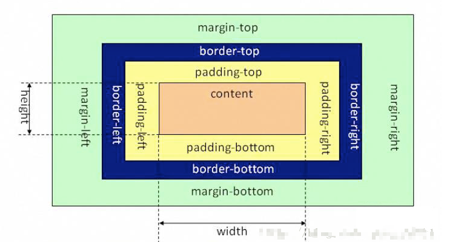
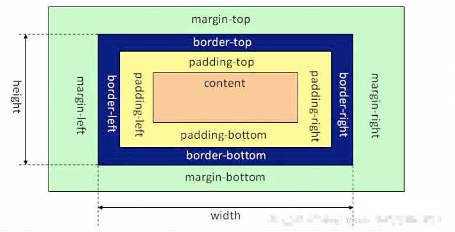
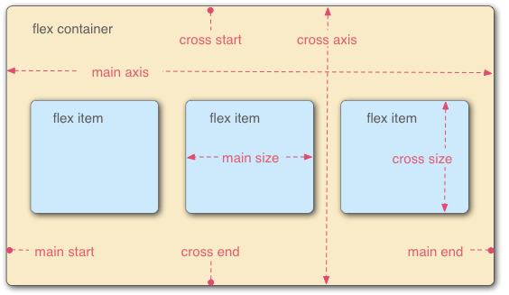
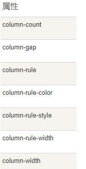

## css部分面试题

1.介绍一下标准的css盒子模型 低版本的IE的盒子模型有什么不同

2.css选择符有哪些，那些属性可以继承

3.css优先级计算

4.css3新增的伪类有哪些

6.position有哪几个属性值

7.relative和absolute的定位原点是

8.css3有哪些新特性

9.为什么要是用精灵图

10.display:none 和 visibility:hidden 有什么区别

11.请解释一下css3的flexbox（弹性盒布局）以及适用场景

12.经常遇到的浏览器兼容性问题有哪些，原因解决方法是什么，常用的hack技巧

13.写出几种IE6 BUG的解决方案

14.CSS里的visibility属性有个collapse属性值是干嘛用的？在不同浏览器下以后什么区别？

15.position跟display、margin collapse、overflow、float这些特性相互叠加后会怎么样？

16.为什么需要清除浮动，清除浮动的方法有哪些

17.什么是外边距合并

18.浏览器是怎样解析CSS选择器的？

19.在网页中的应该使用奇数还是偶数的字体？为什么呢？

20.margin和padding分别适合什么场景使用？

21.元素竖向的百分比设定是相对于容器的高度吗

22.响应式设计的基本原理是什么 如何兼容低版本的IE

23.你对line-height是如何理解的

24.如果需要手写动画，你认为的最小时间间隔是多久

25.display:inline-block什么时候会显示间隙

26.有一个高度自适应的div里面有两个div，一个高度100px，希望另一个填满剩下的高度

27.png、jpg、gif 这些图片格式解释一下，分别什么时候用。有没有了解过webp？

\28. style标签写在body后与body前有什么区别？

29.什么是CSS预处理器/后处理器

30.rem布局的优缺点

31.css属性overflow属性定义溢出元素内容区的内容会如何处理

32.左右两栏固定宽高，中间自适应布局的五种方案


### 1.介绍一下标准的css盒子模型 低版本的IE的盒子模型有什么不同

```css
区别：
	盒子模型有两种：标准盒模型和怪异盒模型
	标准盒子模型：内容content、填充padding、边界margin、边框border
	怪异盒子模型：内容content（包括边框border和填充padding）

声明方式：
	IE盒子模型box-sizing:border-box;（怪异模式）
	W3C标准盒子模型 box-sizing:content-box;（标准模式）默认模式
	content-box:这是默认样式指定CSS标准。测量width和height属性只包括的内容，但不是border, margin, 或者 padding。
	padding-box:width和height属性包括padding的大小，不包括border和	margin
	border-box:width和height属性包括padding和border，但不是margin。这是盒模型的文档时，Internet Explorer使用Quirks模式。
	content-box不包含padding，border-box包含padding。所以如果你设置的大小是一样的，content-box看起来，会比border-box大
```

### 2.css选择符有哪些，那些属性可以继承

```
 1.id选择器（#myid）
 2.类选择器（.myclassname）
 3.标签选择器（div h1 p）
 4.相邻选择器（h1 + p）
 5.子选择器（ul>li）
 6.后代选择器（li a）
 7.通配符选择器 （*）
 8.属性选择器（a[rel = "external"]）
 9.伪类选择器（a:hover,li:nth-child）
 
 可继承的样式：font-size font-family color 
 不可继承的样式：border padding margin width height
```

### 3.css优先级计算

```
优先级：
	同权重：内联样式表>嵌入样式表>外部样式表
	！important>id>class>tag
	important比内联优先级高
	
```

### 4.css3新增的伪类有哪些

```
举例：
    p:first-of-type 选择属于其父元素的首个 <p> 元素的每个 <p> 元素。
    p:last-of-type  选择属于其父元素的最后 <p> 元素的每个 <p> 元素。
    p:only-of-type  选择属于其父元素唯一的 <p> 元素的每个 <p> 元素。
    p:only-child        选择属于其父元素的唯一子元素的每个 <p> 元素。
    p:nth-child(2)  选择属于其父元素的第二个子元素的每个 <p> 元素。

    :after          在元素之前添加内容,也可以用来做清除浮动。
    :before         在元素之后添加内容
    :enabled        
    :disabled       控制表单控件的禁用状态。
    :checked        单选框或复选框被选中。
```

#### 5.掌握盒子水平垂直居中的五大方案

回答：这种问题在我之前的项目当中经常遇到，最开始我用的方法是display：flex，后来了解到css3之后，

- 定位：三种

```css
/* 定位1 
	需要知道子盒子的宽高
*/
		body {
			position: relative;
		}

		.box {
			position: absolute;
			top: 50%;
			left: 50%;
			margin-top: -25px;
			margin-left: -50px;
		}

/* 定位2 
	子盒子必须有宽高，可以不知道，但是必须有宽高
*/
		.box {
			position: absolute;
			top: 0;
			left: 0;
			right: 0;
			bottom: 0;
			margin: auto;
		}

/* 定位3  
	不需要具体宽高，可以由内容撑开
	css3新增transform
	有兼容问题
*/
		.box {
			position: absolute;
			top: 50%;
			left: 50%;
			transform: translate(-50%, -50%);
		}
```


- display:flex

```css
/* display: flex; 
	不兼容，移动端经常用这种方法
	不过当前不考虑兼容，vue
*/
		body {
			display:flex;  使body成为弹性容器，容器内所有下级项目成为弹性项目
			justify-content:center;  弹性项目 水平居中(使<text>水平居中)
			align-items:center;  弹性项目 垂直居中
		} 
```


- javascript

```JavaScript
// JavaScript方法
// 这种方法也是通过获取盒子宽高，设置盒子位置完成
		let HTML = document.documentElement,
          winW = HTML.clientWidth,
          winH = HTML.clientHeight,
          boxW = box.offsetWidth,
          boxH = box.offsetHeight;
		box.style.position = "absolute";
		box.style.left = (winW - boxW) / 2 + 'px';
		box.style.top = (winH - boxH) / 2 + 'px'; 
```


- display:table-cell

```css
body {			display: table-cell;			vertical-align: middle;			text-align: center;			/* 固定宽高 */			width: 500px;			height: 500px;		}		.box {			display: inline-block;		}
```

### 6.position有哪几个属性值

| 值       | 描述                                                         |
| -------- | ------------------------------------------------------------ |
| absolute | 生成绝对定位的元素，相对于 static 定位以外的第一个父元素进行定位。元素的位置通过 "left", "top", "right" 以及 "bottom" 属性进行规定。 |
| fixed    | 生成绝对定位的元素，相对于浏览器窗口进行定位。元素的位置通过 "left", "top", "right" 以及 "bottom" 属性进行规定。 |
| relative | 生成相对定位的元素，相对于其正常位置进行定位。因此，"left:20" 会向元素的 LEFT 位置添加 20 像素。 |
| static   | 默认值。没有定位，元素出现在正常的流中（忽略 top, bottom, left, right 或者 z-index 声明）。 |
| inherit  | 规定应该从父元素继承 position 属性的值。                     |

### 7.relative和absolute的定位原点是

```
absolute  	生成绝对定位的元素，相对于值不为 static的第一个父元素进行定位。 fixed （老IE不支持）  	生成绝对定位的元素，相对于浏览器窗口进行定位。 relative  	生成相对定位的元素，相对于其正常位置进行定位。 static  	默认值。没有定位，元素出现在正常的流中（忽略 top, bottom, left, right z-index 声明）。 inherit  	规定从父元素继承 position 属性的值。
```

### 8.css3有哪些新特性

```
1、颜色：新增RGBA、HSLA模式
2、文字阴影(text-shadow)
3、边框：圆角（border-radius）边框阴影：box-shadow
4、盒子模型：box-sizing
5、背景：background-size设置背景图片的尺寸，background-origin设置背景图片的原点，background-clip设置背景图片的裁剪区域，以“，”分隔可以设置多背景，用于自适应布局
6、渐变：linear-gradient、radial-gradient
7、过渡：transition可实现动画
8、自定义动画
9、在CSS3中唯一引入的伪元素是::selection
10、多媒体查询、多栏布局
11、border-image
12、2D转换：transform:translate(x,y)rotate(x,y)skew(x,y)scale(x,y)
13、3D转换
缩放,定位,倾斜,动画,多背景
    例如:transform:\scale(0.85,0.90)\ translate(0px,-30px)\ skew(-9deg,0deg)\Animation:
```

### 9.为什么要是用精灵图

```
css精灵 把一堆小的图片整合到一张大的图片上，减轻服务器对图片的请求数量

css sprites其实就是把网页中一些背景图片整合到一张图片文件中，再利用css的"background-image","background-position"的组合进行背景定位，这样可以减少。
很多图片请求的开销，因为请求耗时比较长；请求虽然可以并发，但是如果请求太多会给服务器增加很大的压力。
```

### 10.display:none 和 visibility:hidden 有什么区别

```
display:none;使用该属性后，HTML元素（对象）的宽高，高度等各种属性值都将“丢失”；
visibility:hidden;使用该属性后，HTML元素（对象）仅仅是在视觉上看不见（完全透明），而它所占据的空间位置仍然存在，也即是说它仍然具有高度，宽度等属性值。
```

### 11.请解释一下css3的flexbox（弹性盒布局）以及适用场景

```
 一个用于页面布局的全新CSS3功能，Flexbox可以把列表放在同一个方向（从上到下排列，从左到右），并让列表能延伸到占用可用的空间。
   较为复杂的布局还可以通过嵌套一个伸缩容器（flex container）来实现。
   采用Flex布局的元素，称为Flex容器（flex container），简称"容器"。
   它的所有子元素自动成为容器成员，称为Flex项目（flex item），简称"项目"。
   常规布局是基于块和内联流方向，而Flex布局是基于flex-flow流可以很方便的用来做局中，能对不同屏幕大小自适应。
   在布局上有了比以前更加灵活的空间。
```

### 12.经常遇到的浏览器兼容性问题有哪些，原因解决方法是什么，常用的hack技巧

```
 * png24位的图片在iE6浏览器上出现背景，解决方案是做成PNG8.

 * 浏览器默认的margin和padding不同。解决方案是加一个全局的*{margin:0;padding:0;}来统一。

 * IE6双边距bug:块属性标签float后，又有横行的margin情况下，在ie6显示margin比设置的大。

    浮动ie产生的双倍距离 #box{ float:left; width:10px; margin:0 0 0 100px;}

    这种情况之下IE会产生20px的距离，解决方案是在float的标签样式控制中加入 ——_display:inline;将其转化为行内属性。(_这个符号只有ie6会识别)

    渐进识别的方式，从总体中逐渐排除局部。

    首先，巧妙的使用“\9”这一标记，将IE游览器从所有情况中分离出来。
    接着，再次使用“+”将IE8和IE7、IE6分离开来，这样IE8已经独立识别。

    css
        .bb{
            background-color:red;/*所有识别*/
  	      background-color:#00deff\9; /*IE6、7、8识别*/
  	      +background-color:#a200ff;/*IE6、7识别*/
  	      _background-color:#1e0bd1;/*IE6识别*/
        }


 *  IE下,可以使用获取常规属性的方法来获取自定义属性,
     也可以使用getAttribute()获取自定义属性;
     Firefox下,只能使用getAttribute()获取自定义属性。
     解决方法:统一通过getAttribute()获取自定义属性。

 *  IE下,even对象有x,y属性,但是没有pageX,pageY属性;
     Firefox下,event对象有pageX,pageY属性,但是没有x,y属性。

 *  解决方法：（条件注释）缺点是在IE浏览器下可能会增加额外的HTTP请求数。

 *  Chrome 中文界面下默认会将小于 12px 的文本强制按照 12px 显示,
     可通过加入 CSS 属性 -webkit-text-size-adjust: none; 解决。

 *  超链接访问过后hover样式就不出现了 被点击访问过的超链接样式不在具有hover和active了
  	解决方法是改变CSS属性的排列顺序:
  L-V-H-A :  a:link {} a:visited {} a:hover {} a:active {}

```

### 13.写出几种IE6 BUG的解决方案

```css
一、IE6双倍边距bug
当页面上的元素使用float浮动时，不管是向左还是向右浮动；只要该元素带有margin像素都会使该值乘以2，例如“margin-left:10px” 在IE6中，该值就会被解析为20px。想要解决这个BUG就需要在该元素中加入display:inline 或 display:block 明确其元素类型即可解决双倍边距的BUG

二、IE6中3像素问题及解决办法
当元素使用float浮动后，元素与相邻的元素之间会产生3px的间隙。诡异的是如果右侧的容器没设置高度时3px的间隙在相邻容器的内部，当设定高度后又跑到容器的相反侧了。要解决这类BUG的话，需要使布局在同一行的元素都加上float浮动。

三、IE6中奇数宽高的BUG
IE6中奇数的高宽显示大小与偶数高宽显示大小存在一定的不同。其中要问题是出在奇数高宽上。要解决此类问题，只需要尽量将外部定位的div高宽写成偶数即可。

四、IE6中图片链接的下方有间隙
IE6中图片的下方会存在一定的间隙，尤其在图片垂直挨着图片的时候，即可看到这样的间隙。要解决此类问题，需要将img标签定义为display:block 或定义vertical-align对应的属性。也可以为img对应的样式写入font-size:0

五、IE6下空元素的高度BUG
如果一个元素中没有任何内容，当在样式中为这个元素设置了0-19px之间的高度时。此元素的高度始终为19px。
解决的方法有四种:

1.在元素的css中加入：overflow:hidden
2.在元素中插入html注释：<!– >
3.在元素中插入html的空白符：&nbsp;
4.在元素的css中加入：font-size:0

六、重复文字的BUG
在某些比较复杂的排版中，有时候浮动元素的最后一些字符会出现在clear清除元素的下面。

解决方法如下：

1.确保元素都带有display:inline

2.在最后一个元素上使用“margin-right:-3px

3.为浮动元素的最后一个条目加上条件注释，<!–[if !IE]>xxx<![endif]–>

4.在容器的最后元素使用一个空白的div，为这个div指定不超过容器的宽度。

七、IE6中 z-index失效
具体BUG为，元素的父级元素设置的z-index为1，那么其子级元素再设置z-index时会失效，其层级会继承父级元素的设置，造成某些层级调整上的BUG。详细解释可以阅读IE6中部分情况下z-index无效的原因，以及解决办法

结语：实际上IE6中，很多BUG的解决方法都可以使用display:inline、font-size:0、float解决。因此我们在书写代码时要记住，一旦使用了float浮动，就为元素增加一个display:inline样式，可以有效的避免浮动造成的样式错乱问题。使用空DIV时，为了避免其高度影响布局美观，也可以为其加上font-size:0 这样就很容易避免一些兼容上的问题。


兼容
1li列表的bug
/*A当父元素li有float子元素a没有设置浮动时会出现垂直bug
hank：给父元素li和子元素都设置浮动*/
/*B当li中的a转成block并且有height并有float的li中设置浮动会出现阶梯显示
 hank：给li加float*/
2marginBUG
/*A：描述：当前元素与父元素没有设置浮动情况下设置margin-top会出现错误的加在父元素上
hank：给父元素和子元素加overflow：hidden
hank：给父元素和子元素加浮动*/
/*B：描述：当上下排列的元素上元素有margin-bottom：30px下元素有margin-top：20px他们
中间的间距不会叠加而是会设置较大的值
hank：把margin值加在一个元素上
hank：给上或下元素套一个div给div加overflow：hidden*/
3按钮元素默认大小不一
/*各个浏览器中按钮元素大小不一
hank1：统一大小（用a标签模拟）
hank2：input外面套一个标签在这个标签里直接写按钮的样式把input边框去掉
hank3：如果这个按钮是一个图片直接把图片作为按钮背景即可*/
4.百分比的bug
/*百分比bug在ie6及更低版本浏览器解析百分比时会按照四舍五入导致50%+50%》100%
hank：给右边的浮动元素添加声明clear：right*/
5.表单元素行高对齐不一致
/*form里的input select表单元素的行高对齐方式不一致
 hank：给表单元素加float：left*/
6.高度自适应出现高度塌陷
 hank1：给父级元素添加声明overflow:hidden
 hank2:在浮动元素下方添加空的div病添加声明div{clear:both;height:0;overflow:hidden}
hank3:万能清除法ie6不支持div:after{content:".";clear:both;display:block;
height:0;overflow:hidden;visibility:hidden;}
7.块级元素默认高度
/*描述：在ie6及以下版本中部分块元素拥有默认高度（小于20px在16px左右）
hank：给元素添加声明：font-size：0
hank：给元素添加声明：overflow：hidden*/
8.鼠标指针
/*描述：cursor属性的hand值只有在ie9以上识别其他浏览器不支持cursor的pointer属性只有
在ie6以上版本及其他内核浏览器都支持
hank：统一鼠标元素鼠标指针形状为手型cursor：pointer*/
9.双倍边距
/*当ie6及更低版本浏览器解析浮动元素时会错误把浮向边边界margin加倍显示
hank：给浮动元素添加声明display：inline*/
10透明度的兼容
div{opacity:0.5;filter:alpha(opacity=50)}
11.图片的间隙
    img{display: block;}
       /*在div中的图片间隙*/ 
       /*在div中的图片会在div下方撑大3px
        hank1：div和img写在一行上
         hank2：img转成块元素给img添加display：block
       图片水平居中不起作用加margin：0 auto*/
       /*dt li 中的图片间隙*/
     /*img添加display：block*/
12图片有边框
img{border:0;}
/*当图片加在a标签上时会出现边框
 hank：给图片加border：0或border：none*/
13.最小高度自适应的兼容
/*min-height属性ie浏览器不识别
hank1：min-height：100px；_height：100px
hank2：min-height：100px；height：auto！important；height：100px*/
```

### 14.CSS里的visibility属性有个collapse属性值是干嘛用的？在不同浏览器下以后什么区别？

```
对于普通元素visibility:collapse;会将元素完全隐藏,不占据页面布局空间,与display:none;表现相同. 

如果目标元素为**table**,visibility:collapse;将table隐藏,但是会占据页面布局空间. 
注意 仅在Firefox下起作用,IE会显示元素,Chrome会将元素隐藏,但是占据空间.
————————————————
版权声明：本文为CSDN博主「yxorg」的原创文章，遵循CC 4.0 BY-SA版权协议，转载请附上原文出处链接及本声明。
原文链接：https://blog.csdn.net/yxorg/article/details/108182919
```

### 15.position跟display、margin collapse、overflow、float这些特性相互叠加后会怎么样？

```
如果元素的display为none,那么元素不被渲染,position,float不起作用如果元素拥有position:absolute;或者position:fixed;属性那么元素将为绝对定位,float不起作用.如果元素float属性不是none,元素会脱离文档流,根据float属性值来显示.有浮动,绝对定位,inline-block属性的元素,margin不会和垂直方向上的其他元素margin折叠.
```

### 16.为什么需要清除浮动，清除浮动的方法有哪些

```
**1.使用空标签清除浮动clear:both。**
原理：添加一个空div，利用css提高的clear:both清除浮动，让父级div能自动获取到高度
优点：通俗易懂，容易掌握
缺点：会添加很多无意义的空标签，有违结构与表现的分离，在后期维护中将是噩梦
建议：不推荐使用，但此方法是以前主要使用的一种清除浮动方法
<div style="clear:both;"></div>

**2.父级div定义overflow:hidden或auto**
原理：必须定义width或zoom:1，同时不能定义height，使用overflow:hidden时，浏览器会自动检查浮动区域的高度
优点：简单，代码少，浏览器支持好
缺点：不能和position配合使用，因为超出的尺寸的会被隐藏
建议：只推荐没有使用position或对overflow:hidden理解比较深的朋友使用
给包含浮动元素的父标签添加css属性 overflow:auto; zoom:1; //zoom:1用于兼容IE6。

**3.父级div定义伪类:after和zoom(用于非IE浏览器)**
原理：IE8以上和非IE浏览器才支持:after，原理和方法1有点类似，zoom(IE专有属性)可解决ie6,ie7浮动问题
优点：浏览器支持好，不容易出现怪问题（目前：大型网站都有使用，如：腾迅，网易，新浪等等）。
缺点：代码多，要两句代码结合使用，才能让主流浏览器都支持
建议：推荐使用，建议定义公共类，以减少CSS代码

  	.clearfix::after {
  	    content: "."; // 至于content里面是点还是其他都是可以的
  	    display: block; // 使生成的元素以块级元素显示,占满剩余空间;
  	    clear: both;
  	    visibility: hidden; // 使生成的内容不可见，并允许可能被生成内容盖住的内容可以进行点击和交互;
  	    height: 0; // 避免生成内容破坏原有布局的高度
  	}
  	.clearfix {
  	    *zoom: 1; // 触发IE hasLayout。
  	}
通过分析发现，除了clear：both用来清除浮动的，其他代码无非都是为了隐藏掉content生成的内容，这也就是其他版本的闭合浮动为什么会有font-size：0，line-height：0。

**4.父级div定义height**
原理：父级div手动定义height，就解决了父级div无法自动获取到高度的问题。
优点：简单，代码少，容易掌握
缺点：只适合高度固定的布局，要给出精确的高度，如果高度和父级div不一样时，会产生问题

**5、父级div定义overflow:auto**
原理：必须定义width或zoom:1，同时不能定义height，使用overflow:auto时，浏览器会自动检查浮动区域的高度
优点：简单，代码少，浏览器支持好
缺点：内部宽高超过父级div时，会出现滚动条。
建议：不推荐使用，如果你需要出现滚动条或者确保你的代码不会出现滚动条就使用吧。
```

### 17.什么是外边距合并

```
外边距合并指的是，当两个垂直外边距相遇时，它们将形成一个外边距。
  合并后的外边距的高度等于两个发生合并的外边距的高度中的较大者。
```

### 18.浏览器是怎样解析CSS选择器的？

```javascript
 关键选择器（key selector）。选择器的最后面的部分为关键选择器（即用来匹配目标元素的部分）；
  如果规则拥有 ID 选择器作为其关键选择器，则不要为规则增加标签。过滤掉无关的规则（这样样式系统就不会浪费时间去匹配它们了）；
  提取项目的通用公有样式，增强可复用性，按模块编写组件；增强项目的协同开发性、可维护性和可扩展性;
  使用预处理工具或构建工具（gulp对css进行语法检查、自动补前缀、打包压缩、自动优雅降级）；
样式系统从关键选择器开始匹配，然后左移查找规则选择器的祖先元素。
  只要选择器的子树一直在工作，样式系统就会持续左移，直到和规则匹配，或者是因为不匹配而放弃该规则。
```

### 19.在网页中的应该使用奇数还是偶数的字体？为什么呢？

```javascript
偶数字号相对更容易和 web 设计的其他部分构成比例关系使用奇数号字体不好的地方是，文本段落无法对齐
```

### 20.margin和padding分别适合什么场景使用？

```javascript
  margin是用来隔开元素与元素的间距；padding是用来隔开元素与内容的间隔。  margin用于布局分开元素使元素与元素互不相干；  padding用于元素与内容之间的间隔，让内容（文字）与（包裹）元素之间有一段
```

### 21.元素竖向的百分比设定是相对于容器的高度吗

```
一般而言，子元素的百分比设定都是以父元素为依据，子元素的宽度百分比依赖父元素的宽度百分比，子元素的高度百分比依赖父元素的高度百分比。但是	对于竖直方向的margin和padding，参照父元素的宽度。	对于水平方向的margin和padding，也是参照父元素的宽度。
```

### 22.响应式设计的基本原理是什么 如何兼容低版本的IE

```HTML
响应式网站设计( Responsive Web design)是—个网站能够兼容多个终端,而不是为每一个终端做一个特定的版本。基本原理是通过媒体查询检测不同的设备屏幕尺寸做处理。页面头部必须有meta声明的 viewport<meta name="viewport'content="width=device-width, "initial-scale=1. "maximum -scale="1, user-scalable=no">
```

### 23.你对line-height是如何理解的

```
行高是指一行文字的高度,具体说是两行文字间基线的距离。CSS中起高度作用的是 height和 line-height,没有定义 height属性,最终其表现作用一定是 line-height。	单行文本垂直居中:		把 line-height值设置为 height一样大小的值可以实现单行文字的垂直居中,其实也可以把height删除	多行文本垂直居中:		需要设置 display属性为 linline- block。
```

### 24.如果需要手写动画，你认为的最小时间间隔是多久

```
多数显示器的默认频率是60hz，即1s刷新60次，最小时间间隔就是（1/60）S
```

### 25.display:inline-block什么时候会显示间隙

```
1.有空格时候会有间隙
解决: 移除空格
2.margin正值的时候	
解决: margin使用负值
3.使用font-size时候	
解决: font-size:0、 letter- spacing、word- spacing
```

### 26.有一个高度自适应的div里面有两个div，一个高度100px，希望另一个填满剩下的高度

```css
 1.外层box-sizing: border-box;
    同时设置padding: 100px 0 0；
2.内层100像素高的元素向上移动100像素，或使用absolute定位防止占据空间； 3.另一个元素直接height: 100%;

    /* 方案一*/
    .outer {
        height: 100%;
        padding: 100px 0 0;
        box-sizing: border-box;
    }

    .A {
        height: 100px;
        margin: -100px 0 0;
        background: #BBE8F2;
    }

    .B {
        height: 100%;
        background: #D9C666;
    }

    /*方案二*/
    .outer {
        height: 100%;
        padding: 100px 0 0;
        box-sizing: border-box;
        position: relative;
    }

    .A {
        height: 100px;
        background: #BBE8F2;
        position: absolute;
        top: 0;
        left: 0;
        width: 100%;
    }

    .B {
        height: 100%;
        background: #D9C666;
    }

    /*方案三 */
    .outer {
        height: 100%;
        position: relative;
    }

    .A {
        height: 100px;
        background: #BBE8F2;
    }

    .B {
        background: #D9C666;
        width: 100%;
        position: absolute;
        top: 100px;
        left: 0;
        bottom: 0;
    }
```

### 27.png、jpg、gif 这些图片格式解释一下，分别什么时候用。有没有了解过webp？

```
1.png是便携式网络图片( Portable Network Graphics)是一种无损数据压缩位图文件格式优点是:压缩比高,色彩好。大多数地方都可以用。
2.GIF是无损的、采用索引色的、点阵图。采用LZW压缩算法进行编码。文件小，是GIF格式的优点，同时，GIF格式还具有支持动画以及透明的优点。但，GIF格式仅支持8bit的索引色，所以GIF格式适用于对色彩要求不高同时需要文件体积较小的场景。
3.JPEG是有损的、采用直接色的、点阵图。JPEG的图片的优点，是采用了直接色，得益于更丰富的色彩，JPEG非常适合用来存储照片，与GIF相比，JPEG不适合用来存储企业Logo、线框类的图。因为有损压缩会导致图片模糊，而直接色的选用，又会导致图片文件较GIF更大。
4.**WebP**是谷歌开发的一种新图片格式，WebP是同时支持有损和无损压缩的、使用直接色的、点阵图。从名字就可以看出来它是为Web而生的，什么叫为Web而生呢？就是说相同质量的图片，WebP具有更小的文件体积。现在网站上充满了大量的图片，如果能够降低每一个图片的文件大小，那么将大大减少浏览器和服务器之间的数据传输量，进而降低访问延迟，提升访问体验。
优点：	
•在无损压缩的情况下，相同质量的WebP图片，文件大小要比PNG小26%；	
•在有损压缩的情况下，具有相同图片精度的WebP图片，文件大小要比JPEG小25%~34%；	
•WebP图片格式支持图片透明度，一个无损压缩的WebP图片，如果要支持透明度只需要22%的格外文件大小。
缺点：
但是目前只有Chrome浏览器和Opera浏览器支持WebP格式，兼容性不太好。2
```

### 28.  style标签写在body后与body前有什么区别？

```
页面加载自上而下当然是先加载样式写在body标签后由于浏览器以逐行方式对HTML文档进行解析,当解析到写在尾部的样式表(外联或写在 style标签〕会导致浏览器停止之前的渲染,等待加载且解析样式表完成之后重新渲染,在 windows的l下可能会出现FOUC现象(即样式失效导致的页面闪烁问题)
```

### 29.什么是CSS预处理器/后处理器

```
- 预处理器例如：LESS、Sass、Stylus，用来预编译Sass或less，增强了css代码的复用性，
    还有层级、mixin、变量、循环、函数等，具有很方便的UI组件模块化开发能力，极大的提高工作效率。

  - 后处理器例如：PostCSS，通常被视为在完成的样式表中根据CSS规范处理CSS，让其更有效；目前最常做的是给CSS属性添加浏览器私有前缀，实现跨浏览器兼容性的问题。
```

### 30.rem布局的优缺点

```
rem是一个灵活的、可扩展的单位，由浏览器转化像素并显示。与em单位不同，rem单位无论嵌套层级如何，都只相对于浏览器的根元素（html元素）的font-size。默认情况下，html元素的font-size为16px， rem单位都是相对于根元素html的font-size来决定大小的,根元素的font-size相当于提供了一个基准，当页面的size发生变化时，只需要改变font-size的值，那么以rem为固定单位的元素的大小也会发生响应的变化。 因此，如果通过rem来实现响应式的布局，只需要根据视图容器的大小，动态的改变font-size即可。

通过rem单位，可以实现响应式的布局，特别是引入相应的postcss相关插件，免去了设计稿中的px到rem的计算。rem单位在国外的一些网站也有使用，这里所说的rem来实现布局的缺点，或者说是小缺陷是：在响应式布局中，必须通过js来动态控制根元素font-size的大小。也就是说css样式和js代码有一定的耦合性。且必须将改变font-size的代码放在css样式之前。 
```

### 31.css属性overflow属性定义溢出元素内容区的内容会如何处理

```
参数是scro时候,必会出现滚动条。
参数是auto时候,子元素内容大于父元素时出现滚动条。
参数是 visible时候,溢出的内容出现在父元素之外。
参数是 hidden时候,溢出隐藏
```

### 32.左右两栏固定宽高，中间自适应布局的五种方案

```HTML
**1、float浮动**
通过float，让左右2栏浮动到左边和右边，然后中间div需要放在左右两个div之后。

优点：浏览器的兼容性比较好
缺点：浮动会造成相关元素脱离文档流，需要做一些清除浮动的处理。另外当中间区域内容高度超出设定高度时候，会破坏三栏布局。
代码：
  <style media="screen">
    article div{
      height: 200px;
    }
    .left{
      float:left;
      width:200px;
      background: red;
    }
    .center{
      background: yellow;
    }
    .right{
      float:right;
      width:200px;
      background: blue;
    }
  </style>
</head>
<body>
  <article>
    <div class="left">左</div>
    <div class="right">右</div>
    <div class="center">中</div>
  </article>
</body>

**2、绝对定位**
左中右三个div都需要设置绝对定位：position: absolute，左侧div设置left: 0靠左，右侧div同理设置right: 0靠右，中间div设置left和right值为左侧和右侧div的宽度。
优点：方便快捷
缺点：会造成子元素也一起脱离文档流，可使用性比较差。另外当中间区域内容高度超出设定高度时候，会破坏三栏布局。
代码：
  <style media="screen">
    article div{
      height: 200px;
      position: absolute;
    }
     .left{
      left:0;
      width: 200px;
      background: red;
    }
     .center{
      left: 200px;
      right: 200px;
      background: yellow;
    }
     .right{
      right:0;
      width: 200px;
      background: blue;
    }
  </style>
</head>
<body>
  <article>
    <div class="left">左</div>
    <div class="center">中</div>
    <div class="right">右</div>
  </article>
</body>

**3、flex布局**
首先设置包裹左中右三个div的父容器节点的布局为flex布局即display: flex，
左右div设置固定宽度，中间div设置flex: 1占满剩余的空间。

优点：比较完美的做法，移动端比较常见。当不给定三栏高度时，可以随区域内容高度的改变而改变。
缺点：兼容性不太好，IE11以下都不支持。且设为 Flex 布局以后，子元素的float、clear和vertical-align属性将失效。
代码：
  <style media="screen">
    article {
      display: -webkit-flex; /* Safari */
      display: flex;
    }
    article div{
      height: 200px;
    }
     .left{
      width: 200px;
      background: red;
    }
     .center{
      flex: 1;
      background: yellow;
    }
     .right{
      width: 200px;
      background: blue;
    }
  </style>
</head>
<body>
  <article>
    <div class="left">左</div>
    <div class="center">中</div>
    <div class="right">右</div>
  </article>
</body>

**4、表格布局table**
首先设置包裹左中右三个div的父容器节点的布局为table布局即display: table，且设置总的宽度为100%，左中右都设为table-cell，左右div设置固定宽度，中间div不设置宽度。

优点：比较完美的做法。当不给定三栏高度时，可以随区域内容高度的改变而改变。
缺点：兼容性不太好，IE11以下不支持，三栏高度会始终一致，如果只想对某一栏高度增加或减少是不行的
代码：
  <style media="screen">
    article {
      display: table;
      width: 100%;
    }
    article div{
      height: 200px;
      display: table-cell;
    }
     .left{
      width: 200px;
      background: red;
    }
     .center{
      background: yellow;
    }
     .right{
      width: 200px;
      background: blue;
    }
  </style>
</head>
<body>
  <article>
    <div class="left">左</div>
    <div class="center">中</div>
    <div class="right">右</div>
  </article>
</body>

**5、网格grid布局**
首先设置包裹左中右三个div的父容器节点的布局为grid布局即display: grid，且设置总的宽度为100%，网格需要设置行和列，行高设置200px，即grid-template-rows: 200px;，同时有3列，左右各200px宽度，中间自适应，即grid-template-columns: 200px auto 200px;。

优点：比较新颖的做法
缺点：兼容性不太好，IE11以下不支持。另外当中间区域内容高度超出设定高度时候，会破坏三栏布局。
代码：
  <style media="screen">
    article {
      width:100%;
      display: grid;
      grid-template-rows: 200px;
      grid-template-columns: 200px auto 200px;
    }
     .left{
      background: red;
    }
     .center{
      background: yellow;
    }
     .right{
      background: blue;
    }
  </style>
</head>
<body>
  <article>
    <div class="left">左</div>
    <div class="center">中</div>
    <div class="right">右</div>
  </article>
</body>
```

 


#### 2.关于css3中盒模型的几道面试题

##### 标准盒子模型



**标准盒模型下盒子的大小** = **content** + **border** + **padding** + **margin**

##### IE（怪异）盒子模型



**怪异盒模型下盒子的大小=width（content + border + padding） + margin**

可以通过属性box-sizing来设置盒子模型的解析模式

可以为**box-sizing**赋三个值：

**content-box**： *默认值*，border和padding不算到width范围内，可以理解为是W3c的标准模型(default)

**border-box**：border和padding划归到width范围内，可以理解为是IE的怪异盒模型

**padding-box：**将padding算入width范围 

- 当设置为box-sizing:content-box时，将采用标准模式解析计算（默认模式）；
- 当设置为box-sizing:border-box时，将采用怪异模式解析计算；

##### **FLEX盒模型**



https://www.ruanyifeng.com/blog/2015/07/flex-grammar.html


##### 多列布局



#### 3.掌握几大经典布局方案（三栏布局）

圣杯布局 双飞翼布局=>左右固定，中间自适应

##### 圣杯布局：浮动和负margin

一个奖杯，左右把手和奖杯杯体是一体的

```html
<style>
    html,
    body {
        height: 100%;
        overflow: hidden;
    }

    .container {
        height: 100%;
        padding: 0 200px;
    }

    .left,
    .right {
        width: 200px;
        min-height: 200px;
        background: lightblue;
    }

    .center {
        width: 100%;
        min-height: 400px;
        background: lightsalmon;
    }

    .left,
    .center,
    .right {
        float: left;
    }

    .left {
        margin-left: -100%;
        position: relative;
        left: -200px;
    }

    .right {
        margin-right: -200px;
    }
</style>

<div class="container clearfix">
    <div class="center"></div>
    <div class="left"></div>
    <div class="right"></div>
</div>
```


##### 双飞翼布局：

一个人体和两个翅膀，翅膀可分离，并非一体

```html
<style>
    html,
    body {
        height: 100%;
        overflow: hidden;
    }

    .container,
    .left,
    .right {
        float: left;
    }

    .container {
        width: 100%;
    }

    .container .center {
        margin: 0 200px;
        min-height: 400px;
        background: lightsalmon;
    }

    .left,
    .right {
        width: 200px;
        min-height: 200px;
        background: lightblue;
    }

    .left {
        margin-left: -100%;
    }

    .right {
        margin-left: -200px;
    }
</style>

<body class="clearfix">
    <div class="container">
        <div class="center"></div>
    </div>
    <div class="left"></div>
    <div class="right"></div>
</body>
```

##### CALC 

```css
.center {
    /* 兼容到IE9  css尽量少些表达式 */
    width: calc(100% - 400px);
    min-height: 400px;
    background: #ffa07a;
}
......
```

##### flex

```css
html,
body {
    overflow: hidden;
}

.container {
    display: flex;
    justify-content: space-between;
    height: 100%;
}

.left,
.right {
    flex: 0 0 200px;
    height: 200px;
    background: lightblue;
}

.center {
    flex: 1;
    min-height: 400px;
    background: lightsalmon;
}
```

##### 定位方式

```css
html,
    body {
        height: 100%;
        overflow: hidden;
    }

    .container {
        position: relative;
        height: 100%;
    }

    .left,
    .right {
        position: absolute;
        top: 0;
        width: 200px;
        min-height: 200px;
        background: lightblue;
    }

    .left {
        left: 0;
    }

    .right {
        right: 0;
    }

    .center {
        margin: 0 200px;
        min-height: 400px;
        background: lightsalmon;
    }
```

#### 4.移动端响应式布局开发的三大方案

- media

  ```
  媒体查询， 可以针对不同的屏幕尺寸设置不同的样式，特别是如果你需要设置设计响应式的页面，@media 是非常有用的。当你重置浏览器大小的过程中，页面也会根据浏览器的宽度和高度重新渲染页面。
  ```

- rem

- flex

- vh / vw

  ```
  方法三：vw,vh进行适配
  
  　　vw：viewport width(可视窗口宽度)  1vw等于1%的设备宽度(设计稿宽度)
  　　vh：viewport height(可视窗口高度) 1vh等于1%的设备高度(设计稿高度) 
  　　这样看来vw,vh其它是最方便的，但是目前兼容性不是特别好
  
  　　只有在不需要考虑兼容的时候可以用这个相对最简便的适配方案了，比如一些混合开发里，app内的浏览器如果支持vw、vh，只在app内使用的页面就可以用了
  ```

  

#### 权重

```
 以下是权重的规则：标签的权重为1，class的权重为10，id的权重为100，以下例子是演示各种定义的权重值：

  /*权重为1*/
  div{
  }
  /*权重为10*/
  .class1{
  }
  /*权重为100*/
  #id1{
  }
  /*权重为100+1=101*/
  #id1 div{
  }
  /*权重为10+1=11*/
  .class1 div{
  }
  /*权重为10+10+1=21*/
  .class1 .class2 div{
  }

  如果权重相同，则最后定义的样式会起作用，但是应该避免这种情况出现
```

### BFC 概念

Formatting context(格式化上下文) 是 W3C CSS2.1 规范中的一个概念。它是页面中的一块渲染区域，并且有一套渲染规则，它决定了其子元素将如何定位，以及和其他元素的关系和相互作用。


那么 BFC 是什么呢？

BFC 即 Block Formatting Contexts (块级格式化上下文)，它属于上述定位方案的普通流。

**具有 BFC 特性的元素可以看作是隔离了的独立容器，容器里面的元素不会在布局上影响到外面的元素，并且 BFC 具有普通容器所没有的一些特性。
**

通俗一点来讲，可以把 BFC 理解为一个封闭的大箱子，箱子内部的元素无论如何翻江倒海，都不会影响到外部。

### 触发 BFC

只要元素满足下面任一条件即可触发 BFC 特性：

- body 根元素
- 浮动元素：float 除 none 以外的值
- 绝对定位元素：position (absolute、fixed)
- display 为 inline-block、table-cells、flex
- overflow 除了 visible 以外的值 (hidden、auto、scroll)

### BFC 特性及应用

**1. 同一个 BFC 下外边距会发生折叠**

**2. BFC 可以包含浮动的元素（清除浮动）**

**3. BFC 可以阻止元素被浮动元素覆盖**