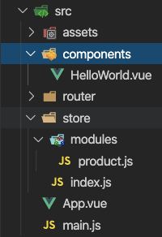

**
\1. Vue实现双向绑定的原理**

**2.Vue组件间的参数传递**

**3. Vue路由的实现：hash模式和history模式**

**4. Vue路由的钩子函数**

**5. Vue的生命周期**

**6. Vuex是什么？怎么使用？哪种功能场景使用它？**

**7. Vue 中key有什么作用？**

**8. Vue路由跳转有哪几种？**

**9. 怎样理解 Vue 的单向数据流？**

**10. 深拷贝和浅拷贝的区别**

**11. 从输入URL到页面展示，中间发生了什么？**

**12. 强缓存和协商缓存**

**13. Vue的diff算法和DOM原理**

14.**vue等单页面应用及其优缺点**

15 .**Vue3.0的特性**

16.**防抖和节流区别**


### **1. Vue实现双向绑定的原理**

> vue实现数据双向绑定主要是：采用数据劫持结合发布者-订阅者模式的方式，通过Object.defineProperty（）来劫持各个属性的setter，getter，在数据变动时发布消息给订阅者，触发相应监听回调。当把一个普通 Javascript 对象传给 Vue 实例来作为它的 data 选项时，Vue 将遍历它的属性，用 Object.defineProperty 将它们转为 getter/setter。用户看不到 getter/setter，但是在内部它们让 Vue 追踪依赖，在属性被访问和修改时通知变化。
>
> vue的数据双向绑定 将MVVM作为数据绑定的入口，整合Observer，Compile和Watcher三者，通过Observer来监听自己的model的数据变化，通过Compile来解析编译模板指令（vue中是用来解析 {{}}），最终利用watcher搭起observer和Compile之间的通信桥梁，达到数据变化 —>视图更新；视图交互变化（input）—>数据model变更双向绑定效果。

### **2.Vue组件间的参数传递**

> 1.父组件与子组件传值
> 父组件传给子组件：子组件通过props方法接受数据;
> 子组件传给父组件：$emit方法传递参数
> 2.非父子组件间的数据传递，兄弟组件传值
> eventBus，就是创建一个事件中心，相当于中转站，可以用它来传递事件和接收事件。项目比较小时，用这个比较合适。（虽然也有不少人推荐直接用VUEX，具体来说看需求咯。技术只是手段，目的达到才是王道。）

### **3. Vue路由的实现：hash模式和history模式**

> hash模式：在浏览器中符号“#”，#以及#后面的字符称之为hash，用window.location.hash读取；
> 特点：hash虽然在URL中，但不被包括在HTTP请求中；用来指导浏览器动作，对服务端安全无用，hash不会重加载页面。
> hash 模式下，仅 hash 符号之前的内容会被包含在请求中，如 [http://www.xxx.com](http://www.xxx.com/)，因此对于后端来说，即使没有做到对路由的全覆盖，也不会返回 404 错误。
>
> history模式：history采用HTML5的新特性；且提供了两个新方法：pushState（），replaceState（）可以对浏览器历史记录栈进行修改，以及popState事件的监听到状态变更。
> history 模式下，前端的 URL 必须和实际向后端发起请求的 URL 一致，如 http://www.xxx.com/items/id。后端如果缺少对 /items/id 的路由处理，将返回 404 错误。Vue-Router 官网里如此描述：“不过这种模式要玩好，还需要后台配置支持……所以呢，你要在服务端增加一个覆盖所有情况的候选资源：如果 URL 匹配不到任何静态资源，则应该返回同一个 index.html 页面，这个页面就是你 app 依赖的页面。

### **4. Vue路由的钩子函数**

> 首页可以控制导航跳转，beforeEach，afterEach等，一般用于页面title的修改。一些需要登录才能调整页面的重定向功能。
>
> beforeEach主要有3个参数to，from，next：
>
> to：route即将进入的目标路由对象，
>
> from：route当前导航正要离开的路由
>
> next：function一定要调用该方法resolve这个钩子。执行效果依赖next方法的调用参数。可以控制网页的跳转

### **5. Vue的生命周期**

> beforeCreate（创建前） 在数据观测和初始化事件还未开始
> created（创建后） 完成数据观测，属性和方法的运算，初始化事件，$el属性还没有显示出来
> beforeMount（载入前） 在挂载开始之前被调用，相关的render函数首次被调用。实例已完成以下的配置：编译模板，把data里面的数据和模板生成html。注意此时还没有挂载html到页面上。
> mounted（载入后） 在el 被新创建的 vm.$el 替换，并挂载到实例上去之后调用。实例已完成以下的配置：用上面编译好的html内容替换el属性指向的DOM对象。完成模板中的html渲染到html页面中。此过程中进行ajax交互。
> beforeUpdate（更新前） 在数据更新之前调用，发生在虚拟DOM重新渲染和打补丁之前。可以在该钩子中进一步地更改状态，不会触发附加的重渲染过程。
> updated（更新后） 在由于数据更改导致的虚拟DOM重新渲染和打补丁之后调用。调用时，组件DOM已经更新，所以可以执行依赖于DOM的操作。然而在大多数情况下，应该避免在此期间更改状态，因为这可能会导致更新无限循环。该钩子在服务器端渲染期间不被调用。
> beforeDestroy（销毁前） 在实例销毁之前调用。实例仍然完全可用。
> destroyed（销毁后） 在实例销毁之后调用。调用后，所有的事件监听器会被移除，所有的子实例也会被销毁。该钩子在服务器端渲染期间不被调用。
> 1.什么是vue生命周期？
> 答： Vue 实例从创建到销毁的过程，就是生命周期。从开始创建、初始化数据、编译模板、挂载Dom→渲染、更新→渲染→销毁等一系列过程，称之为 Vue 的生命周期。
>
> 2.vue生命周期的作用是什么？
> 答：它的生命周期中有多个事件钩子，让我们在控制整个Vue实例的过程时更容易形成好的逻辑。
>
> 3.vue生命周期总共有几个阶段？
> 答：它可以总共分为8个阶段：创建前/后, 载入前/后,更新前/后,销毁前/销毁后。
>
> 4.第一次页面加载会触发哪几个钩子？
> 答：会触发 下面这几个beforeCreate, created, beforeMount, mounted 。
>
> 5.DOM 渲染在 哪个周期中就已经完成？
> 答：DOM 渲染在 mounted 中就已经完成了。

### **6. Vuex是什么？怎么使用？哪种功能场景使用它？**

> Vuex 是一个专为 Vue.js 应用程序开发的状态管理模式。每一个 Vuex 应用的核心就是 store（仓库）。“store” 基本上就是一个容器，它包含着你的应用中大部分的状态 ( state )。
>
> 在main.js引入store，注入。新建了一个目录store，….. export 。
> 场景有：单页应用中，组件之间的状态、音乐播放、登录状态、加入购物车
>
> state ： Vuex 使用单一状态树,即每个应用将仅仅包含一个store 实例，但单一状态树和模块化并不冲突。存放的数据状态，不可以直接修改里面的数据。
>
> mutations ： 修改Vuex 的 store 中的状态或数据。
>
> getters：类似vue的计算属性，主要用来过滤一些数据。
>
> action ：可以理解为通过将mutations里面处里数据的方法变成可异步的处理数据的方法，简单的说就是异步操作数据。view 层通过 store.dispath 来分发 action。
>
> modules：项目特别复杂的时候，可以让每一个模块拥有自己的state、mutation、action、getters,使得结构非常清晰，方便管理。

### **7. Vue 中key有什么作用？**

> 当 Vue.js 用 v-for 正在更新已渲染过的元素列表时，它默认用“就地复用”策略。如果数据项的顺序被改变，Vue 将不会移动 DOM 元素来匹配数据项的顺序， 而是简单复用此处每个元素，并且确保它在特定索引下显示已被渲染过的每个元素。key的作用主要是为了高效的更新虚拟DOM。

### **8. Vue路由跳转有哪几种？**

> 1.router-link
>
> 不带参数
> <router-link :to="{name:'home'}">
> <router-link :to="{path:'/home'}"> //name,path都行, 建议用name
> // 注意：router-link中链接如果是'/'开始就是从根路由开始，如果开始不带'/'，则从当前路由开始。
> 带参数
> <router-link :to="{name:'home', params: {id:1}}">
>
> 2.this.$router.push() (函数里面调用)
>
> 不带参数
> this.$router.push('/home')
> this.$router.push({name:'home'})
> this.$router.push({path:'/home'})
> query传参
> this.$router.push({name:'home',query: {id:'1'}})
> this.$router.push({path:'/home',query: {id:'1'}})

### **9. 怎样理解 Vue 的单向数据流？**

> 所有的 prop 都使得其父子 prop 之间形成了一个单向下行绑定：父级 prop 的更新会向下流动到子组件中，但是反过来则不行。
> 这样会防止从子组件意外改变父级组件的状态，从而导致你的应用的数据流向难以理解。
> 额外的，每次父级组件发生更新时，子组件中所有的 prop 都将会刷新为最新的值。
> 这意味着你不应该在一个子组件内部改变 prop。如果你这样做了，Vue 会在浏览器的控制台中发出警告。
> 子组件想修改时，只能通过 $emit 派发一个自定义事件，父组件接收到后，由父组件修改。

### **10. 深拷贝和浅拷贝的区别**

> 首先深复制和浅复制只针对像 Object, Array 这样的复杂对象的。简单来说，浅复制只复制一层对象的属性，而深复制则递归复制了所有层级
>
> 1.因为浅复制只会将对象的各个属性进行依次复制，并不会进行递归复制，而 [JavaScript](http://caibaojian.com/t/javascript) 存储对象都是存地址的，所以浅复制会导致 obj.arr 和 shallowObj.arr 指向同一块内存地址
>
> shallowObj.arr[1] = 5;
> obj.arr[1] // = 5
>
> 2.而深复制则不同，它不仅将原对象的各个属性逐个复制出去，而且将原对象各个属性所包含的对象也依次采用深复制的方法递归复制到新对象上。这就不会存在上面 obj 和 shallowObj 的 arr 属性指向同一个对象的问题。
>
> var obj = { a:1, arr: [1,2] };
> var obj2 = deepCopy(obj);

### **11. 从输入URL到页面展示，中间发生了什么？[](https://www.cnblogs.com/caishengkai/p/10393151.html)**

> 1.在浏览器输入URL www.github.com
>
> 2.浏览器解析URL，
>
> 3.浏览器与ISP通信，通过DNS查找到域名对应的IP，发给浏览器
>
> 4.浏览器将拿这个IP地址和URL中的端口号（HTTP协议默认端口号是80，HTTPS默认端口号是443），打开一个TCP套接字连接。这时，浏览器和服务器就建立了连接。
>
> 5.浏览器发送一个HTTP请求至Web服务器，去获取www.github.com的主页
>
> 6.Web服务器接收请求，并查找HTML页面。如果该页面存在，该Web服务器准备响应并把它发回给你的浏览器。如果服务器找不到你请求的页面，它将发送一个404错误消息，404表示“页面未找到”
>
> 7.浏览器接收到的HTML页面从头到尾扫描一遍，并去寻找其它相关的资源，如图片、CSS文件、JavaScript脚本文件等等,通过相同方式获取到资源
>
> 8.一旦浏览器加载完HTML涉及到的所有资源，页面最终会加载在浏览器窗体里，并关闭与服务器的连接。

### **12. 强缓存和协商缓存**

> 强缓存（Expires/max-age）
> 强致缓存。在HTTP1.0中强缓存通过Expires响应头实现。
> 在HTTP1.1中，Cache-control响应头实现，其中max-age=xxx表示缓存资源将在xxx秒后过期。
>
> 协商缓存（Last-Modified/E-tag）
> 协商缓存。在HTTP1.0中第一次请求资源时通过服务器设置Last-Modified响应头，填入最后修改时间。在之后的每次请求中都会在请求头中带上If-Modified-Since字段，如果未更新就返回304，指导浏览器从本地缓存中读取。
> 在HTTP1.1中，Etag设置响应头缓存标志。请求头附带If-None-Match。
>
> 强缓存和协商缓存的区别总结：
> 1.强缓存只有首次请求会跟服务端通信，读取缓存资源时不用发送请求。返回200。
> 2.协商缓存总会与服务器交互，第一次是拿数据和E-tag的过程，之后每次凭E-tag询问是否更新。命中缓存返回304。
> 3.二者之间最大的区别就是：强缓存只通信一次；协商缓存每次都通信询问。

### **13. Vue的diff算法和DOM原理**

> vdom为何用diff算法
>
> - DOM操作是昂贵的，因此尽量减少DOM操作
> - 找出本次DOM必须更新的节点来更新，其他的不更新
> - 这个‘找出’的过程，就需要diff算法
>
> 在数据发生变化，vue是先根据真实DOM生成一颗 virtual DOM ，当 virtual DOM 某个节点的数据改变后会生成一个新的 Vnode ，然后 Vnode 和 oldVnode 作对比，发现有不一样的地方就直接修改在真实的DOM上，然后使 oldVnode 的值为 Vnode ，来实现更新节点。
>
> 1.原理简述：
> （1）先去同级比较，然后再去比较子节点
>
> （2）先去判断一方有子节点一方没有子节点的情况
>
> （3）比较都有子节点的情况
>
> （4）递归比较子节点
>
> 虚拟 DOM 的实现原理主要包括以下 3 部分：
> （1）用 JavaScript 对象模拟真实 DOM 树，对真实 DOM 进行抽象；
> （2）diff 算法 — 比较两棵虚拟 DOM 树的差异；
> （3）pach 算法 — 将两个虚拟 DOM 对象的差异应用到真正的 DOM 树。

### 14.**vue等单页面应用及其优缺点**

> 优点：Vue 的目标是通过尽可能简单的 API 实现响应的数据绑定和组合的视图组件，核心是一个响应的数据绑定系统。MVVM、数据驱动、组件化、轻量、简洁、高效、快速、模块友好。
> 缺点：不支持低版本的浏览器，最低只支持到IE9；不利于SEO的优化（如果要支持SEO，建议通过服务端来进行渲染组件）；第一次加载首页耗时相对长一些；不可以使用浏览器的导航按钮需要自行实现前进、后退。

### 15 .**Vue3.0的特性**

> 1.监测机制的改变
> Vue3.0 将带来基于代理 Proxy 的 observer 实现，提供全语言覆盖的反应性跟踪。这消除了 Vue 2 当中基于 Object.defineProperty 的实现所存在的很多限制：①只能监测属性，不能监测对象；②检测属性的添加和删除；③检测数组索引和长度的变更；④支持 Map、Set、WeakMap 和 WeakSet。
> 新的 observer 还提供了以下特性：
> 用于创建 observable 的公开 API。这为中小规模场景提供了简单轻量级的跨组件状态管理解决方案。
> 默认采用惰性观察。在 2.x 中，不管反应式数据有多大，都会在启动时被观察到。如果你的数据集很大，这可能会在应用启动时带来明显的开销。在 3.x 中，只观察用于渲染应用程序最初可见部分的数据。
> 更精确的变更通知。在 2.x 中，通过 Vue.set 强制添加新属性将导致依赖于该对象的 watcher 收到变更通知。在 3.x 中，只有依赖于特定属性的 watcher 才会收到通知。
> 不可变的 observable：我们可以创建值的“不可变”版本（即使是嵌套属性），除非系统在内部暂时将其“解禁”。这个机制可用于冻结 prop 传递或 Vuex 状态树以外的变化。
> 更好的调试功能：我们可以使用新的 renderTracked 和 renderTriggered 钩子精确地跟踪组件在什么时候以及为什么重新渲染。
>
> 2.模板
> 模板方面没有大的变更，只改了作用域插槽，2.x 的机制导致作用域插槽变了，父组件会重新渲染，而 3.0 把作用域插槽改成了函数的方式，这样只会影响子组件的重新渲染，提升了渲染的性能。
> 同时，对于 render 函数的方面，vue3.0 也会进行一系列更改来方便习惯直接使用 api 来生成 vdom 。
> 3.对象式的组件声明方式
> vue2.x 中的组件是通过声明的方式传入一系列 option，和 TypeScript 的结合需要通过一些装饰器的方式来做，虽然能实现功能，但是比较麻烦。3.0 修改了组件的声明方式，改成了类式的写法，这样使得和 TypeScript 的结合变得很容易。
> 此外，vue 的源码也改用了 TypeScript 来写。其实当代码的功能复杂之后，必须有一个静态类型系统来做一些辅助管理。现在 vue3.0 也全面改用 TypeScript 来重写了，更是使得对外暴露的 api 更容易结合 TypeScript。静态类型系统对于复杂代码的维护确实很有必要。
> 4.其它方面的更改
> vue3.0 的改变是全面的，上面只涉及到主要的 3 个方面，还有一些其它的更改：
> 支持自定义渲染器，从而使得 weex 可以通过自定义渲染器的方式来扩展，而不是直接 fork 源码来改的方式。
> 支持 Fragment（多个根节点）和 Protal（在 dom 其它部分渲染组建内容）组件，针对一些特殊的场景做了处理。
> 基于 treeshaking 优化，提供了更多的内置功能。


vuex的使用

项目目录




HelloWord.vue

```vue
<template>
  <div class="hello">
    <h1>{{ msg }}</h1>
    <input v-model="txt" type="text" placeholder="请输入" @keyup.enter="keyupHandle">
    <button @click="addDelay">新增</button>
    <ul>
      <li v-for="item in list" :key= 'item'>{{ item }}</li>
    </ul>
  </div>
</template>

<script>
// mapState 是把不vuex中的state数据映射到组件的计算属性
// mapMutations 把vuex中的mutations映射到methods中
// mapActions 把vuex中的actions映射到methods中
import { mapState ,mapMutations ,mapActions } from 'vuex'
export default {
  name: 'HelloWorld',
  data () {
    return {
      msg: 'Welcome to Your Vue.js App',
      txt:''
    }
  },
  methods: {
    ...mapMutations('product',['add']),
    ...mapActions('product',['addAsync']),
    keyupHandle (e){
      if(e.currentTarget.value){
        // console.log(e.currentTarget.value);
        this.add(e.currentTarget.value); //直接调用mutations中的方法
      }
    },
    addDelay(){
      this.addAsync(this.txt);
    }
  },
  computed: {
    // ...mapState(['count']);
    ...mapState({
      c:'count',//相当于给count写了一个别名
    }),
    ...mapState('product',['list'])
  }
}
</script>

<!-- Add "scoped" attribute to limit CSS to this component only -->
<style scoped>
h1, h2 {
  font-weight: normal;
}
ul {
  list-style-type: none;
  padding: 0;
}
li {
  display: inline-block;
  margin: 0 10px;
}
a {
  color: #42b983;
}
</style>

```

state/index.js

```js
import Vuex from 'vuex'
import Vue from 'vue'
import product from './modules/product'; //这里引入数据product
Vue.use(Vuex);

const store = new Vuex.Store({
    state: {
        count:1,
        name: "vuex项目演示"
    },
    modules: {
        //一个单独的模块，每一个模块都需要完整的vuex数据对象
        // 包含state mutations actions getters 这些内容
        product, //数据过大时，可以通过模板将数据拆分
    }
});

export default store; 
```

state/modules/product.js

```js
export default{
    
        namespaced: true,
        state: {
            list: ['毛巾','洗发露','可乐']
        },
        //  用来改变数据，所有的数据改变都在这里进行
        // 目的是每一次的数据改变都可以被追踪到，都会被开发者工具记录下来
        mutations: {
            add(state,payload) {
                //state 表示当前模块的数据
                // payload 表示参数
                console.log(state);
                console.log(payload);
                state.list.push(payload);
                
            }
        },
        // 所有的异步操作要放到actions中
        // 在actions中也能直接改变state数据，但是不建议这样做
        // 因为在vuex中所有的数据改变都需要能呗追踪到，所以改变数据都需要在mutations中进行
        actions: {
            addAsync(context,payload){
                console.log(context);
                console.log(payload);
                // context.state.list.push(payload);
                setTimeout(() => {
                context.commit('add',payload);//commit表示触发一个mutation   
                }, 1000);
            }
        }
    }

```

