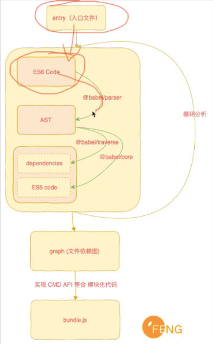

前端项目的构建工具打包工具。 可以对我们的代码进行一些合并和压缩。还可以处理各种依赖关系。而且有些高级语法他可以帮我们做一些转化，做一些兼用性的处理。webpack有哪些配置呢，webpack可以帮我们配一些入口文件和出口文件。还可以装一些插件。有些插件可以实现自动打包的效果。有些插件可以帮我们生成HTML文件之类的。webpack还可以配置一些加载器。通过加载器可以导入一些css less等文件。vue的文件就是通过vue加载器进行加载的。




1. 读取入口文件内容
2. 将入口文件转换成AST语法树
3. 用钩子勾取我们想要的数据（依赖文件地址）
4. 将语法树转换成ES5 代码
5. 生成graph（文件依赖图）
6. 最后打包成bundle.js文件

https://www.bilibili.com/video/BV1CJ411T7k5?from=search&seid=5537463455854469704

###### 简介

webpack 是一个现代 JavaScript 应用程序的静态模块打包器(module bundler)。主要是用来将前端资源打包、压缩、优化。

- webpack 打包原理：
  当 webpack 处理应用程序时，不会根据 package.json 文件中的devDependencies 或者 Dependencies 的内容对文件进行打包。而是会根据入口文件做查询，加载其所依赖的包模块，它会递归地构建一个依赖关系图(dependency graph)，其中包含应用程序需要的每个模块，然后将所有这些模块打包成一个或多个 bundle。
- 两个最核心的概念：
  1.一切皆模块
  正如js文件可以是一个模块（module）一样，其他的（如css、image或html）文件也可视作模块。因此，你可以require(‘myJSfile.js’)也可以require(‘myCSSfile.css’)。这意味着我们可以业务分割成更小的易于管理的片段，从而达到重复利用的目的。
  2.按需加载
  传统的模块打包工具（module bundlers）最终将所有的模块编译生成一个庞大的bundle.js文件。但是在真实的app里边，bundle.js文件可能有10M到15M之大，可能会导致应用一直处于加载中状态。因此Webpack使用许多特性来分割代码然后生成多个bundle文件，而且异步加载部分代码以实现按需加载。

### webpack.config.js

 一个开发模式下，完整的webpack.config.js文件内容如下：


```tsx
const path=require("path");
//将html模板和js文件整合在一起
const htmlWebpackPlugin=require("html-webpack-plugin");
//将css样式提取出来，使用Link标签导入
const miniCssExtractPlugin=require("mini-css-extract-plugin");
//将静态资源打包到输出目录中
const copyWebpackPlugin=require("copy-webpack-plugin");

module.exports={
    mode:"development",
    devtool:"inline-source-map",
    entry:"./src/js/index.js",
    output:{
        path:path.resolve(__dirname+"./dev"),
        filename:"[name]-[hash].js"
    },
    devServer:{
        port:8088,
        open:true,
        proxy: { //配置代理
          "/api": {
                target: "http://localhost:3000",
                pathRewrite: {"^/api" : ""}
          }
        }
    },
    plugins:[
        new htmlWebpackPlugin({
            title:"demo title",
            template:"./src/views/index.html",
            filename:"index.html",
            chunks:["main"]
        }),
        new miniCssExtractPlugin({
            filename:"[name]-[hash].css"
        }),
        new copyWebpackPlugin([
            {from:"./src/static",to:"./static"}
        ])
    ],
    module:{
        rules:[
            {
                test:/\.s[ac]ss$/,
                use:[
                    miniCssExtractPlugin.loader,
                    "css-loader",
                    "sass-loader"
                ]
            },        
            {
                test:/\.html$/,
                use:["string-loader"]
            }
        ]
    }
}
```


package.json文件内容如下：


```json
{
  "name": "admin-fe",
  "version": "1.0.0",
  "description": "",
  "main": "index.js",
  "scripts": {
    "dev": "webpack-dev-server --config webpack.config.js"
  },
  "keywords": [],
  "author": "",
  "license": "ISC",
  "dependencies": {
    "handlebars": "^4.7.3",
    "sme-router": "^0.12.8"
  },
  "devDependencies": {
    "copy-webpack-plugin": "^5.1.1",
    "css-loader": "^3.4.2",
    "html-webpack-plugin": "^4.0.1",
    "mini-css-extract-plugin": "^0.9.0",
    "node-sass": "^4.13.1",
    "sass-loader": "^8.0.2",
    "string-loader": "^0.0.1",
    "style-loader": "^1.1.3",
    "webpack": "^4.42.1",
    "webpack-cli": "^3.3.11",
    "webpack-dev-server": "^3.10.3"
  }
}
```


