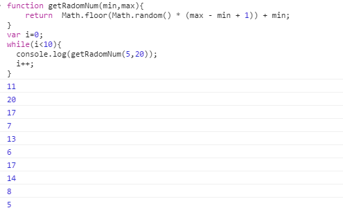
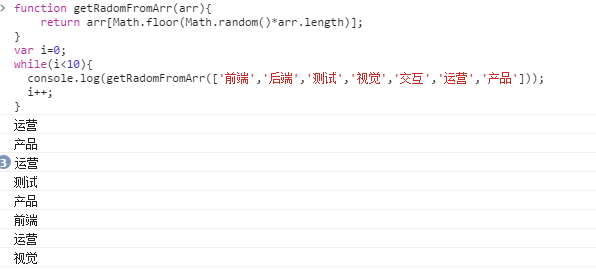
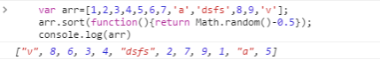
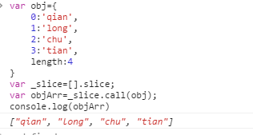
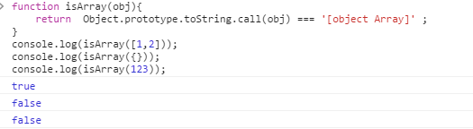
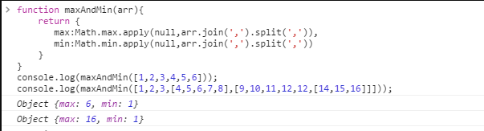
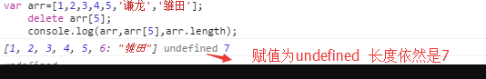
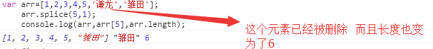
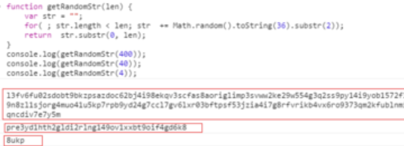

###  括号匹配

```js
var isValid = function(s) {
        var len=s.length/2;
    for(var i=0;i<len;i++){
        s= s.replace("[]",'');
        s= s.replace("()",'');
        s= s.replace("{}",'');
    }
    return s.length>0 ?false:true;
};
```

匹配fl***

```
reg = /fl[a-z]+/g
```


### 冒泡排序

0.如果遇到相等的值不进行交换，那这种排序方式是稳定的排序方式。

1.原理：比较两个相邻的元素，将值大的元素交换到右边

2.思路：依次比较相邻的两个数，将比较小的数放在前面，比较大的数放在后面。

　　　　(1)第一次比较：首先比较第一和第二个数，将小数放在前面，将大数放在后面。

　　　　(2)比较第2和第3个数，将小数 放在前面，大数放在后面。

　　　　......

　　　　(3)如此继续，知道比较到最后的两个数，将小数放在前面，大数放在后面，重复步骤，直至全部排序完成

　　　　(4)在上面一趟比较完成后，最后一个数一定是数组中最大的一个数，所以在比较第二趟的时候，最后一个数是不参加比较的。

　　　　(5)在第二趟比较完成后，倒数第二个数也一定是数组中倒数第二大数，所以在第三趟的比较中，最后两个数是不参与比较的。

　　　　(6)依次类推，每一趟比较次数减少依次

3.时间复杂度是n方

```js
//思路：先比较一轮一次，然后用for循环比较一轮多次，然后再加for循环比较多轮多次
    //从大到小排序
function blo (array) {
   for ( var i=0;i<array.length-1;i++){
        //每轮比较次数，次数=长度-1-此时的轮数
        for (var j=0;j<array.length-1-i;j++) {
            if (array[j] > array[j + 1]) {
                var temp = array[i];
                array[j] = array[j + 1];
                array[j + 1] = temp;
            } //end if
        }//end for 次数
    } //end for 轮数
}

```


### 快速排序

1. 算法思想
   快速排序的基本思想：通过一趟排序将待排记录分隔成独立的两部分，其中一部分记录的关键字均比另一部分的关键字小，则可分别对这两部分记录继续进行排序，以达到整个序列有序。

2. 实现原理
   2.1、设置两个变量 low、high，排序开始时：low=0，high=size-1。
   2.2、整个数组找基准正确位置，所有元素比基准值小的摆放在基准前面，所有元素比基准值大的摆在基准的后面

默认数组的第一个数为基准数据，赋值给key，即key=array[low]。
因为默认数组的第一个数为基准，所以从后面开始向前搜索（high–），找到第一个小于key的array[high]，就将 array[high] 赋给 array[low]，即 array[low] = array[high]。（循环条件是 array[high] >= key；结束时 array[high] < key）
此时从前面开始向后搜索（low++），找到第一个大于key的array[low]，就将 array[low] 赋给 array[high]，即 array[high] = array[low]。（循环条件是 array[low] <= key；结束时 array[low] > key）
循环 2-3 步骤，直到 low=high，该位置就是基准位置。
把基准数据赋给当前位置。
2.3、第一趟找到的基准位置，作为下一趟的分界点。
2.4、递归调用（recursive）分界点前和分界点后的子数组排序，重复2.2、2.3、2.4的步骤。
2.5、最终就会得到排序好的数组。


https://www.bilibili.com/video/BV1at411T75o?from=search&seid=12928461090033564249


#### [排序]()[算法]()有哪些，它们的时间复杂度，写一个快排

|          | 时间复杂度 | 时间复杂度 | 时间复杂度 | 空间复杂度    | 稳定性 | 复杂性 | 特点                                                         |
| -------- | ---------- | ---------- | ---------- | ------------- | ------ | ------ | ------------------------------------------------------------ |
|          | 最好       | 平均       | 最坏       | 辅助存储      |        |        |                                                              |
| 直接插入 | O(N)       | O(N2)      | O(N2)      | O(1)          | 稳定   | 简单   |                                                              |
| 直接选择 | O(N)       | O(N2)      | O(N2)      | O(1)          | 不稳定 |        |                                                              |
| 堆排序   | O(N*log2N) | O(N*log2N) | O(N*log2N) | O(1)          | 不稳定 | 复杂   |                                                              |
| 冒泡排序 | O(N)       | O(N2)      | O(N2)      | O(1)          | 稳定   | 简单   | 1、冒泡排序是一种用时间换空间的排序方法，n小时好<br/>2、最坏情况是把顺序的排列变成逆序，或者把逆序的数列变成顺序，最差时间复杂度O(N^2)只是表示其操作次数的数量级<br/>3、最好的情况是数据本来就有序，复杂度为O(n) |
| 快速排序 | O(N*log2N) | O(N*log2N) | O(N2)      | O(log2n)~O(n) | 不稳定 | 复杂   | 1、n大时好，快速排序比较占用内存，内存随n的增大而增大，但却是效率高不稳定的排序算法。<br/>2、划分之后一边是一个，一边是n-1个，<br/>这种极端情况的时间复杂度就是O(N^2)<br/>3、最好的情况是每次都能均匀的划分序列，O(N*log2N) |
| 归并排序 | O(N*log2N) | O(N*log2N) | O(N*log2N) | O(n)          | 稳定   | 复杂   | 1、n大时好，归并比较占用内存，内存随n的增大而增大，但却是效率高且稳定的排序算法。 |

### Q1 判断一个单词是否是回文？

> 回文是指把相同的词汇或句子，在下文中调换位置或颠倒过来，产生首尾回环的情趣，叫做回文，也叫回环。比如 mamam redivider .

很多人拿到这样的题目非常容易想到用for 将字符串颠倒字母顺序然后匹配就行了。其实重要的考察的就是对于reverse的实现。其实我们可以利用现成的函数，将字符串转换成数组，这个思路很重要，我们可以拥有更多的自由度去进行字符串的一些操作。

```js
function checkPalindrom(str) {  
    return str == str.split('').reverse().join('');
   return str == str.split('').reverse(),join('')
}
//split()： 方法用于把一个字符串分割成字符串数组。
//reverse()： 方法用于颠倒数组中元素的顺序。
//join() ：方法用于把数组中的所有元素以字符串的形式输出
```

```js


//split()： 方法用于把一个字符串分割成字符串数组。
//reverse()： 方法用于颠倒数组中元素的顺序。
//join() ：方法用于把数组中的所有元素以字符串的形式输出

//利用对象key值的唯一性
//先判断是否为空Object中的属性，不是的话就添加进去，然后
//说明这个值是唯一的。
//如果是Object的属性说明之前已经添加过了，重复就去除

//splice(index,1):删除数组index位置开始的一个元素
//Math.floor是():向下取整
//Math.random():是随机取一个实数在[0,1)的范围内 

//arr1.concat(arr2，arr3) :返回arr1、arr2和arr3拼接
//起来的数组
//字符串匹配 fl***
function fl_reg(str){
    var reg = /fl[a-z]+/g;
    let result = '';
    let array = [];
        while((result = reg.exec(str))&& result!=null){
            array.push(result[0])
        }
    return array;
}


```


### Q2 去掉一组整型数组重复的值

```
比如输入: [1,13,24,11,11,14,1,2] 
输出: [1,13,24,11,14,2]
需要去掉重复的11 和 1 这两个元素。
```

这道问题出现在诸多的前端面试题中，主要考察个人对Object的使用，利用key来进行筛选。

```js
/**
* unique an array 
**/
let unique = function(arr) {  
  let hashTable = {};
  let data = [];
  for(let i=0,l=arr.length;i<l;i++) {
    if(!hashTable[arr[i]]) {
      hashTable[arr[i]] = true;
      data.push(arr[i]);
    }
     
  }
  return data

   
   return [... new Set(arr)]
}
//利用对象key值的唯一性
//先判断是否为空Object中的属性，不是的话就添加进去，然后说明这个值是唯一的。
//如果是Object的属性说明之前已经添加过了，重复就去除
module.exports = unique;  
```

### Q3 统计一个字符串出现最多的字母

给出一段英文连续的英文字符窜，找出重复出现次数最多的字母

```
输入 ： afjghdfraaaasdenas 

输出 ： a
```

前面出现过去重的算法，这里需要是统计重复次数。

```js
function findMaxDuplicateChar(str) {  
  if(str.length == 1) {
    return str;
  }
  let charObj = {};
  for(let i=0;i<str.length;i++) {
    if(!charObj[str.charAt(i)]) {
      charObj[str.charAt(i)] = 1;
    }else{
      charObj[str.charAt(i)] += 1;
    }
  }
  let maxChar = '',
      maxValue = 1;
  for(var k in charObj) {
    if(charObj[k] >= maxValue) {
      maxChar = k;
      maxValue = charObj[k];
    }
  }
  return maxChar;

}

module.exports = findMaxDuplicateChar;  
```

### Q4 排序算法

如果抽到算法题目的话，应该大多都是比较开放的题目，不限定算法的实现，但是一定要求掌握其中的几种，所以冒泡排序，这种较为基础并且便于理解记忆的算法一定需要熟记于心。冒泡排序算法就是依次比较大小，小的的大的进行位置上的交换。

```js
function bubbleSort(arr) {  
    for(let i = 0,l=arr.length;i<l-1;i++) {
        for(let j = i+1;j<l;j++) { 
          if(arr[i]>arr[j]) {
                let tem = arr[i];
                arr[i] = arr[j];
                arr[j] = tem;
            }
        }
    }
    return arr;
}
module.exports = bubbleSort;  
```

除了冒泡排序外，其实还有很多诸如 [插入排序](https://zh.wikipedia.org/wiki/插入排序),[快速排序](https://zh.wikipedia.org/wiki/快速排序)，[希尔排序](https://zh.wikipedia.org/wiki/希尔排序)等。每一种排序算法都有各自的特点。全部掌握也不需要，但是心底一定要熟悉几种算法。 

比如快速排序

算法参考某个元素值，将小于它的值，放到左数组中，大于它的值的元素就放到右数组中，然后递归进行上一次左右数组的操作，返回合并的数组就是已经排好顺序的数组了。

```js
var quickSort = function(arr) {
　　if (arr.length <= 1) { return arr; }
　　var pivotIndex = Math.floor(arr.length / 2);//获取数组中间位置的值
　　var pivot = 1arr.splice(pivotIndex, 1)[0];
　　var left = [];
　　var right = [];
　　for (var i = 0; i < arr.length; i++){
　　　　if (arr[i] < pivot) {
　　　　　　left.push(arr[i]);
　　　　} else {
　　　　　　right.push(arr[i]);
　　　　}
　　}
　　return quickSort(left).concat([pivot], quickSort(right));
};
```

### Q5 不借助临时变量，进行两个整数的交换

```
输入 a = 2, b = 4 输出 a = 4, b =2
```

这种问题非常巧妙，需要大家跳出惯有的思维，利用 a , b进行置换。

主要是利用 + - 去进行运算，类似 a = a + ( b - a) 实际上等同于最后 的 a = b;

```js
function swap(a , b) {  
  b = b - a;
  a = a + b;
  b = a - b;
  return [a,b];
}

module.exports = swap; 
```

### Q6 使用canvas 绘制一个有限度的斐波那契数列的曲线？


数列长度限定在9.

`斐波那契数列`，又称黄金分割数列，指的是这样一个数列：0、1、1、2、3、5、8、13、21、34、……在数学上，斐波纳契数列主要考察递归的调用。我们一般都知道定义

```
fibo[i] = fibo[i-1]+fibo[i-2];  
```

生成斐波那契数组的方法

```
function getFibonacci(n) {  
  var fibarr = [];
  var i = 0;
  while(i<n) {
    if(i<=1) {
      fibarr.push(i);
    }else{
      fibarr.push(fibarr[i-1] + fibarr[i-2])
    }
    i++;
  }

  return fibarr;
}
```

剩余的工作就是利用canvas `arc`方法进行曲线绘制了

### Q7 找出下列正数组的最大差值比如:

```
输入 [10,5,11,7,8,9]

输出 6
```

这是通过一道题目去测试对于基本的数组的最大值的查找，很明显我们知道，最大差值肯定是一个数组中最大值与最小值的差。

```js
  function getMaxProfit(arr) {

    var minPrice = arr[0];
    var maxProfit = 0;

    for (var i = 0; i < arr.length; i++) {
        var currentPrice = arr[i];

        minPrice = Math.min(minPrice, currentPrice);

        var potentialProfit = currentPrice - minPrice;

        maxProfit = Math.max(maxProfit, potentialProfit);
    }

    return maxProfit;
}
```

### Q8 随机生成指定长度的字符串

实现一个算法，随机生成指制定长度的字符窜。

```js
比如给定 长度 8  输出 4ldkfg9j
function randomString(n) {  
  let str = 'abcdefghijklmnopqrstuvwxyz9876543210';
  let tmp = '',
      i = 0,
      l = str.length;
  for (i = 0; i < n; i++) {
    tmp += str.charAt(Math.floor(Math.random() * l));
  }
  return tmp;
}

module.exports = randomString;  
```

### Q9 实现类似getElementsByClassName 的功能

自己实现一个函数，查找某个DOM节点下面的包含某个class的所有DOM节点？不允许使用原生提供的 getElementsByClassName querySelectorAll 等原生提供DOM查找函数。

```js
function queryClassName(node, name) {  
  var starts = '(^|[ \n\r\t\f])',
       ends = '([ \n\r\t\f]|$)';
  var array = [],
        regex = new RegExp(starts + name + ends),
        elements = node.getElementsByTagName("*"),
        length = elements.length,
        i = 0,
        element;

    while (i < length) {
        element = elements[i];
        if (regex.test(element.className)) {
            array.push(element);
        }

        i += 1;
    }

    return array;
}
```

### Q10 使用JS 实现二叉查找树(Binary Search Tree)

一般叫全部写完的概率比较少，但是重点考察你对它的理解和一些基本特点的实现。 二叉查找树，也称二叉搜索树、有序二叉树（英语：ordered binary tree）是指一棵空树或者具有下列性质的二叉树：

- 任意节点的左子树不空，则左子树上所有结点的值均小于它的根结点的值；
- 任意节点的右子树不空，则右子树上所有结点的值均大于它的根结点的值；
- 任意节点的左、右子树也分别为二叉查找树；
- 没有键值相等的节点。二叉查找树相比于其他数据结构的优势在于查找、插入的时间复杂度较低。为O(log n)。二叉查找树是基础性数据结构，用于构建更为抽象的数据结构，如集合、multiset、关联数组等。


在写的时候需要足够理解二叉搜素树的特点，需要先设定好每个节点的数据结构

```
class Node {  
  constructor(data, left, right) {
    this.data = data;
    this.left = left;
    this.right = right;
  }

}
```

树是有节点构成，由根节点逐渐延生到各个子节点，因此它具备基本的结构就是具备一个根节点，具备添加，查找和删除节点的方法.

```js
class BinarySearchTree {

  constructor() {
    this.root = null;
  }

  insert(data) {
    let n = new Node(data, null, null);
    if (!this.root) {
      return this.root = n;
    }
    let currentNode = this.root;
    let parent = null;
    while (1) {
      parent = currentNode;
      if (data < currentNode.data) {
        currentNode = currentNode.left;
        if (currentNode === null) {
          parent.left = n;
          break;
        }
      } else {
        currentNode = currentNode.right;
        if (currentNode === null) {
          parent.right = n;
          break;
        }
      }
    }
  }

  remove(data) {
    this.root = this.removeNode(this.root, data)
  }

  removeNode(node, data) {
    if (node == null) {
      return null;
    }

    if (data == node.data) {
      // no children node
      if (node.left == null && node.right == null) {
        return null;
      }
      if (node.left == null) {
        return node.right;
      }
      if (node.right == null) {
        return node.left;
      }

      let getSmallest = function(node) {
        if(node.left === null && node.right == null) {
          return node;
        }
        if(node.left != null) {
          return node.left;
        }
        if(node.right !== null) {
          return getSmallest(node.right);
        }

      }
      let temNode = getSmallest(node.right);
      node.data = temNode.data;
      node.right = this.removeNode(temNode.right,temNode.data);
      return node;

    } else if (data < node.data) {
      node.left = this.removeNode(node.left,data);
      return node;
    } else {
      node.right = this.removeNode(node.right,data);
      return node;
    }
  }

  find(data) {
    var current = this.root;
    while (current != null) {
      if (data == current.data) {
        break;
      }
      if (data < current.data) {
        current = current.left;
      } else {
        current = current.right
      }
    }
    return current.data;
  }

}

module.exports = BinarySearchTree;  
```

## 前言

> javascript是一门非常灵活的语言，实际的开发过程中我们也可以灵活的使用它而给我们的工作带来便利，这篇文章记录了自己平时学习过程中经常用到的一些小技巧，整理出来作为笔记，也希望对感兴趣的同学有所帮助。( 持续更新… )

## 1 获取指定范围内的随机数

> 当我们需要获取指定范围(min,max)内的整数的时候，下面的代码非常适合。

function getRadomNum(min,max){return Math.floor(Math.random() * (max - min + 1)) + min;}


**测试**



2 随机获取数组中的元素

function getRadomFromArr(arr){return arr[Math.floor(Math.random()*arr.length)];}

**测试**



3 生成从0到指定值的数字数组

var arr=[],length=100,i=1;for(;arr.push(i++)<length;){}console.log(arr)

**测试**

```
function arrN(arr, n) {
    for (let i = 0; arr.push(i++) < n;) { }
    console.log(arr);
}
console.log(arrN([], 10))
```


## 4 打乱数字数组的顺序

var arr = [1,2,3,4,5,6,7,'a','dsfs',8,9,'v'];arr.sort(function(){return Math.random()-0.5});

**测试**


## 5 对象转换为数组

//注意对象必须是以下格式的才可以通过此方式转化为数组//获取的DOM集合，以及函数的arguments也可以通过此方式转化为数组var obj={0:'qian',1:'long',2:'chu',3:'tian',length:4}var _slice=[].slice;var objArr=_slice.call(obj);

**测试**



## 6 验证是否为数组

function isArray(obj){return Object.prototype.toString.call(obj) === '[object Array]' ;}

**测试**



## 7 获取数组中最大或者最小值

function maxAndMin(arr){return {max:Math.max.apply(null,arr.join(',').split(',')),min:Math.min.apply(null,arr.join(',').split(','))}}

**该方法适合一维或者多维数组求最大最小值的情况**

**测试**




## 8 清空数组

//方式一 通过将长度设置为0var arr=[1,2,3,4,5];arr.length=0; //方式二 通过splice方法var arr=[1,2,3,4,5];arr.splice(0,arr.length); //方式三 通过将空数组 [] 赋值给数组(严格意义来说这只是将ary重新赋值为空数组，之前的数组如果没有引用在指向它将等待垃圾回收。)var arr=[1,2,3,4,5];arr=[];

## 9 保留指定小数位

var num =4.345678;num = num.toFixed(4); // 4.3457 第四位小数位以四舍五入计算

## 10 不要直接使用delete来删除数组中的元素

> 数组在js中也是对象，有时候我们可能会通过delete来删除数组中的元素，但是其实仅仅是将数组的元素的值赋值为了undefined。
>
> var arr=[1,2,3,4,5,'谦龙','雏田'];delete arr[5];console.log(arr,arr[5],arr.length);
>
>  

**测试**



**可以通过splice来删除数组中的某一项**

var arr=[1,2,3,4,5,'谦龙','雏田'];arr.splice(5,1);console.log(arr,arr[5],arr.length);

 

**测试**



### 11 生成指定长度的随机字母数字字符串

function getRandomStr(len) {var str = "";for( ; str.length < len; str += Math.random().toString(36).substr(2));return str.substr(0, len);}

**测试**


### 12 null 与 undefined

> null == undefined,null == null 返回true,有时候我们为了排除null 和 undefined可以使用如下的代码

function test(obj){if(obj!=null){// obj除了undefined 和 null 之外都会走这里....这里写代码逻辑}}

### 13 找出数组中出现次数最的元素，并给出其出现过的位置

```js
function getMaxAndIndex(arr) {
    var obj = {};
    arr.forEach(function (item, index) {
        if (!obj[item]) {
            obj[item] = { indexs: [index] }
        } else {
            obj[item]['indexs'].push(index);
        }
    });
    var num = 0;//记录出现次数最大值var str='';
    //记录出现次数最多的字符
    var reArr;
    //返回最大值的位置数组
    for (var attr in obj) {
        var temp = obj[attr]['indexs'];
        if (temp.length > num) {
            num = temp.length; str = attr; reArr = temp;
        }
    }
    return { maxStr: str, indexs: reArr }
}
```

```js
//判断回文字符串
function checkP(str) {
    return str == str.split('').reverse().join('');
}

// 去掉一组整形数组里重复的值
function unique(arr) {
    let obj = {};
    let array = [];
    for (let i = 0; i < arr.length; i++) {
        if (!obj[arr[i]]) {
            obj[arr[i]] = true;
            array.push(arr[i]);
        }
    }
    return array;
}
//console.log(unique([1,2,3,4,5,6,6,6]));

//统计一个数组里出现最多的数
function maxTime(array) {
    let obj = {};
    for (let i = 0; i < array.length; i++) {
        if (!obj[array[i]]) {
            obj[array[i]] = 1;
        } else {
            obj[array[i]]++;
        }
    }
    let max = 1;
    let maxNum = '';
    for (k in obj) {
        if (obj[k] > max) {
            maxNum = k;
        }
    }
    return maxNum;
}
// console.log(maxTime([1,1,1,22,22,22]));

// 排序算法
// 冒泡排序
function bubbleSort(array) {
    let temp = '';
    for (let i = 0; i < array.length; i++) {
        for (let j = 0; j < array.length - i; j++) {
            if (array[j] > array[j + 1]) {
                temp = array[j];
                array[j] = array[j + 1];
                array[j + 1] = temp;
            }
        }
    }
    return array;
}
// console.log(bubbleSort([1,7,3,5,4,6]));

// 快速排序
var quickSort = function (array) {
    if (array.length <= 1) return array;
    let index = array[0];
    array.splice(0, 1);
    let left = [];
    let right = [];
    for (var i = 0; i < array.length; i++) {
        if (array[i] < index) {
            left.push(array[i]);

        } else {
            right.push(array[i]);

        }
    }
    return quickSort(left).concat([index], quickSort(right));
}
// console.log(quickSort([5,8,3,4,7,2,6,1,9]));

//不借助中间变量，实现数据交换
function swap(a, b) {
    b = b - a;
    a = a + b;
    b = a - b;
    return [a, b];
}
// 生成斐波那契数组的方式
function fb(n) {
    let fibrr = [];
    for (let i = 0; i <= n; i++) {
        if (i <= 1) {
            fibrr.push(i);
        } else {
            fibrr.push(fibrr[i - 1] + fibrr[i - 2]);
        }
    }
    return fibrr;
}
// console.log(fb(5));
// 找到数组中两数的的最大差值
function getMaxProfit(array) {
    let max = array[0];
    let min = array[0];
    for (let i = 0; i < array.length; i++) {
        if (array[i] < min) {
            min = array[i]
        }
        if (array[i] > max) {
            max = array[i]
        }
    }
    return max - min;
}
// console.log(getMaxProfit([1,2,3,4,5,6,7,8,9]));
// 返回一个指定长度的随机字符串
function randomString(n) {
    let str = 'abcdefghijklmnopqrstuvwxyz9876543210';
    let tmp = '',
        i = 0,
        l = str.length;
    for (i = 0; i < n; i++) {
        tmp += str.charAt(Math.floor(Math.random() * l));
        //floor是向下取整
        //random是随机取一个实数在[0,1)的范围内 
    }
    return tmp;
}

var quickSort2 = function(array) {
    if (array.length <= 1) return array;
    let index = array[0];
    array.splice(0, 1);
    let left = [];

    let right = [];
    for (let i = 0; i < array.length; i++) {
        if (array[i] < index) {
            left.push(array[i]);
        } else {
            right.push(array[i]);
        }
    }
    return quickSort2(left).concat([index], quickSort2(right));
}
// console.log(quickSort2([1, 3, 4, 5, 2, 7, 9, 8]));
// 输出数组中出现一次以上的数字,输出数组中重复最大次数的值
function chongfu (array){
    let obj = {};
    let chongfuArr = [];
    for(let i = 0;i<array.length;i++){
        if(!obj[array[i]]){
            obj[array[i]] = 1;
        }else{
            obj[array[i]]++;
        }
    }
    let max = 0;
    let maxNum = chongfuArr[0];
    for(k in obj){
        if(obj[k] > max)
        maxNum = parseInt(k);
    }
    return maxNum;
}
// console.log(chongfu([1,2,3,4,5,5,6,7,7,7]));

//字符串匹配 fl***
function fl_reg(str){
    var reg = /fl[a-z]+/g;
    let result = '';
    let array = [];
        while((result = reg.exec(str))&& result!=null){
            array.push(result[0])
        }
    return array;
}
// console.log(fl_reg('fow flf fls fl fladfd'));
//字符串括号有效匹配
function isVaild (str) {
    let len = str.length/2;
    for(let i = 0;i<=len;i++){
        str = str.replace("[]","");
        str = str.replace("{}","");
        str = str.replace("()","");
    }
    return str.length > 0 ? false:true;
}
// console.log(isVaild('{{[()]}}1'));

```

