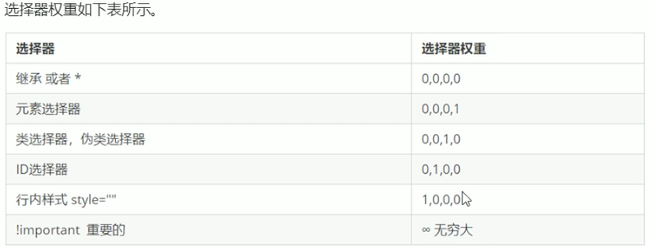
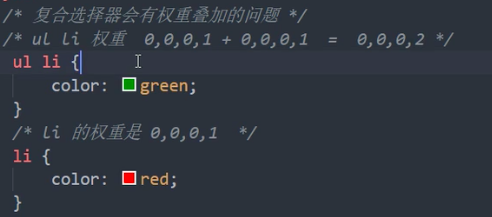

#### 1、说[项目]()（约20分钟） 


####   2、熟悉C语言的语法吗？或者C#（因为我简历上写了所以会问到） 

####   3、知道http和https的区别吗？ 

> http协议和https协议的区别：传输信息安全性不同、连接方式不同、端口不同、证书申请方式不同
>
> 一、传输信息安全性不同
>
> 1、http协议：是超文本传输协议，信息是明文传输。如果攻击者截取了Web浏览器和网站服务器之间的传输报文，就可以直接读懂其中的信息。
>
> 2、https协议：是具有安全性的ssl加密传输协议，为浏览器和服务器之间的通信加密，确保数据传输的安全。
>
> [](https://iknow-pic.cdn.bcebos.com/d01373f082025aaf65da6a13f5edab64024f1a79)
>
> 二、连接方式不同
>
> 1、http协议：http的连接很简单，是无状态的。
>
> 2、https协议：是由SSL＋HTTP协议构建的可进行加密传输、身份认证的网络协议。
>
> 三、端口不同
>
> 1、http协议：使用的端口是80。
>
> 2、https协议：使用的端口是443．
>
> 四、证书申请方式不同
>
> 1、http协议：免费申请。
>
> 2、https协议：需要到ca申请证书，一般免费证书很少，需要交费。

####   4、https是怎么实现加密的？为什么对称加密和非对称加密要结合使用？ 

> （一）对称加密（Symmetric Cryptography）  －－－共享密钥加密
>
> 对称加密是最快速、最简单的一种加密方式，加密（encryption）与解密（decryption）用的是同样的密钥（secret key）,这种方法在密码学中叫做对称加密算法。对称加密有很多种算法，由于它效率很高，所以被广泛使用在很多加密协议的核心当中。
> 对称加密通常使用的是相对较小的密钥，一般小于256 bit。因为密钥越大，加密越强，但加密与解密的过程越慢。如果你只用1 bit来做这个密钥，那黑客们可以先试着用0来解密，不行的话就再用1解；但如果你的密钥有1 MB大，黑客们可能永远也无法破解，但加密和解密的过程要花费很长的时间。密钥的大小既要照顾到安全性，也要照顾到效率，是一个trade-off。
> 对称加密的一大缺点是密钥的管理与分配，换句话说，如何把密钥发送到需要解密你的消息的人的手里是一个问题。在发送密钥的过程中，密钥有很大的风险会被黑客们拦截。现实中通常的做法是将对称加密的密钥进行非对称加密，然后传送给需要它的人。
> （二）非对称加密（Asymmetric Cryptography）  －－－公开密钥加密
> 1976年，美国学者Dime和Henman为解决信息公开传送和密钥管理问题，提出一种新的密钥交换协议，允许在不安全的媒体上的通讯双方交换信息，安全地达成一致的密钥，这就是“公开密钥系统”。相对于“对称加密算法”这种方法也叫做“非对称加密算法”。
> 非对称加密为数据的加密与解密提供了一个非常安全的方法，它使用了一对密钥，公钥（public key）和私钥（private key）。私钥只能由一方安全保管，不能外泄，而公钥则可以发给任何请求它的人。非对称加密使用这对密钥中的一个进行加密，而解密则需要另一个密钥。比如，你向银行请求公钥，银行将公钥发给你，你使用公钥对消息加密，那么只有私钥的持有人--银行才能对你的消息解密。与对称加密不同的是，银行不需要将私钥通过网络发送出去，因此安全性大大提高。
> 目前最常用的非对称加密算法是RSA算法，是Rivest, Shamir, 和Adleman于1978年发明。
> 虽然非对称加密很安全，但是和对称加密比起来，它非常的慢，所以我们还是要用对称加密来传送消息，但对称加密所使用的密钥我们可以通过非对称加密的方式发送出去。为了解释这个过程，请看下面的例子：
> （1） Alice需要在银行的网站做一笔交易，她的浏览器首先生成了一个随机数作为对称密钥。
> （2） Alice的浏览器向银行的网站请求公钥。
> （3） 银行将公钥发送给Alice。
> （4） Alice的浏览器使用银行的公钥将自己的对称密钥加密。
> （5） Alice的浏览器将加密后的对称密钥发送给银行。
> （6） 银行使用私钥解密得到Alice浏览器的对称密钥。
> （7） Alice与银行可以使用对称密钥来对沟通的内容进行加密与解密了。
>
> （三）总结
> （1） 对称加密加密与解密使用的是同样的密钥，所以速度快，但由于需要将密钥在网络传输，所以安全性不高。
> （2） 非对称加密使用了一对密钥，公钥与私钥，所以安全性高，但加密与解密速度慢。
> （3） 解决的办法是将对称加密的密钥使用非对称加密的公钥进行加密，然后发送出去，接收方使用私钥进行解密得到对称加密的密钥，然后双方可以使用对称加密来进行沟通。

####   5、知道http请求响应头都有哪些吗？ 


> HTTP请求头部信息：
>
> 每个HTTP请求和响应都会带有相应的头部信息。默认情况下，在发送XHR请求的同时，还会发送下列头部信息：
>
> - Accept:浏览器能够处理的内容类型
> - Accept-Charset:浏览器能够显示的字符集
> - Accept-Encoding：浏览器能够处理的压缩编码
> - Accept-Language：浏览器当前设置的语言
> - Connection：浏览器与服务器之间连接的类型
> - Cookie：当前页面设置的任何Cookie
> - Host：发出请求的页面所在的域
> - Referer：发出请求的页面的URL
> - User-Agent：浏览器的用户代理字符串
>
> HTTP响应头部信息：
>
> - Date：表示消息发送的时间，时间的描述格式由rfc822定义
> - server:服务器名字。
> - Connection：浏览器与服务器之间连接的类型
> - content-type:表示后面的文档属于什么MIME类型
> - Cache-Control：控制HTTP缓存

####   6、说一下http2.0和http3.0有什么不一样的地方？ 

> 2 HTTP2.0（SPDY的升级版）
> HTTP2.0支持明文传输，而HTTP 1.X强制使用SSL/TLS加密传输。
> 和HTTP 1.x使用的header压缩方法不同。
> HTTP2.0 基于二进制格式进行解析，而HTTP 1.x基于文本格式进行解析。
> 多路复用，HTTP1.1是多个请求串行化单线程处理，HTTP 2.0是并行执行，一个请求超时并不会影响其他请求。
> HTTP2.0的多路复用提升了网页性能：
>
> 在 HTTP1 中浏览器限制了同一个域名下的请求数量（Chrome下一般是六个），当在请求很多资源的时候，由于队头阻塞，当浏览器达到最大请求数量时，剩余的资源需等待当前的六个请求完成后才能发起请求。
> HTTP2 中引入了多路复用的技术，这个技术可以只通过一个 TCP连接就可以传输所有的请求数据。多路复用可以绕过浏览器限制同一个域名下的请求数量的问题，进而提高了网页的性能。
> 注意：
>
> 主流浏览器只支持基于TLS部署的HTTP2.0协议，所以要将网站升级为HTTP 2.0，就需要先升级为HTTPS。
> HTTP 2.0完全兼容HTTP 1.x,所以对于部署了HTTP 2.0的网站可以自动向下兼容HTTP 1.X.
> 参考博客：HTTP1.0、HTTP1.1 和 HTTP2.0 的区别
>
> 3 HTTP 3.0 (QUIC)
> QUIC (Quick UDP Internet Connections), 快速 UDP 互联网连接。
> QUIC是基于UDP协议的。
>
> 两个主要特性：
> （1）线头阻塞(HOL)问题的解决更为彻底：
> 基于TCP的HTTP/2，尽管从逻辑上来说，不同的流之间相互独立，不会相互影响，但在实际传输方面，数据还是要一帧一帧的发送和接收，一旦某一个流的数据有丢包，则同样会阻塞在它之后传输的流数据传输。而基于UDP的QUIC协议则可以更为彻底地解决这样的问题，让不同的流之间真正的实现相互独立传输，互不干扰。
> （2）切换网络时的连接保持：
> 当前移动端的应用环境，用户的网络可能会经常切换，比如从办公室或家里出门，WiFi断开，网络切换为3G或4G。基于TCP的协议，由于切换网络之后，IP会改变，因而之前的连接不可能继续保持。而基于UDP的QUIC协议，则可以内建与TCP中不同的连接标识方法，从而在网络完成切换之后，恢复之前与服务器的连接。

####   **7、说一下从输入url到渲染页面的过程** 

> 加载资源的形式
> html代码.
> 媒体文件，如图片、视频等.
> javascript、css.
>
> 1.加载资源的过程
>
> ```
> DNS解析（域名服务解析）：域名->IP地址
> 浏览器根据IP地址向服务器发送http请求
> 服务器处理http请求，并返回给浏览器
> ```
>
> 2.渲染页面的过程
>
> ```
> 根据HTML生成DOM Tree
> 根据css代码生成CSSOM(CSS对象模型)
> 将DOM Tree和CSSOM整合形成Render Tree
> 浏览器根据 Render Tree 渲染页面
> 如果遇到<script>则暂停渲染，优先加载并执行JS代码，完成再继续
> 直至把 Render Tree渲染完成
> 为何把css放在head中？
> 在渲染DOM节点前把CSS规则加载完，防止重复渲染
> ```
>
> 为何建议把js放在body最后？
>
> ```
> Render Tree 渲染页面时，如果遇到<script>则暂停渲染， 优先加载并执行JS代码， 完成再继续放在中间阻塞dom渲染
> ```
>
> window.onload和DOMContentLoaded的区别
>
> ```
> window.addEventListener('load',function(){
>     //页面加载完全部资源才执行，包括图片，视频
> })
> window.addEventListener('DOMContentLoaded',function(){
>    //DOM渲染完即可执行，包括图片，视频可能没加载完
> })
> ```
>
> 

   **补：页面渲染加载资源的时候，加载顺序是怎样的？** 

服务端渲染和客户端渲染

####   **8、讲一下js的作用域** 

> 全局函数无法查看局部函数的内部细节，但局部函数可以查看其上层的函数细节，直至全局细节。
>  当需要从局部函数查找某一属性或方法时，如果当前作用域没有找到，就会上溯到上层作用域查找，直至全局函数，这种组织形式就是作用域链。
>  	作用域链的作用是保证执行环境里有权访问的变量和函数是有序的，作用域链的变量只能向上访问，变量访问到window对象即被终止，作用域链向下访问变量是不被允许的
> 简单的说，作用域就是变量与函数的可访问范围，即作用域控制着变量与函数的可见性和生命周期

####   **9、如果有两个http请求先后向服务器发送数据包，且间隔时间不大，那么服务器如何分辨这两个数据包？** 

####   **10、js如何实现多线程？** 

> **JS如何实现多线程**
>
> 　　　**JS为我们提供了一个Worker的类，它的作用就是为了解决这种阻塞的现象。当我们使用这个类的时候，它就会向浏览器申请一个新的线程。这个线程就用来单独执行一个js文件。**
>
> ```
> var worker = new Worker(js文件路径);  //这个语句就会申请一个线程用来执行这个js文件。
> ```
>
> 　　　在主线程中有一些方法来实现对新线程的控制和数据的接收。在这里，我们只说比较常用的几个方法。
>
> ```js
> //postMessage(msg);
> //postMessage方法把在新线程执行的结果发送到浏览器的js引擎线程里
> worker.onmessage = function(){
>     //获取在新线程中执行的js文件发送的数据 用event.data接收数据
>     console.log( event.data )
> };
> setTimeout( function(){
>     worker.terminate();
>     //terminate方法用于关闭worker线程
> },2000)
>     
> setTimeout( function(){
>     worker = new Worker("js/test22.js");
>     //再次开启worker线程
> },3000)
> ```
>
> 　　　　新线程中使用postMessage()方法可以向主线程中发送一些数据，主线程中使用worker的onmessage事件来接收这些数据，这样就实现了js的多线程执行和多线程之间数据的传递。

####   **11、讲一下promise** 

> promise是ES6提出的一个异步处理对象，通过它我们可以完成对异步请求的处理
>
> 记得我在2020年夏天和同学一起参加了一个微信小程序的开发项目，我在里边就是担任前端方面的编写，我和负责后端的同学都是临时上阵，什么也不会，后端给我接口的时候，我记得是使用了是wx.xxx，是微信小程序请求后台的接口函数，但是无论如何我无法获取发回来的值。后来我请教了在家里有相关专业的人，才知道其实这里的获取函数式异步的，需要使用一个promise对象，从那个时候开始了解promise的。promise使用时，有两个参数，一个是resolve，另一个是reject，有一个函数体，还有一个then方法，在函数体内部的代码是同步执行的，也就是说只有内部运行结果出来之后，才会执行then方法中的代码程序。这就解决了我之前遇到的问题，其实在小程序的接口中是可以获取导数据的，但是我使用这个数据的时候，数据送到。而promise的机制就是，当函数体内部运行结构出现之后，才会执行then中的代码。只要我把使用调用发回数据的代码写到then内部就可以了。
>
> promise还有两个重要的api，分别是promise.all，和promise.race
>
> 前者可以传入多个promise对象，然后一次返回执行的结果，值得一体的是，返回结果的顺序和传入时的先后顺序是一致的，并不会因为响应的快慢而出现顺序问题。
>
> 后者是race就是赛跑的意思，谁先执行结束，谁就先返回，并不会等待所有promise对象都执行出结果之后才返回。

####   **12、如果promise外部有一个输出函数，那么promise.then什么时候才会执行？或者说他们的执行顺序是怎样的？** 

> Promise 的 then 的 注册微任务队列 和 执行 是分离的。
>
> 注册 : 是完全遵循 JS 和 Promise 的代码的执行过程。
>
> 执行 : 先 同步，再 微任务 ，再 宏观任务。
>
> 输入函数是一个同步任务，并不会阻塞，会等待输入后再继续执行下边的代码

####   **13、说一下http2的多路复用的概念和原理** 

> https://blog.csdn.net/weixin_33693070/article/details/88711831

####   **14、快排的时间复杂度是多少？是怎么算的？空间复杂度是多少？怎么来的？** 

> 快速排序的时间复杂度，
>
> 最好的情况是递归次数是log N 比较次数是N，即nlogn，
>
> 最坏情况是O(n^2)。
>
> 最好的一种情况
>
> 每行的操作都是n，用了logN 行，即 log2（8）=3行。
>
> 此时复杂度公式是 nlogn
>
> 最坏的一次情况
>
> 没画完，可以看出一共是八行。即是n。
>
> 此时复杂度公式是 n*n

####   **15、要求在数组合并完成的同时[排序]()也已经完成，题目如图** 

  **** 

> 考察：数组，数组小应用，有序数组，归并排序的思想
> 思路：题目的本质是将数组nums2中的元素，插入到nums1中，并返回插入后的有序的数组nums1.
> 题目中要求将nums1在变成有序数组，并有提示nums1足够长>=m+n，且本题中的nums1与2都是升序数组，从小到大排序，可以理解为从数组末尾开始找，找到最大，并将其依次插入到nums1中，同时下标向前移动一位。
> 最后的新数组nums1，相当于长度为m+n的一个新数组。
>
> ```
> 	var merge=function(nums1,m,nums2,n){
> 	var k=m+n-1;//新数组nums1的末尾
> 	var i=m-1,j=n-1; //分别定位到给定数组nums1和nums2的末尾
> 	while(i>=0&&j>=0){
> 		if(nums2[j]>=nums1[i]){
> 			nums1[k]=nums2[j];
> 			j--;
> 		}else{
> 			nums1[k]=nums1[i];
> 			i--;
> 		}
> 		k--;
> 	}
> 	while(j>=0){
> 		nums1[k]=nums2[j];
> 		j--;
> 		k--;
> 	}
> 	return nums1;
> 	
> }
> 
> ```
>
> 

> 归并排序：
> **
> 归并排序是用分治思想，分治模式在每一层递归上有三个步骤：
>
> 分解（Divide）：将n个元素分成个含n/2个元素的子序列。
> 解决（Conquer）：用合并排序法对两个子序列递归的排序。
> 合并（Combine）：合并两个已排序的子序列已得到排序结果。
> 实现逻辑：
> ① 申请空间，使其大小为两个已经排序序列之和，该空间用来存放合并后的序列
> ② 设定两个指针，最初位置分别为两个已经排序序列的起始位置
> ③ 比较两个指针所指向的元素，选择相对小的元素放入到合并空间，并移动指针到下一位置
> ④ 重复步骤③直到某一指针到达序列尾
> ⑤ 将另一序列剩下的所有元素直接复制到合并序列尾
> 以一组无序数列｛14，12，15，13，11，16｝为例分解说明，如下图所示：
>
> 上图中首先把一个未排序的序列从中间分割成2部分，再把2部分分成4部分，依次分割下去，直到分割成一个一个的数据，再把这些数据两两归并到一起，使之有序，不停的归并，最后成为一个排好序的序列。

  **16、你有什么要问我的吗？**


#### **一面：**

#### 2.怎么接触前端的

> 首先，接触到前端是在大一的时候在学校的课程里学习了HTML静态页面的制作，其实也并没有实在的教学，也是通过网上的资料自学的。当时并没有系统的进行学习，只是了解了一些HTML和css的简单用法，完成了第一个静态页面的制作。
>
> 后来在大二的时候参加大学习创新创业比赛，几个人开始做项目，是关于微信小程序的，我负责前端部分，有几名同学负责后端接口的开发。那个时候开始较为系统的学习了前端知识，学会了js的基本使用方法，但是关于js深一点应用就没有接触了。因为项目没有在学校通过，就没有在进行下去。
>
> 也是在大二的时候，开始进行职业规划，认为我比较喜欢前端的工作，绘制和设计页面。于是选择了前端工程师的这个方向。选定方向后，就开始自学前端。因为学校里的课程都是基础课程，并没有前端知识的讲解。于是我开始在网上搜集资料。
>
> 我一开始是在知乎和贴吧上看一些小白推荐。然后总结发现，需要学的东西还挺多的。于是我觉得须有首先列一个前端学习路线。也算是一个计划。
>
> 首先就是HTML和css的系统学习，因为之前基础薄弱，所以这些是必须要从头到尾观看一遍的。我是在B站的看了黑马程序员的HTML和css教程。
>
> 然后是JavaScript，我买了一些书，红宝书和es6+入门。但是发现光是看这些书感觉太晦涩，所以就开始看视频，写代码，查书的学习过程。过了一遍JavaScript，了解了基本语法和dom、bom操作同时还接触了nodejs。然后就做了一个简单的项目聊天室。
>
> 再后来学习了jQuery。这个并没有很深入的学习。jQuery是js dom操作的一个库，对复杂繁多的dom操作进行了封装。我没有深入的学习jQuery。
>
> 之后就学习了vue.js。vue的学习也是通过视频+文档+实践完成的。顺着vue了解了webpack和git，其实git是在18年的时候就接触到了，也将一些简单的代码交上去了，就了解简单的提交和管理操作。
>
> 之后在腾讯云上申请了云服务器，在将vue上传的时候了解到了webpack的使用，也对webpack进行简单的了解，了解了webpack之后对vue的认识也就更加深刻了。知道了打包的过程和依赖的处理。
>
> 之后还简单的了解了vuex的使用，因为我没有大型项目的经验，所以对vuex的使用仅仅是了解。

#### 3.js 继承方式？平时有用过吗

> 1.原型链
>
> 基本思想：利用原型让一个引用类型继承另外一个引用类型的属性和方法。
>
> 构造函数，原型，实例之间的关系：每个构造函数都有一个原型对象，原型对象包含一个指向构造函数的指针，而实例都包含一个指向原型对象的内部指针。
>
> 原型链实现继承例子：
>
> ```js
> function SuperType() {
>     this.property = true;
> }
> SuperType.prototype.getSuperValue = function () {
>     return this.property;
> }
> function subType() {
>     this.property = false;
> }
> //继承了SuperType
> SubType.prototype = new SuperType();
> SubType.prototype.getSubValue = function () {
>     return this.property;
> }
> var instance = new SubType();
> console.log(instance.getSuperValue()); //true
> 
> ```
>
>
> 2.借用构造函数
>
> 基本思想：在子类型构造函数的内部调用超类构造函数，通过使用call()和apply()方法可以在新创建的对象上执行构造函数。
>
> 例子：
>
> ```
> function SuperType() {
>     this.colors = ["red", "blue", "green"];
> }
> function SubType() {
>     SuperType.call(this); //继承了SuperType
> }
> var instance1 = new SubType();
> instance1.colors.push("black");
> console.log(instance1.colors); //"red","blue","green","black"
> var instance2 = new SubType();
> console.log(instance2.colors); //"red","blue","green"
> 
> ```
>
>
> 3.组合继承
>
> 基本思想：将原型链和借用构造函数的技术组合在一块，从而发挥两者之长的一种继承模式。
>
> 例子：
>
> ```
> function SuperType(name) {
>     this.name = name;
>     this.colors = ["red", "blue", "green"];
> }
> SuperType.prototype.sayName = function () {
>     console.log(this.name);
> }
> function SubType(name, age) {
>     SuperType.call(this, name); //继承属性
>     this.age = age;
> }
> //继承方法
> SubType.prototype = new SuperType();
> Subtype.prototype.constructor = Subtype;
> Subtype.prototype.sayAge = function () {
>     console.log(this.age);
> }
> var instance1 = new SubType("EvanChen", 18);
> instance1.colors.push("black");
> consol.log(instance1.colors); //"red","blue","green","black"
> instance1.sayName(); //"EvanChen"
> instance1.sayAge(); //18
> var instance2 = new SubType("EvanChen666", 20);
> console.log(instance2.colors); //"red","blue","green"
> instance2.sayName(); //"EvanChen666"
> instance2.sayAge(); //20
> ```
>
>
> 4.原型式继承
>
> 基本想法：借助原型可以基于已有的对象创建新对象，同时还不必须因此创建自定义的类型。
>
> 原型式继承的思想可用以下函数来说明：
>
> ```
> function object(o) {
>     function F() { }
>     F.prototype = o;
>     return new F();
> }
> 
> ```
>
>
> 例子：
>
> ```
> var person = {
>     name: "EvanChen",
>     friends: ["Shelby", "Court", "Van"];
> };
> var anotherPerson = object(person);
> anotherPerson.name = "Greg";
> anotherPerson.friends.push("Rob");
> var yetAnotherPerson = object(person);
> yetAnotherPerson.name = "Linda";
> yetAnotherPerson.friends.push("Barbie");
> console.log(person.friends); //"Shelby","Court","Van","Rob","Barbie"
> ```
>
>
> ECMAScript5通过新增Object.create()方法规范化了原型式继承，这个方法接收两个参数：一个用作新对象原型的对象和一个作为新对象定义额外属性的对象。
>
> ```js
> 
> var person = {
>     name: "EvanChen",
>     friends: ["Shelby", "Court", "Van"];
> };
> var anotherPerson = Object.create(person);
> anotherPerson.name = "Greg";
> anotherPerson.friends.push("Rob");
> var yetAnotherPerson = Object.create(person);
> yetAnotherPerson.name = "Linda";
> yetAnotherPerson.friends.push("Barbie");
> console.log(person.friends); //"Shelby","Court","Van","Rob","Barbie"
> ```
>
>
> 5.寄生式继承
>
> 基本思想：创建一个仅用于封装继承过程的函数，该函数在内部以某种方式来增强对象，最后再像真正是它做了所有工作一样返回对象。
>
> 例子：
>
> ```
> function createAnother(original) {
>     var clone = object(original);
>     clone.sayHi = function () {
>         alert("hi");
>     };
>     return clone;
> }
> var person = {
>     name: "EvanChen",
>     friends: ["Shelby", "Court", "Van"];
> };
> var anotherPerson = createAnother(person);
> anotherPerson.sayHi(); ///"hi"
> ```
>
> 6.寄生组合式继承
>
> 基本思想：通过借用函数来继承属性，通过原型链的混成形式来继承方法
>
> 其基本模型如下所示：
>
> ```
> function inheritProperty(subType, superType) {
>     var prototype = object(superType.prototype); //创建对象
>     prototype.constructor = subType; //增强对象
>     subType.prototype = prototype; //指定对象
> }
> ```
>
>
> 例子：
>
> ```
> function SuperType(name) {
>     this.name = name;
>     this.colors = ["red", "blue", "green"];
> }
> SuperType.prototype.sayName = function () {
>     alert(this.name);
> };
> function SubType(name, age) {
>     SuperType.call(this, name);
>     this.age = age;
> }
> inheritProperty(SubType, SuperType);
> SubType.prototype.sayAge = function () {
>     alert(this.age);
> }
> ```
>
> 

#### 4.数据结构有哪些？分别适合什么场景

> 

#### 5.[排序]()[算法]()有哪些，它们的时间复杂度，写一个快排

|          | 时间复杂度 | 时间复杂度 | 时间复杂度 | 空间复杂度    | 稳定性 | 复杂性 | 特点                                                         |
| -------- | ---------- | ---------- | ---------- | ------------- | ------ | ------ | ------------------------------------------------------------ |
|          | 最好       | 平均       | 最坏       | 辅助存储      |        |        |                                                              |
| 直接插入 | O(N)       | O(N2)      | O(N2)      | O(1)          | 稳定   | 简单   |                                                              |
| 直接选择 | O(N)       | O(N2)      | O(N2)      | O(1)          | 不稳定 |        |                                                              |
| 堆排序   | O(N*log2N) | O(N*log2N) | O(N*log2N) | O(1)          | 不稳定 | 复杂   |                                                              |
| 冒泡排序 | O(N)       | O(N2)      | O(N2)      | O(1)          | 稳定   | 简单   | 1、冒泡排序是一种用时间换空间的排序方法，n小时好<br/>2、最坏情况是把顺序的排列变成逆序，或者把逆序的数列变成顺序，最差时间复杂度O(N^2)只是表示其操作次数的数量级<br/>3、最好的情况是数据本来就有序，复杂度为O(n) |
| 快速排序 | O(N*log2N) | O(N*log2N) | O(N2)      | O(log2n)~O(n) | 不稳定 | 复杂   | 1、n大时好，快速排序比较占用内存，内存随n的增大而增大，但却是效率高不稳定的排序算法。<br/>2、划分之后一边是一个，一边是n-1个，<br/>这种极端情况的时间复杂度就是O(N^2)<br/>3、最好的情况是每次都能均匀的划分序列，O(N*log2N) |
| 归并排序 | O(N*log2N) | O(N*log2N) | O(N*log2N) | O(n)          | 稳定   | 复杂   | 1、n大时好，归并比较占用内存，内存随n的增大而增大，但却是效率高且稳定的排序算法。 |

```js
function quickSort(arr, low, high){
      let i = low; //哨兵
      let j = high;//哨兵
      let pivot = arr[low];
      if(i >= j) {
        return;
      }
      while(i != j){
        while(i < j && arr[j] >= pivot)
          j--;
        while(i < j && arr[i] <= pivot)
          i++;
        if(i < j) {
          let temp = arr[j];
          arr[j] = arr[i];
          arr[i] = temp;
        }
      }
      arr[low] = arr[i];//每一次排序后将基准点放在正确的位置
      arr[i] = pivot;
      quickSort(arr, low, i -1);
      quickSort(arr, i + 1, high);
```

#### 6.[前端]()安全

> 1、XSS与CSRF分别是什么，两者有什么联系，其他安全问题（csp  sql）
>  2、XSS与CSRF原理、案例、形式、分类
>  3、如何防范XSS与CSRF（项目中如何处理安全问题）
>  4、其他常见web安全及防护原理
> 链接：https://www.jianshu.com/p/544bb4bccd82

#### 7.进程与线程的区别（几乎必问）

> 1.进程。
> 				进程是程序的一次执行过程，是个动态概念。是程序在执行过程中分配和管理资源的基本单位，每个进程都有一个自己的地址空间。
> 		2.线程。
> 				线程是CPU调度和分派的基本单位，它可与同属一个进程的其他线程共享进程的拥有的资源。
> 		3.区别
> 				根本区别：进程是操作系统分配资源的基本单位，而线程是任务调度和执行的基本单位。
> 				开销方面：每个进程都有独立的代码和数据空间（程序上下文），程序之间切换会有较大的开销；线程可看成是轻量级的进程，同一类线程共享代码和数据空间，每个线程都有自己独立的运行栈和程序计数器，线程之间切换开销小。
> 				内存分配方面：系统在运行时会为每个进程分配不同的内存空间；而线程，除了CPU外，系统不会为线程分配内存。
> 				一个进程可以包含>=1个线程。

#### 8.tcp和udp的区别？tcp为什么是可靠的

> 
>
> 
>
> 

#### 9.js为什么是单线程的

> > (1) JS为什么是单线程的?
>
> JS最初被设计用在浏览器中,那么想象一下,如果浏览器中的JS是多线程的。
>
> ```
>  场景描述: 那么现在有2个进程,process1 process2,由于是多进程的JS,所以他们对同一个dom,同时进行操作 process1 删除了该dom,而process2 编辑了该dom,同时下达2个矛盾的命令,浏览器究竟该如何执行呢
> ```
>
> 这样想,JS为什么被设计成单线程应该就容易理解了吧。
>
> https://www.cnblogs.com/langzianan/p/8403330.html

10.反问

一面和面试官聊得还好，面完就叫我准备下一面。

------

**二面：**

面试官一上来就笑嘻嘻的，还问我名字怎么读，感觉还挺不错（完全是错觉）。

1.自我介绍

2.为什么选择[前端]()

3.你觉得你跟其他人比有哪些优势

#### 4.15min 做道题（括号匹配，没 A 完，最大的败笔就在这儿，当时[算法]()还是刷太少了）好家伙，没 A 完嘛，当场面试官就变脸了，略带严肃哈哈

```js
function check(str){
    str = str.split("");
    if(str[0] == ')' || str[0] == '}' || str[0] == ']') return false;
    else if(str.length %2 != 0) return false;
    else {
        var arr = [];
        while(str.length > 0){
            if(arr.length != 0){
                //如果栈顶元素和下一个将要入栈的元素匹配的话把栈顶元素和将要入栈的元素移除
                if(match(str[str.length-1],arr[arr.length-1])) {
                    arr.pop();
                    str.pop();
                }else{
                    //如果不匹配则入栈
                    arr.push(str[str.length-1])
                    str.pop();
                }
            }else{
                arr.push(str[str.length-1]);
                str.pop();
            }
        }
        if(arr.length == 0) return true;
        return false;
    }

}
function match(a,b){
    if((a == '[' && b == ']') || (a == '{' && b == '}') || (a == '(' && b == ')')){
        return true
    }
    return false;
}
```

5.问[项目]()


#### [好未来]()一面 

 es6新特性  

####  js数据类型  

> 基本数据类型：String字符串类型、Number数字类型、Boolean类型、null类型、undefined类型、symbol类型、bigint类型
>
> 复杂数据类型、Object类型
>
> 

####  前端页面加载性能提升方法  

> <a src="/Users/weijunze/Desktop/webNotebook/笔记本/面试相关/前端面试题/页面优化方法.md">前端优化</a>

####  map的实现思路  

> 　　假设有一个函数f(x)=x²;作用在一个数组[1,2,3,4,5,6,7,8,9],通常我们会用遍历的方法来实现。　　
>
> [](javascript:void(0);)
>
> ```
> function f(x){
> 　　return x * x;   
> }
> 
> var arr = [1,2,3,4,5,6,7,8,9];
> var result = [];
> for(var i=0; i<arr.length; i++){
> 　　result.push(f(arr[i]))   
> }
> ```
>
> [](javascript:void(0);)
>
> 　　这样的确可以实现，但我们有更优雅的实现。
>
> ```
> function f(x) {
>     return x * x;
> }
> 
> var arr = [1, 2, 3, 4, 5, 6, 7, 8, 9];
> arr.map(f); // [1, 4, 9, 16, 25, 36, 49, 64, 81]
> ```
>
> 　　map()方法定义在JavaScript的Array中，我们调用Array的map()方法，传入我们自己的函数，就得到一个新的Array作为结果。map传入的参数时f，即函数本身。
>
> 　　所以，map()作为高阶函数，事实上它把运算规则抽象了。因此我们不光可以用来计算简单的f(x)=x²，还可以计算任意复杂度的函数，比如将数组的所有数字转化为字符串：
>
> ```
> var arr = [1, 2, 3, 4, 5, 6, 7, 8, 9];
> arr.map(String); // ['1', '2', '3', '4', '5', '6', '7', '8', '9']
> ```

####  weakmap和weakset的区别  

> WeakSet
> 和Set结构类似，也是不重复的值的集合，但WeakSet的成员只能是对象。
>
> WeakSet的API：add() //增 ；delete() //删； has() //是否存在
>
> 注意：ws没有size属性，不可遍历。因为WeakSet的成员都是弱引用，随时可能消失，成员是不稳定的。
>
> WeakSet的用处：
> （1）使用ws储存DOM节点，就不用担心节点从文档移除时，会引发内存泄漏（即在被移除的节点上绑定的click等事件）。
> （2）下面代码保证了Foo的实例方法，只能在Foo的实例上调用。这里使用 WeakSet 的好处是，foos对实例的引用，不会被计入内存回收机制，所以删除实例的时候，不用考虑foos，也不会出现内存泄漏。
>
> WeakSet
> WeakMap与Map的区别:
> WeakMap 对象是一组键值对的集合，其中的键是弱引用对象，而值可以是任意。
>
> 注意，WeakMap 弱引用的只是键名，而不是键值。键值依然是正常引用。
>
> WeakMap 中，每个键对自己所引用对象的引用都是弱引用，在没有其他引用和该键引用同一对象，这个对象将会被垃圾回收（相应的key则变成无效的），所以，WeakMap 的 key 是不可枚举的。
> 
>
> set方法
>
> size属性: 返回集合的元素个数。（类似数组的长度length）
> add(value)方法: 向集合中添加一个元素value。注意：如果向集合中添加一个已经存在的元素，不报错但是集合不会改变。
> delete(value)方法: 从集合中删除元素value。
> has(value)方法: 判断value是否在集合中，返回true或false.
> clear()方法: 清空集合。
> set应用场景
> 鉴于set存储值的不重复特性，经常被用来求数组去重，交集，并集，差集等操作。
>
> 数组去重
> let arry = [1, 2, 3, 4, 4,1,2,3,2];
> var mySet = new Set(arry);
>  let newArry = [...mySet]; // [1, 2, 3, 4]
> 1
> 2
> 3
> 求并集，交集,差集。
>     //set求并集
>     let arryA= [2,3,4,5,6],arryB = [3,4,5,6,7,8];
>     let setAB = new Set([...arryA,...arryB]);
>     let newArryAB = [...setAB];
>     console.log(newArryAB); //[2,3,4,5,6,7,8]
>
>     //求交集
>     let arryC= [2,3,4,5,6],arryD = [3,4,5,6,7,8];
>     let setC = new Set(arryC);
>     let setD = new Set(arryD);
>     let newArryC_D = arryA.filter(x=>setD.has(x));
>     console.log(newArryC_D); //[3,4,5,6]
>     
>     //求差集
>     let newArryD_C = arryA.filter(x=>!setD.has(x));
>     let newArryD_D = arryB.filter(x=>!setC.has(x));
>     let newArryCD = [...newArryD_C,...newArryD_D];
>     console.log(newArryCD); //[2,7,8]

> Map常用属性及增删改查方法:
>
> size: 属性，取出字典的长度
> set(key, value)：方法，向字典中添加新元素
> get(key)：方法，通过键查找特定的数值并返回
> has(key)：方法，判断字典中是否存在键key
> delete(key)：方法，通过键 key 从字典中移除对应的数据
> clear()：方法，将这个字典中的所有元素删除
> 与Object的区别：
>
> 一个 Object 的键只能是字符串或者 Symbols，但一个 Map 的键可以是任意值。
> Map 中的键值是有序的（FIFO 原则），而添加到对象中的键则不是。
> Map 的键值对个数可以从 size 属性获取，而 Object 的键值对个数只能手动计算。
> Object 都有自己的原型，原型链上的键名有可能和你自己在对象上的设置的键名产生冲突，而map健不可重复，如果键名冲突则会覆盖对应的值。
> let map = new Map();
>     let s = {
>         name:'cc',
>         job:'programmer'
>     }
>     let m ={
>         dd:'cdcdcd',
>         do:function(str){
>             console.log(str)
>         }
>     }
>     map.set(s,m);
>     map.set(m,s);
>     map.set(0,s);
>     map.set(0,m);
>     console.log(map)

####  状态码  

> **1XX：信息状态码**
> 	100 Continue 继续，一般在发送post请求时，已发送了http header之后服务端将返回此信息，表示确认，之后发送具体参数信息
> **2XX：成功状态码**
> 	200 OK 正常返回信息
> 	201 Created 请求成功并且服务器创建了新的资源
> 	202 Accepted 服务器已接受请求，但尚未处理
> **3XX：重定向**
> 	301 Moved Permanently 请求的网页已永久移动到新位置。
> 	302 Found 临时性重定向。
> 	303 See Other 临时性重定向，且总是使用 GET 请求新的 URI。
> 	304 Not Modified 自从上次请求后，请求的网页未修改过。
> **4XX：客户端错误**
> 	400 Bad Request 服务器无法理解请求的格式，客户端不应当尝试再次使用相同的内容发起请求。
> 	401 Unauthorized 请求未授权。
> 	403 Forbidden 禁止访问。
> 	404 Not Found 找不到如何与 URI 相匹配的资源。
> **5XX: 服务器错误**
> 	500 Internal Server Error 最常见的服务器端错误。
> 	503 Service Unavailable 服务器端暂时无法处理请求（可能是过载或维护）。

 跨域  

####  url输入后的过程  

> 1.DNS解析（网址->IP地址）：
>
> ​	（1）查找本地DNS缓存：先浏览器再操作系统
>
> ​	（2）分级查询：本地DNS服务器、根域名服务器、COM顶级域名服务器、google\com域名服务器
>
> 2.建立TCP连接（三次握手）
>
> 3.发送http请求
>
> 4.服务器处理请求，并返回http报文
>
> 5.浏览器解析和渲染页面
>
> 6.连接结束（四次挥手）

 webpack用过吗  

####  vue组件通信  

> 常见使用场景可以分为三类：
>
> - 父子通信：
>
> 父向子传递数据是通过 props，子向父是通过 events（`$emit`）；通过父链 / 子链也可以通信（`$parent` / `$children`）；ref 也可以访问组件实例；provide / inject API；`$attrs/$listeners`
>
> - 兄弟通信：
>
> Bus；Vuex
>
> - 跨级通信：
>
> Bus；Vuex；provide / inject API、`$attrs/$listeners`

####  vue2.0和3.0的区别  

> Vue3.0和Vue2.0的区别
> 默认进行懒观察（lazy observation）。
> 在 2.x 版本里，不管数据多大，都会在一开始就为其创建观察者。当数据很大时，这可能会在页面载入时造成明显的性能压力。3.x 版本，只会对「被用于渲染初始可见部分的数据」创建观察者，而且 3.x 的观察者更高效。
> 更精准的变更通知。
> 比例来说：2.x 版本中，使用 Vue.set 来给对象新增一个属性时，这个对象的所有 watcher 都会重新运行；3.x 版本中，只有依赖那个属性的 watcher 才会重新运行。
> 3.0 新加入了 TypeScript 以及 PWA 的支持
> 部分命令发生了变化：
> 下载安装 npm install -g vue@cli
> 删除了vue list
> 创建项目 vue create
> 启动项目 npm run serve
> 默认项目目录结构也发生了变化：
> 移除了配置文件目录，config 和 build 文件夹
> 移除了 static 文件夹，新增 public 文件夹，并且 index.html 移动到 public 中
> 在 src 文件夹中新增了 views 文件夹，用于分类 视图组件 和 公共组件
>
> Vuecli3.0和Vuecli2.0的区别
>
> 1.项目目录结构
> vue-cli2.0与3.0在目录结构方面，有明显的不同
>
> vue-cli3.0移除了配置文件目录，config 和 build 文件夹
>
> 同时移除了 static 静态文件夹，新增了 public 文件夹，打开层级目录还会发现， index.html 移动到 public 中
>
> 2.配置项
> 3.0 config文件已经被移除，但是多了.env.production和env.development文件，除了文件位置，实际配置起来和2.0没什么不同
>
> 没了config文件，跨域需要配置域名时，从config/index.js 挪到了vue.config.js中，配置方法不变
>
> 3.渲染
> Vue2.x使用的Virtual Dom实现的渲染
>
> Vue3.0不论是原生的html标签还是vue组件，他们都会通过h函数来判断，如果是原生html标签，在运行时直接通过Virtual Dom来直接渲染，同样如果是组件会直接生成组件代码
> 4.数据监听
> Vue2.x大家都知道使用的是es5的object.defineproperties中getter和setter实现的，而vue3.0的版本，是基于Proxy进行监听的，其实基于proxy监听就是所谓的lazy by default，什么意思呢，就是只要你用到了才会监听，可以理解为‘按需监听’，官方给出的诠释是：速度加倍，同时内存占用还减半。
>
> 4.按需引入
> Vue2.x中new出的实例对象，所有的东西都在这个vue对象上，这样其实无论你用到还是没用到，都会跑一变。而vue3.0中可以用ES module imports按需引入，如：keep-alive内置组件、v-model指令，等等。

####  computed watched methods区别  

> #### 一、computed 和 methods
>
> `computed`是计算属性，`methods`是方法，都可以实现对 data 中的数据加工后再输出。
>  不同的是 `computed` 计算属性是基于它们的依赖进行缓存的。计算属性 `computed` 只有在它的相关依赖发生改变时才会重新求值。这就意味着只要data 中的数据 message 还没有发生改变，多次访问 reversedMessage（对message 进行加工的处理函数） 计算属性会立即返回之前的计算结果，而不必再次执行函数。而对于method ，只要发生重新渲染，method 调用总会执行该函数。
>  当有一个性能开销比较大的的计算属性 A ，它需要遍历一个极大的数组和做大量的计算。然后我们可能有其他的计算属性依赖于 A ，这时候，我们就需要缓存。也就是使用 `computed` 而不是 `methods`。但对于每次都需要进行重新计算的属性比如下面这个函数的返回值 `function () { return Date.now() }` ，我们最好使用  `methods`。
>  总之：数据量大，需要缓存的时候用 `computed` ；每次确实需要重新加载，不需要缓存时用 `methods` 。
>
> #### 二、computed 和 watch
>
> 计算属性顾名思义就是通过其他变量计算得来的另一个属性， fullName 在它所依赖 firstName ， lastName 这两个变量变化时重新计算自己的值。
>  另外，计算属性具有缓存。计算属性是基于它们的依赖进行缓存的。计算属性只有在它的相关依赖发生改变时才会重新求值。这就意味着只要 lastName 和 firstName都没有发生改变，多次访问 fullName 计算属性会立即返回之前的计算结果，而不必再次执行函数。
>  而侦听器 `watch` 是侦听一个特定的值，当该值变化时执行特定的函数。例如分页组件中，我们可以监听当前页码，当页码变化时执行对应的获取数据的函数。
>
> 
>
> ```html
> <div id="myDiv">
>     <input type="text" v-model="firstName">
>     <input type="text" v-model="lastName">
>     <input type="text" v-model="fullName">
> </div>
> ```
>
> 
>
> ```js
> // watch
> new Vue({
>   el: '#myDiv',
>   data: {
>     firstName: 'Foo',
>     lastName: 'Bar',
>     fullName: 'Foo Bar'
>   },
>   watch: {
>     firstName: function (val) {
>       this.fullName = val + ' ' + this.lastName
>     },
>     lastName: function (val) {
>       this.fullName = this.firstName + ' ' + val
>     }
>   }
> })
> ```
>
> 
>
> ```js
> // computed
> new Vue({
>        el:"#myDiv",
>             data:{
>                 firstName:"Den",
>                 lastName:"wang",
> 
>             },
>             computed:{
>                 fullName:function(){
>                     return  this.firstName  + " " +this.lastName;
>                 }
>             }
>    })
> ```
>
> 也就是说，`computed` 对于其中变量的依赖是多个的，它的函数中使用了多个 `this.xxx` ,只要其中一个发生了变化，都会触发这个函数。而 `watch` 的依赖则是单个的，它每次只可以对一个变量进行监控。 
>
> 

####  怎么实现一个eventBus  

> **一、初始化**
> 首先需要创建事件总线并将其导出，以便其它模块可以使用或者监听它。我们可以通过两种方式来处理。先来看第一种，新创建一个 .js 文件，比如 `event-bus.js`
>
> ```text
> // event-bus.js
> import Vue from 'vue'
> export const EventBus = new Vue()
> ```
>
> 实质上`EventBus`是一个不具备 `DOM` 的组件，它具有的仅仅只是它实例方法而已，因此它非常的轻便。
>
> 另外一种方式，可以直接在项目中的 `main.js` 初始化 `EventBus` :
>
> ```text
> // main.js
> Vue.prototype.$EventBus = new Vue()
> ```
>
> 注意，这种方式初始化的`EventBus`是一个`全局的事件总线`。稍后再来聊一聊全局的事件总线。
>
> 现在我们已经创建了 `EventBus` ，接下来你需要做到的就是在你的组件中加载它，并且调用同一个方法，就如你在父子组件中互相传递消息一样。
>
> **二、发送数据**
>
> 假设你有两个Vue页面需要通信： A 和 B ，A页面 在按钮上面绑定了点击事件，发送一则消息，想=通知 B页面。
>
> ```text
> <!-- A.vue -->
> <template>
>     <button @click="sendMsg()">-</button>
> </template>
> 
> <script> 
> import { EventBus } from "../event-bus.js";
> export default {
>   methods: {
>     sendMsg() {
>       EventBus.$emit("aMsg", '来自A页面的消息');
>     }
>   }
> }; 
> </script>
> ```
>
> 接下来，我们需要在 B页面 中接收这则消息。
>
> 三、接收事件
>
> ```text
> <!-- IncrementCount.vue -->
> <template>
>   <p>{{msg}}</p>
> </template>
> 
> <script> 
> import { 
>   EventBus 
> } from "../event-bus.js";
> export default {
>   data(){
>     return {
>       msg: ''
>     }
>   },
>   mounted() {
>     EventBus.$on("aMsg", (msg) => {
>       // A发送来的消息
>       this.msg = msg;
>     });
>   }
> };
> </script>
> ```
>
> 同理我们也可以在 B页面 向 A页面 发送消息。这里主要用到的两个方法：
>
> ```text
> // 发送消息
> EventBus.$emit(channel: string, callback(payload1,…))
> 
> // 监听接收消息
> EventBus.$on(channel: string, callback(payload1,…))
> ```
>
> 前面提到过，如果使用不善，`EventBus`会是一种灾难，到底是什么样的`“灾难”`了？大家都知道vue是单页应用，如果你在某一个页面刷新了之后，与之相关的`EventBus`会被移除，这样就导致业务走不下去。还要就是如果业务有反复操作的页面，`EventBus`在监听的时候就会触发很多次，也是一个非常大的隐患。这时候我们就需要好好处理`EventBus`在项目中的关系。通常会用到，在vue页面销毁时，同时移除`EventBus`事件监听。

一面： 

  0.自我介绍 

  1.说一下vue（我从路由，响应式，虚拟dom，diff[算法]()方面介绍） 

 2.一个对话框组件怎么设计（内部嵌套其他组件） 

####   3.闭包（题目） 

   


 4.跨域，解决（正向代理怎么实现的） 

  5.原型链的题目（原型，delete 

   


 6.怎么判断属性在当前对象上还是构造函数的prototype里面 

  ...反问 

  


  二面： 

 1.自我介绍 
 2.vue 
 3.webpack，关于loader和plugin，是否手写过 
 4.怎么学习[前端]()，了解哪些新技术
 5.移动端适配（从em，rem，百分比说，还有vh、vw当时没想起） 
 6.场景跨域和xss攻击 
 7.怎么收集用户反馈，怎么收集[项目]()中的报错

  8.白屏如何查错 

  9.如果领导交给你一个重要的任务，但是按照预期无法完成肿么办（这个问题懂得都懂） 

  ...反问 

  

一面（1h10min）  

   自我介绍（介绍[项目]()）  

   数据结构有哪些  

   各个数据结构的应用场景  

   [排序]()[算法]()，时间复杂度  

   实现快速[排序]()  

####    强类型语言、弱类型语言  

> **强类型语言**
>
> 强类型语言也称为强类型定义语言，是一种总是强制类型定义的语言，要求变量的使用要严格符合定义，所有变量都必须先定义后使用。
>
> Java、.Net和C++等一些语言都是强制类型定义的，也就是说，一旦一个变量被指定了某个数据类型，如果不经过强制转换，那么它就永远是这个数据类型了。
>
> 例如你有一个整数，如果不显式地进行转换，你不能将其视为一个字符串。
>
> **弱类型语言**
>
> 弱类型语言也称为弱类型定义语言，与强类型定义相反。像VB，PHP等一些语言就属于弱类型语言。
>
> 简单理解就是一种变量类型可以被忽略的语言。比如VBScript是弱类型定义的，在VBScript中就可以将字符串'12'和整数3进行连接得到字符串'123'，然后可以把它看成整数123，而不用显示转换。但其实他们的类型没有改变，VB只是在判断出一个表达式含有不同类型的变量之后，自动在这些变量前加了一个clong()或(int)()这样的转换函数而已。能做到这一点其实是归功于VB的编译器的智能化而已，这并非是VB语言本身的长处或短处。
>
> **强类型语言和弱类型语言比较**
>
> 强类型语言在速度上可能略逊色于弱类型语言，但是强类型语言带来的严谨性可以有效地帮助避免许多错误。

####    进程与线程的区别  

####    cdn是如何实现加速的  

> CDN（内容分发网络），它通过避开互联网上有可能影响传输速度与稳定性的缓解，使传输更快更稳定。
>
> 简单来说，就是将静态资源缓存到离用户很近的一个CDN节点上，不必千里迢迢去访问服务器，这样不仅能提高用户的访问速度，也能减少服务器的带宽消耗，降低负载。
>
> 不同地区的用户会访问到离自己最近的相同网络线路上的CDN节点，当请求达到CDN节点后，节点会判断自己的内容缓存是否有效，如果有效，则立即响应缓存内容给用户，从而加快响应速度。如果CDN节点的缓存失效，它会根据服务配置去我们的内容源服务器获取最新的资源响应给用户，并将内容缓存下来以便响应给后续访问的用户，这就意味着一个地区的用户只需要访问一次服务器，后续的用户都能因此受益。

####    js的事件循环，宏任务有哪些，微任务有哪些？  

> 微任务要比宏任务执行的早
>
> 宏任务：setTimeout 、setInterval、DOM事件、AJAX请求
>
> 微任务：Promise、async/await
>
> 执行顺序：
>
> ​	微任务->DOM渲染->宏任务

####    三栏布局，左右固定，中间自适应  

> css

####    页面中输入url所经历的过程  

> 上边有

####    浏览器拿到内容如何渲染  

> 1.根据html文件构建DOM树和CSSOM树。构建DOM树期间，如果遇到JS，阻塞DOM树及CSSOM树的构建，优先加载JS文件，加载完毕，再继续构建DOM树及CSSOM树。
>
> 2.构建渲染树（Render Tree）。
>
> 3.页面的重绘（repaint）与重排（reflow，也有称回流）。页面渲染完成后，若JS操作了DOM节点，根据JS对DOM操作动作的大小，浏览器对页面进行重绘或是重排。

####    TCP与UDP的区别  

####    TCP的三次握手  

> 客户端->服务端：SYN= 1 seq=n
>
> 服务端->客户端：SYN =1 ack=n+1 seq=x
>
> 客户端->服务端：SYN = 0 ack = x+1

####    说说你对HTTP的理解  

####    dns域名解析的过程  

> 1、浏览器缓存：浏览器会按照一定的频率缓存DNS记录。
>
> 　　2、操作系统缓存：如果浏览器缓存中找不到需要的DNS记录，那就去操作系统中找。
>
> 　　3、路由缓存：路由器也有DNS缓存。
>
> 　　4、ISP的DNS服务器：ISP是互联网服务提供商(Internet Service Provider)的简称，ISP有专门的DNS服务器应对DNS查询请求。
>
> 　　5、根服务器：ISP的DNS服务器还找不到的话，它就会向根服务器发出请求，进行递归查询（DNS服务器先问根域名服务器.com域名服务器的IP地址，然后再问.com域名服务器，依次类推）。

####    解释原型链  

   还学过其他语言嘛？对你学习js有什么帮助  

####    看代码说出结果  

```js
var obj = {
    say: function () {
        var f1 = () => {
            console.log("1111", this);
        }
        f1();
    },
    pro: {
        getPro: () => {
            console.log(this);
        }
    }
}
var o = obj.say;

o();//1111 window
obj.say();// 1111 obj
obj.pro.getPro();// pro

```

   


​    过一会儿收到二面的消息~~  

​    二面   

自我介绍（[项目]()）

#### 服务器集群    

> [服务器](https://baike.baidu.com/item/服务器/100571)集群就是指将很多服务器集中起来一起进行同一种服务，在客户端看来就像是只有一个服务器。集群可以利用多个计算机进行[并行计算](https://baike.baidu.com/item/并行计算/113443)从而获得很高的计算速度，也可以用多个计算机做[备份](https://baike.baidu.com/item/备份/4249315)，从而使得任何一个机器坏了整个系统还是能正常运行。

#### oauth的原理，解决了什么问题？

> 一.OAuth是什么？
>
>         OAuth的英文全称是Open Authorization，它是一种开放授权协议。OAuth目前共有2个版本，2007年12月的1.0版（之后有一个修正版1.0a）和2010年4月的2.0版，1.0版本存在严重安全漏洞，而2.0版解决了该问题，下面简单谈一下我对OAuth2.0的理解。
>
> 二.OAuth2.0有什么用？
>
>  
>
>          引用一下OAuth2.0中文文档中的介绍：
>             
>             1.需要第三方应用存储资源所有者的凭据，以供将来使用，通常是明文密码。
>             
>             2.需要服务器支持密码身份认证，尽管密码认证天生就有安全缺陷。
>             
>             3.第三方应用获得的资源所有者的受保护资源的访问权限过于宽泛，从而导致资源所有者失去对资源使用时限或使用范围的控制。
>             
>             4.资源所有者不能仅撤销某个第三方的访问权限而不影响其它，并且，资源所有者只有通过改变第三方的密码，才能单独撤销这第三方的访问权限。
>             
>             5.与任何第三方应用的让步导致对终端用户的密码及该密码所保护的所有数据的让步。
>             
>         简单概括，就是用于第三方在用户授权下调取平台对外开放接口获取用户相关信息。
>             
>          OAuth引入了一个授权环节来解决上述问题。第三方应用请求访问受保护资源时，资源服务器在获准资源用户授权后，会向第三方应用颁发一个访问令牌(AccessToken)。该访问令牌包含资源用户的授权访问范围、授权有效期等关键属性。第三方应用在后续资源访问过程中需要一直持有该令牌，直到用户主动结束该次授权或者令牌自动过期。

echarts底层原理

svn与git的区别，以及什么时候用git好，什么时候用svn好？

> **Git优点：**
> 1、分布式，每个参与开发的人的电脑上都有一个完整的仓库，不用担心硬盘出问题；在不联网的情况下，一样可以提交到本地仓库，可以查看以往的所有log，等到有网的时候，push到远程即可；本地有暂存区和本地仓库，简直是神来之笔。
> 2、有着非常强大的分支管理功能。
> 3、Git的内容的完整性要优于SVN：GIT的内容存储使用的是SHA-1哈希算法。这能确保代码内容的完整性，确保在遇到磁盘故障和网络问题时降低对版本库的破坏。
>
> **Git缺点：
> **1、使用难度大，中文支持度不高，图形界面功能不全，操作命令多且繁杂，上手较难。
> 2、权限管理不是很方便，需要安装插件gitolite，配置有点麻烦，或者直接使用gitlab管理。
>
> **SVN优点**
> 1、较好的权限管理功能，可以精确控制每个目录的权限；
> 2、SVN对中文支持好，使用界面统一，功能完善，操作简单直观，上手快。美工人员，产品人员，测试人员，实施人员都可轻松上手。
>
> **SVN缺点\**\*\*：\*\**\***
> 1、集中式，如果中心服务器出现问题，所有人都不能正常干活，恢复也很麻烦，因为SVN记录的是每次改动的差异，不是完整文件；
> 2、分支功能没有git强大；
> 3、速度没有git快，如果有五个分支，是把五个分支的文件全部拷下来；
> 4、必须联网才能commit。
>
> **总结：**
> 从我个人的使用经验来看，多人协作写代码，适合用git。
> 如果是只有一个人写代码，使用svn会很简洁。

学过什么语言？

c语言中的空指针现象

vue中是如何将template，style转化成js模板的？                

vue的底层原理了解过吗

[算法]()：合并两个有序数组，要求时间复杂度o(n)                   


一面

#### \1. H5新功能特性有哪些？ 

> 1.标签语义化
>
> header，footer，nav，section，article，aside，diallog等。
>
> 好处：结构清晰，易于阅读，可维护性更高，有利于搜索引擎的搜索（SEO的优化）。
>
> 2.音频和视频标签
>
> audio，video（source标签定义type属性）
>
> 属性：src（音频或视频链接），width，height，controls（显示控件）
>
> 3.表单
>
> input新增输入类型：date，color，month，email，tel，url等
>
> 新增表单元素：keygen（公钥私钥），datalist，progress，meter，output
>
> 新增表单属性：placeholder，min/max，pattern，required，width，height，multitype等
>
> 4.移除元素：big，font，center，frameset，frame等
>
> 5.新增api：获取用户的地理位置-window.navigator.geolocation
>
> 6.canvas画布
>
> 7.svg绘图：可伸缩矢量图形
>
> 8.web worker：在当前JavaScript主进程中开启一个异步线程（独立工作，在主线程以外运行），window.postMessage可用于解决跨域数据传输。
>
> ```html
> <!DOCTYPE HTML>
> 
> <html>
> 
> <head>
> 
> <meta http-equiv="Content-Type" content="text/html; charset=utf-8"/>
> 
> <script type="text/javascript">
> 
> //WEB页主线程
> 
> var worker =new Worker("worker.js"); //创建一个Worker对象并向它传递将在新线程中执行的脚本的URL
> 
> worker.postMessage("hello world");   //向worker发送数据
> 
> worker.onmessage =function(e){   //接收worker传过来的数据函数
> 
>   console.log(e.data);       
> 
> }
> 
> worker.terminate() //终止
> 
> </script>
> 
> </head>
> 
> <body></body>
> 
> </html>
> 
> //worker.js
> 
> onmessage =function (e){
> 
>  var data = e.data;//通过e.data获得发送来的数据
> 
>  postMessage( data );//将获取到的数据发送会主线程
> 
> }
> 
> ```
>
> web storage（常考localStorage，sessionStorage，cookie以及session之间的区别）
>
> ```js
> 
> 
> 
> localStorage.setItem(key,value);//保存数据
> 
> let value = localStorage.getItem(key);//读取数据
> 
> localStorage.removeItem(key);//删除单个数据
> 
> localStorage.clear();//删除所有数据
> 
> let key = localStorage.key(index);//得到某个索引的值
> ```
>
> localStorage：永久存储，存储在浏览器端，存储容量为8M，保存的数据为字符串
>
> sessionStorage：会话存储，窗口关闭即清除，存储在浏览器端，存储容量为8M，保存的数据为字符串
>
> cookie：存储在浏览器端，每次发送http请求时携带，存储容量为4k，保存的数据为字符串
>
> session：存储在服务器端，安全性更高，保存的数据为对象
>
> \10. web socket：浏览器端和服务器端之间的全双工通信机制（没有同源限制，客户端可以和任意服务器端进行通信），服务器可以主动推送数据到服务端。
>
> \11. 允许控制哪些文件需要缓存（CACHE，NETWORK…）

####   \2. CSS3新特性有哪些？ 

> 1、颜色：新增RGBA、HSLA模式
> 2、文字阴影(text-shadow)
> 3、边框：圆角（border-radius）边框阴影：box-shadow
> 4、盒子模型：box-sizing
> 5、背景：background-size设置背景图片的尺寸，background-origin设置背景图片的原点，background-clip设置背景图片的裁剪区域，以“，”分隔可以设置多背景，用于自适应布局
> 6、渐变：linear-gradient、radial-gradient
> 7、过渡：transition可实现动画
> 8、自定义动画
> 9、在CSS3中唯一引入的伪元素是::selection
> 10、多媒体查询、多栏布局
> 11、border-image
> 12、2D转换：transform:translate(x,y)rotate(x,y)skew(x,y)scale(x,y)
> 13、3D转换
> 缩放,定位,倾斜,动画,多背景
>     例如:transform:\scale(0.85,0.90)\ translate(0px,-30px)\ skew(-9deg,0deg)\Animation:

####   \3. 标准盒模型和IE盒模型的区别？

> 区别：
> 	盒子模型有两种：标准盒模型和怪异盒模型
> 	标准盒子模型：内容content、填充padding、边界margin、边框border
> 	怪异盒子模型：内容content（包括边框border和填充padding）
>
> 声明方式：
> 	IE盒子模型box-sizing:border-box;（怪异模式）
> 	W3C标准盒子模型 box-sizing:content-box;（标准模式）默认模式
> 	content-box:这是默认样式指定CSS标准。测量width和height属性只包括的内容，但不是border, margin, 或者 padding。
> 	padding-box:width和height属性包括padding的大小，不包括border和	margin
> 	border-box:width和height属性包括padding和border，但不是margin。这是盒模型的文档时，Internet Explorer使用Quirks模式。
> 	content-box不包含padding，border-box包含padding。所以如果你设置的大小是一样的，content-box看起来，会比border-box大 

####   \4. display:none和visibility:hidden的区别？ 

> visibility: hidden和display: none 在作用、对HTML元素的影响、定义上有所不同:
>
> 1、作用不同
>
> visibility: hidden----将元素隐藏，但是在网页中该占的位置还是占着。
>
> display: none----将元素的显示设为无，即在网页中不占任何的位置。
>
> 2、使用后HTML元素有所不同
>
> visibility:hidden，使用该属性后，HTML元素（对象）仅仅是在视觉上看不见（完全透明），而它所占据的空间位置仍然存在，也即是说它仍具有高度、宽度等属性值。
>
> display:none，使用该属性后，HTML元素（对象）的宽度、高度等各种属性值都将“丢失”。
>
> 3、定义不同
>
> visibility 属性指定一个元素是否是可见的。
>
> display这个属性用于定义建立布局时元素生成的显示框类型。

####   \5. 定位的属性说一下？ 

> | 值       | 描述                                                         |
> | -------- | ------------------------------------------------------------ |
> | absolute | 生成绝对定位的元素，相对于 static 定位以外的第一个父元素进行定位。元素的位置通过 "left", "top", "right" 以及 "bottom" 属性进行规定。 |
> | fixed    | 生成绝对定位的元素，相对于浏览器窗口进行定位。元素的位置通过 "left", "top", "right" 以及 "bottom" 属性进行规定。 |
> | relative | 生成相对定位的元素，相对于其正常位置进行定位。因此，"left:20" 会向元素的 LEFT 位置添加 20 像素。 |
> | static   | 默认值。没有定位，元素出现在正常的流中（忽略 top, bottom, left, right 或者 z-index 声明）。 |
> | inherit  | 规定应该从父元素继承 position 属性的值。                     |

####   \6. CSS权重值说一下？ 

> 优先级
>
> ​           当同一个元素指定多个选择器，就会有优先级产生
>
> ​              选择器相同，则执行层叠性
>
> ​              选择器不同，则根据选择器权重执行
>
> ​              
>
> 
>
> ​       优先级的注意点：
>
> ​           继承的权重是 0 ，不管它父元素的权重多高，子元素继承下来的优先级权重都是 0 
>
> ​           a连接默认制定了样式（蓝色有下划线），他的权重大于继承下来的权重
>
>  
>
> ​       权重的叠加
>
> ​           如果是复合选择器，或有权重叠加的问题
>
> 
>
>  

####   \7. box-sizing的属性值？ 

> padding-box
>
> border-box
>
> content-box 

####   \8. 有一个标签设置float，标签下的文字会以什么样的形式呈现？（文字围绕标签包裹住，浮动标签属于半脱离文本流） 

####   \9. em rem的区别？

> 在css中单位长度用的最多的是px、em、rem，这三个的区别是：
>
> 　　px是固定的像素，一旦设置了就无法因为适应页面大小而改变。
>
> 　　em和rem相对于px更具有灵活性，他们是相对长度单位，意思是长度不是定死了的，更适用于响应式布局。
>
> 对于em和rem的区别一句话概括：**em相对于父元素，rem相对于根元素。**
>
> rem中的r意思是root（根源），这也就不难理解了。
>
>  
>
> **em**
>
> - 子元素字体大小的em是相对于父元素字体大小
> - 元素的width/height/padding/margin用em的话是相对于该元素的font-size
>
>  **rem**
>
> rem是全部的长度都相对于根元素，根元素是谁？<html>元素。通常做法是给html元素设置一个字体大小，然后其他元素的长度单位就为rem。

####   \10. 原型链？var person = new Person(); 这个new做了几件事情？ 

>  1、创建一个空对象，并且 this 变量引用该对象，同时还继承了该函数的原型。
>    	2、属性和方法被加入到 this 引用的对象中。
>  	 3、新创建的对象由 this 所引用，并且最后隐式的返回 this 。
>
>  var obj  = {};
>  obj.__proto__ = Base.prototype;
>  Base.call(obj);

####   \11. 值引用和地址引用？ 

```js
  var obj1= {name: 'A'};
var obj2 = obj1; 
obj2.name = 'B';
console.log(obj1.name); 


  function f(obj) {obj.name = 'C';}
f(obj1);  
console.log(obj2.name); 


  var a=3; 
function fn(a){a=a+1;} 
console.log(a); 
```

####   \12. 闭包？会造成什么问题？如何避免？（销毁闭包） 

####   \13. vue的双向绑定原理？（Object.defineProperty函数实现的） 

####   \14. HTTP状态码：

####   302（临时重定向），

####   301（永久重定向），

####   304（缓存），

####   403（验证访问），

####   404（找不到页面），

####   500（服务器报错），

####   503（服务禁止访问） 

####   \15. 页面布局有哪几种？（静态布局，响应式布局，流式布局，自适应布局，flex布局） 

####   \16. DOM的事件类型？（事件捕获，事件冒泡） 

####   \18. bind, apply, call区别？ 


####   \19. http缓存？（expires, etag, *** control, pragma） 

####   \20. 设计模式 

####   \21. 继承