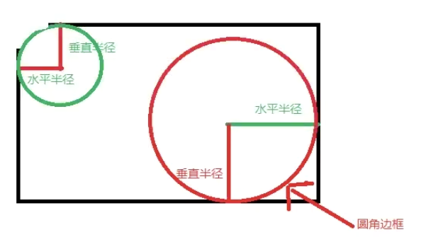

>  关于圆角的形成 
> 	1.从指定角的顶端，向内部引出垂直半径和水平半径
> 	2.将水平半径和垂直半径相交于元素内部的一点（圆心点）
> 	3.以该点为圆心，指定的垂直半径和水平半径画圆或者椭圆
> 	4.与边框相交的部分就是圆角部分

```css
 /* 设置圆角完整格式 2个参数 8个值 */
border-radius: 10px 20px 30px 40px / 10px 20px 30px 40px;
  /* 水平位置/垂直位置  ： 左上角水平 右上角水平  右下角水平 左下角水平 / 左上角垂直 右上角垂直 右下角垂直 最下角垂直  */

 /* 格式 1个参数 4个值 左上 右上 右下 左下*/
border-radius: 10px 20px 30px 40px;
/* 格式 1个参数 2个值  左上和右下 右上和左下*/
border-radius: 10px 20px;
/* 格式 1个参数 1个值  */
border-radius:  20px;
/* 格式有很多种，可以省略，计算方式如上  */


```



