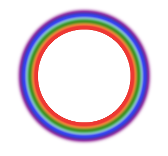

### 盒子阴影和文字阴影

#### 文字阴影


#### 盒子阴影

彩虹效果实现

效果图




```css
.rainbow {
        margin: 50px auto;
        width: 150px;
        height: 150px;
        border-radius: 75px;
        border: 1px solid red;
        box-shadow: 0 0 5px 5px red,0 0 5px 10px orange,0 0 5px 15px green,0 0 5px 20px powderblue,0 0 5px 25px blue,0 0 5px 30px purple;
    }

    /* 
        盒子阴影
        格式： box-shadow: 阴影1,阴影2...;
        阴影的格式：
            水平偏移位置, 垂直偏移位置, 模糊度, 外延值, 颜色, 内置阴影或外置阴影（默认内置阴影）
    */
```

